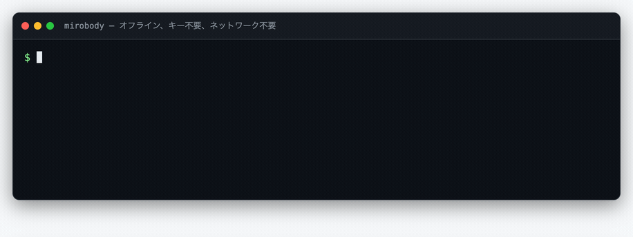
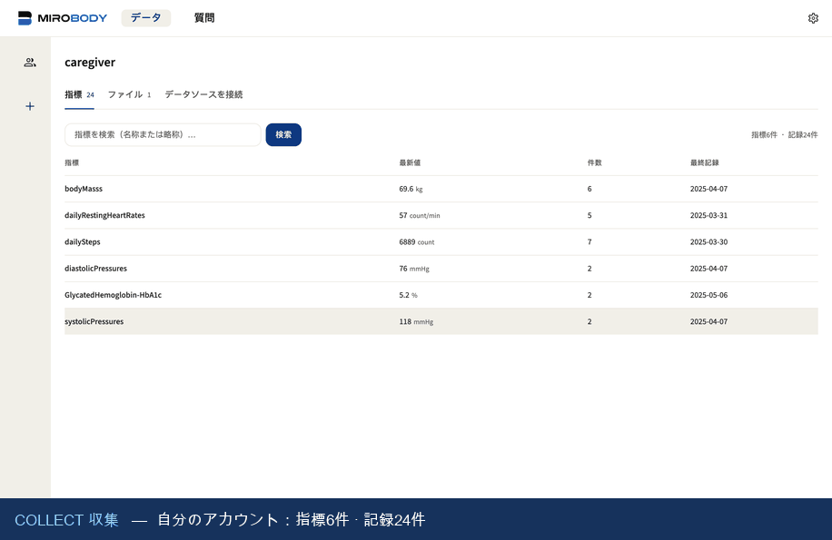
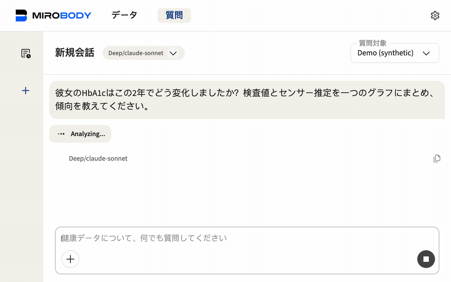
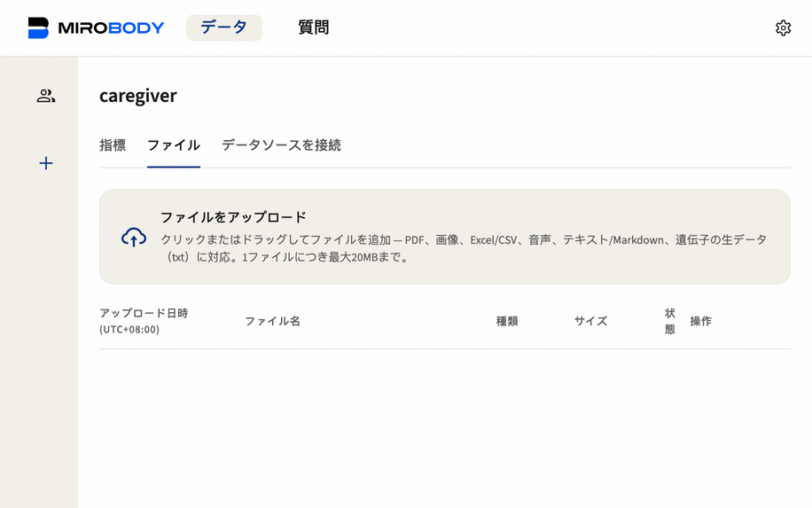
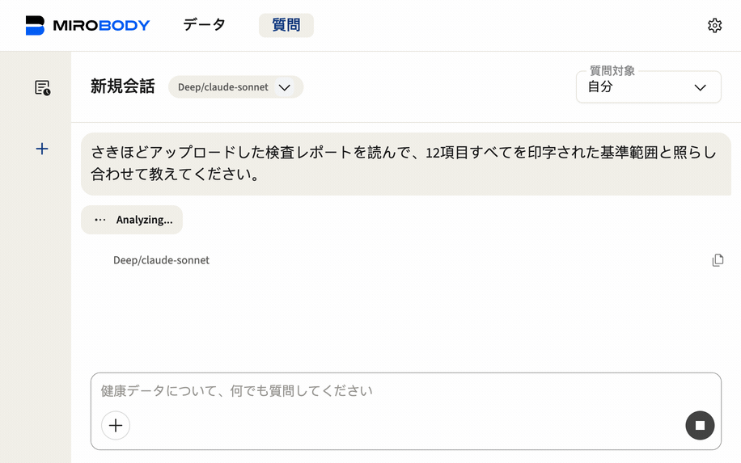

<div align="center">

# 🚀 Mirobody

**AIネイティブな健康データエンジン ―― 検査値・ウェアラブル・ゲノムを収集し、標準化し、そこから推論する。**

[](LICENSE)
[](pyproject.toml)
[](https://pepy.tech/projects/mirobody)
[](https://huggingface.co/healthmemoryarena)
[](https://arxiv.org/abs/2604.02834)
[](https://docs.mirobody.ai/)

**[📚 ドキュメント](https://docs.mirobody.ai/)** · **[💬 ホスト型チャット — chat.mirobody.ai](https://chat.mirobody.ai/)** · **[🔌 APIプラットフォーム — platform.mirobody.ai](https://platform.mirobody.ai/)**

**[English](README.md)** · **[简体中文](README.zh-CN.md)** · **[繁體中文](README.zh-TW.md)** · **日本語**

*血液検査、ウェアラブル、ゲノム、画像診断 ―― どれも断片化していて、互換性がない。
AIが健康データを理解する前に、まずこれらの信号を統合し、AIが実際に読める単一の標準に
落とし込む必要がある。それがこのエンジンの仕事である。*


</div>

本エンジンが行うことは3つ。コードベース(および後述の「コントリビューション」)もこの3段階 ―― [ドキュメント](https://docs.mirobody.ai/en/api-reference/)が使う**C・S・A**と同じ ―― に沿って構成されている。

| 段階                | 意味                                                                                                     | 場所                                                   |
| -------------------- | ----------------------------------------------------------------------------------------------------------------- | -------------------------------------------------------- |
| **① Collect(収集)** | 信号を取り込む:デバイスプロバイダ3種 + SQLソース・ファイル形式7種・Apple Health                                             | [`pulse/`](mirobody/pulse/) |
| **② Standardize(標準化)**    | 単一標準への統一:任意の測定値を正規コード(LOINC・SNOMED CT・RxNorm)に解決し、単位を正規化し、FHIRが認めるコード体系に載せる | [`indicator/`](mirobody/indicator/)                    |
| **③ Answers(応答)**  | 推論:エージェントが仮想ファイルシステム経由で*元の文書*を読み、グラフと引用付きで回答     | [`agent/`](mirobody/agent/)                  |

---

## ⚡ 60秒で試す

指標の解決はこのエンジンの正面玄関で、キーも設定もネットワークも要らない。

```bash
pip install mirobody
mirobody resolve "LDL cholesterol" 血红蛋白 ヘモグロビン "空腹血糖(GLU)" 血脂
```

<p align="center">
  
</p>

> これは実際の出力で、GIFはビルド成果物だ ―― [`docs/demo/resolve.html`](docs/demo/resolve.html) を [`scripts/make_demo_gifs.py`](scripts/make_demo_gifs.py) が描画するので、示すと主張しているコマンドから離れていくことがない。

```python
from mirobody.engine import resolve, resolve_reading

resolve("血红蛋白").loinc                                # '718-7'   どの言語でも同じコード
resolve("total cholesterol").loinc                     # '2093-3'  [質量/体積]
resolve_reading("total cholesterol", "5.0", "mmol/L")   # '14647-2' [モル/体積]
resolve_reading("total cholesterol", "193", "mg/dL")    # '2093-3'  単位がコードを決める

resolve("中性粒细胞百分比").loinc                          # '26511-6' 好中球/白血球
resolve_reading("中性粒细胞", "62 %", None).loinc          # '26511-6' 百分率と……
resolve_reading("中性粒细胞", "4.2", "10*9/L").loinc       # '26499-4' ……実数は別のコード
resolve("血脂").resolved                                 # False    観測ではなくカテゴリ
```

**値と単位が手元にあるなら一緒に渡すこと。** LOINCは単位*と*結果の種類を同一性に
織り込むので、同じ名前が別のコードに解決する ―― mmol/Lの結果をmg/dLのコードに入れる
のが、ひとつの系列に2つの単位が静かに混ざる原因だ。`resolve` は当てずっぽうより棄権を
選ぶ。`""` はもう一度確認する価値のある空白、`"refused"` が答えだ。
→ [エンジン](https://docs.mirobody.ai/en/engine/) ·
[指標](https://docs.mirobody.ai/en/concepts/indicators/)

---

## 標準化層とは実際に何なのか

ルックアップテーブルではない ―― 隣接するオープンソースが持っていないのはこの部分だ。

- **概念グラフ**：440,961ノード · 22,044,110本の語彙間エッジ · **595,746件の
  ソースid**を正規概念へ蒸留（LOINC · SNOMED CT · RxNormのブリッジ）。
- **49,253件の多言語エイリアス**(中文 22,578 · 日本語 16,809 · 他5言語：
  de·es·fr·ko·ru)。`hemoglobin`、`血红蛋白`、`血紅素`、`ヘモグロビン` がすべて
  LOINC 718-7に着地する。
- **繁體中文は2つの問題で、2つとして扱う。** 字体の畳み込みは機械的(同梱の3,336字
  zh-Hant → zh-Hans表)だが、語彙はそうではない ―― 台湾の臨床用語は語の選択が違い、
  `血紅素` を畳むとHbA1cのコードになる。その手の語は繁体表記で個別収録し、収録行は
  常に畳み込みに勝つ。
- **単位**は約310のUCUMファミリーへ正規化。次元解析、LOINCコードをキーとするモル質量
  ブリッジ、`%` と `10*9/L` に対する明示的な拒否を含む。標準pulse指標300種。
- **第2の層があり、意図的にオプトインのままだ。** 上のすべては語彙的で、知らない用語には
  棄権する ―― 正直な天井だ。コサイン検索([`indicator/semantic.py`](mirobody/indicator/semantic.py))
  はそれを越えるが、**棄権できない**：見たことのない用語に対して、正解と同じ確信度で最近傍を
  返し、両者を分けるしきい値は存在しない。**行列は同梱せず、配布もしていない**: LOINC
  108,248行 × 1024次元(約221 MB)で、(provider, model)の組に固有なので、
  `scripts/build_loinc_embeddings.py` で自分の埋め込みモデル向けに作る。別モデルの行列は
  エラーにならず、間違ったベクトル空間で自信満々に並べる ―― だから構築時に
  `<matrix>.meta.json` を刻み、読み込み時に不一致を拒否する。`MIROBODY_SEMANTIC_INDEX`
  を指すまで `resolve()` は変わらない。指した後も、人が確認するコードを*提案*させるために
  使い、同一性を作るためには使わない。
  → [セマンティック検索](https://docs.mirobody.ai/en/concepts/semantic-recall/)：ベンチマーク、
  2つの軸ゲート、そして `min_score` が正しさのしきい値ではない理由。
- **この主張は断言ではなく計測している。**
  [`test_engine_coverage.py`](mirobody/test_engine_coverage.py) は健診が実際に出す
  パネルでオフラインリゾルバを採点する。報告書が実際に印字する書き方で、英語・
  简体中文・繁體中文・日本語、さらにプラットフォームAPIが教えるウェアラブル語彙も。
  **今日は211/211。書いた日は32/94だった。** 採点するのは*臨床的*正しさで、
  `血红蛋白` にHbA1cのコードを答えれば失敗、`血脂` は何も返さないことが要求される。

```bash
pytest mirobody/test_engine_coverage.py -s   # オフライン、約1秒
```

### どのLOINCか、そして何を覆い何を覆わないか

同梱バンドルは **LOINC 2.82** から切り出したもので、それを実行時に自分で名乗る ――
ずれうるコメントに書いておくのではなく:

```python
>>> import mirobody; mirobody.BUNDLE_VERSION
'loinc-2.82+2026.08.28-050559ecc200'
```

リリース、切り出し日、そしてバンドル自身のメンバーに対するダイジェスト ―― だから
「ビルド時にこの語彙を使った成果物」と「実行時にpinしたパッケージ」が同じコーパスかを
断言できる。パッケージのバージョンだけでは決して分からなかったことだ。
[LOINCのライセンス](https://loinc.org/license/)は全ての複製にバージョン番号を求めており、
`res/fhir_loinc_bundle.NOTICE` はそれを持ち、`scripts/stamp_bundle_version.py --check`
がその正しさを保つ。

**なぜ2.83ではなく2.82か。** 軸テーブルと677k行のコーパスは畳み込んだ
`LONG_COMMON_NAME` で結ばれており、2.83はそのうち2,842件を改名した
(`Cerebral spinal fluid` → `Cerebrospinal Fluid` の類)。実測: 軸だけ上げると
「コーパス名 → コード」の対応が **3,486件** 失われ、増えるものは無い。本当に上げるには
コーパスごと作り直すことになり、それはSNOMED CT・RxNorm・CVX・DCMにまたがる ――
どれも個別にライセンスされ、ここから再配布できない。2.82に留まる既知のコスト:
2.83がDISCOURAGED/DEPRECATEDとした650コードが今も返りうること。ベンチマークでは
解決する6,815件のうち52件がこれに当たる。「いっそ返さない」も計測した上で採らなかった
―― 658件のうちLOINCが代替を示すのは9件だけで、拒否はたいてい「少し古いが正しい
コード」を「コード無し」に変えるだけであり、コードの無い測定値はそもそもまとめられない。

**LOINCはウェアラブル領域を思われているより広く覆う。** 検査パネルだけではない:
`BDYWGT.*` が体組成(`101685-6` 骨量、`73964-9` 筋肉量、`101684-9` 体水分率)、
`HRTRATE.*` が安静時心拍(`40443-4`)を単発測定と区別し、歩数(`41950-7`)、
睡眠ステージ(`93831-6` 深睡眠、`93830-8` 浅睡眠)、HRV SDNN(`112429-6`)、
VO₂ peak、獲得標高にもコードがある。止まるのはベンダー独自の合成指標 ――
GarminのBody Batteryやストレススコアにコードは無く、それは正しい:あれは一社の
アルゴリズムであって、測定ではない。

**カバレッジと再現率は別物で、その差はLOINC側ではなくこちら側にある**:
`Body bone mass` はここで `101685-6` に解決するのに、日本語・中国語の `骨量` は
歯科の体積コードに落ちる。そこへ導くエイリアスが無いからだ。
[`res/resolver_overrides.tsv`](mirobody/res/resolver_overrides.tsv) はそのためにある ――
人が書き下ろした一行は、索引の表層一致に常に勝つ。

→ [loinc.org](https://loinc.org/) · [ライセンス](https://loinc.org/license/) ·
[リリースノート](https://loinc.org/kb/) · ダウンロードは無料だが、アカウント登録と
規約への同意が要る。派生バンドルを同梱し、原本を配布しないのはそのためだ。

→ [標準化](https://docs.mirobody.ai/en/api-reference/standardization/) ·
[アーキテクチャ](https://docs.mirobody.ai/en/concepts/architecture/) ·
[データフロー](https://docs.mirobody.ai/en/concepts/data-flow/)

---

## 📊 ベンチマーク ―― すべて公開、独立に再現可能

私たちのヘルスAIベンチマークは、Hugging Faceの同カテゴリで**最もダウンロードされて
いる**(各4,000+)。

| ベンチマーク | 測るもの | DL数 |
| --- | --- | --- |
| [ESL-Bench](https://huggingface.co/datasets/healthmemoryarena/ESL-Bench) | イベント駆動の長期的ヘルスエージェント ―― 合成ユーザー100人、10,000問、プログラム的正解([arXiv:2604.02834](https://arxiv.org/abs/2604.02834)) | 4,800+ |
| [MedHall-Bench](https://huggingface.co/datasets/healthmemoryarena/MedHall-Bench) | 医療ハルシネーション | 4,500+ |
| [MedHarm-Bench](https://huggingface.co/datasets/healthmemoryarena/MedHarm-Bench) | 有害な医療アドバイス | 4,300+ |

いずれも **[mirobody-eval](https://github.com/thetahealth/mirobody-eval)** で
1コマンドで再現できる。同じツールがデプロイに合成(PHIを含まない)推移データを投入する。

---

## 🚀 一式を動かす

```bash
git clone https://github.com/thetahealth/mirobody.git && cd mirobody
git lfs pull          # エンジンのデータバンドル。`resolve` に必要
./deploy.sh           # Postgres + pgvector、Redis、サーバー、ワーカー
```

そして **http://localhost:18060** を開く。サーバーは受け付けるアカウントを起動時に
出力する ―― 同梱のものは `caregiver@mirobody.ai`、コード `111111`。名前がそのまま
役割だ：介護者としてサインインし、読む記録は他人のものになる。

メールプロバイダが無い? 要らない。サインインページは既定で**パスワード**を開き、
メールコードは3つめのタブとして残っている。

```bash
curl -X POST localhost:18060/password/register -H 'Content-Type: application/json' \
     -d '{"email":"you@example.com","password":"at-least-8-chars"}'
```

**キー1つで全部動く。** [OpenRouterのキー](https://openrouter.ai/keys)を
`OPENROUTER_API_KEY` に設定する ―― Docker スタックでは `compose.yaml` の隣の
`.env` に書いて `docker compose restart` するだけでよい（アプリが `/app/.env` を
読み直す。シェルの `export` はコンテナに届かない）。これで会話・ファイルの視覚解析・指標のセマンティック
検索がすべて動き出す ―― 会話は Claude/GPT/DeepSeek、セマンティック検索は
オープンウェイトの Qwen3-Embedding-8B（自前デプロイも可: OpenAI互換の
`/v1/embeddings` で同じモデルをサーブし、`OPENROUTER_BASE_URL` を向ければよい）。

指標検索がベクトル化するのは**あなた自身の指標名**で、LOINCコーパスではない:
workerの `IndicatorSyncTask` が取り込みのたびに
`th_series_dim.embedding_qwen3_8b` を書き、クエリはそれと突き合わされる。
`mirobody worker` が動いている必要があり、`./deploy.sh` が一緒に起動する。
上の「第2の層」が欲しがるコーパス行列とは別のインデックスで、こちらは無料で付いてくる。

ネットワークから openrouter.ai に届かない場合（中国本土がその典型）は、
[DashScopeのキー](https://dashscope.console.aliyun.com/apiKey)を
`DASHSCOPE_API_KEY` に設定すればそのまま置き換えられる ―― 会話は Qwen
（DeepSeek/Kimi はコメント解除で追加）、視覚解析は qwen3-vl、セマンティック検索は
text-embedding-v4。

どちらの道も追加設定は不要。Google・OpenAI への直結キーも引き続き使える ――
`config.yaml` 参照。
→ [Dockerデプロイ](https://docs.mirobody.ai/en/deployment/docker/) ·
[設定](https://docs.mirobody.ai/en/configuration/) ·
[ローカルPython環境](https://docs.mirobody.ai/en/development/setup/)

### 👨‍👩‍👧 エンジン全体を、4分で

`SEED_DEMO_DATA` は既定でオンなので、`./deploy.sh` が終わった瞬間から ① → ② → ③ の
連鎖を通しで歩ける ―― サインインとシードデータの閲覧にキーは要らない。パート2の
アップロード抽出とその後の質問は、上で設定した1つのキーで動く。4パート、どれも
実際に動いているスタックで録画した。

**1 · サインイン。** サインインした時点で自分には**軽量**な記録が1つある ――
数週間のセルフトラッキングと、結果に異常のない年次健診1回。同時にケアサークル
には、**完全**な記録を共有している合成ユーザーが1人いる。**Demo (synthetic)**、
2年分・244指標・14,273件の読み取り、そしてエージェントが `read_file` で読める
文書5件。同じ質問に対して記録は互いに独立している。*自分の*HbA1cを尋ねれば
自分のデータから正常値が1件返り、*彼女の*HbA1cを尋ねれば、閲覧権限のみの
2年分の記録から回答が返る。データ分離がそのまま画面上で確認できる。

<p align="center">
  
</p>

<div align="center">

</div>

最初に開くべき系列は彼女のHbA1cだ ―― 良くなって、そのあと保たなかった:

```
2024-04-16   7.2 %
2024-10-15   6.5
2025-04-15   6.6      ← そしてそれ以降はない
```

**尋ねてみる。** 日本語で彼女のこの2年のHbA1cを尋ねると、エージェントは自分でデータを
探す。採血による検査は **2回** だけ、センサー由来のeA1Cは **約85回** ある。両方を一枚の
グラフに重ね、6.5〜6.6%の帯に張り付いたまま目立った悪化も改善もない、と読む。自分の
限界も自分から言う ―― 検査は2回しかなく、CGM推定と検査値は同じものではない。

<p align="center">
  
</p>

**次にファイルを渡す。** `mirobody/demo/lab_report_2025-10-15.pdf` は彼女の*次の*
パネルで、投入からは意図的に外してある。だからアップロードは空振りではない。
Dataページに落とせば ① Collect と ② Standardize が数秒で走り、12項目が値と単位を
伴って出てくる。どれも読み取り元のページに戻れる。

<p align="center">
  
</p>

**もう一度尋ねる。今度は自分がアップロードしたファイルについて。** 同じエージェント、
違うデータ ―― レポートそのものを読み、12項目を印字された基準範囲と一つずつ照らし合わせ
（12項目すべてが範囲外だった）、そして1回分のデータしかないので傾向はまだ判断できないと
はっきり言う。

<p align="center">
  
</p>

この対比がこのデモの主旨だ ―― **2年の履歴が買うのは傾向、1枚のパネルが買うのは解釈。**
どちらの答えも、自分が読んだものを引用する。

値はすべて合成 ―― [mirobody-eval](https://github.com/thetahealth/mirobody-eval) が
ESL-Bench向けに生成したものを同梱しているので、投入にネットワークもキーも要らない。
実データを載せるデプロイでは `SEED_DEMO_DATA=false` に。抽出の段がその12件の読み取りに
対して**まだできていないこと**は、ここで曖昧にせず
[docs/roadmap.md](docs/roadmap.md) に書いてある。

---

## 🧩 拡張する

5つのディレクトリキーがプラグインのルートを指す。ファイルを置いて再起動するだけ。
ツールは追加配線なしでエージェントツールにもMCPツールにもなる。

| やりたいこと | 置く場所 | ドキュメント |
| --- | --- | --- |
| 新しいツール | `mirobody/agent/tools/` | [ツールの追加](https://docs.mirobody.ai/en/tools/adding-tools/) |
| Agent Skill(SKILL.md) | `mirobody/agent/skills/` | [Skills](https://docs.mirobody.ai/en/tools/skills/) |
| エージェント丸ごと | `mirobody/agent/` | [Agents](https://docs.mirobody.ai/en/tools/agents/) |
| デバイスprovider | `mirobody/pulse/providers/` | [Provider統合](https://docs.mirobody.ai/en/development/provider-integration/) |
| 他人のMCPサーバー | Settings → MCP | [MCP統合](https://docs.mirobody.ai/en/tools/mcp-integration/) |

エージェントが持つツールはすべて `/mcp` 経由でも提供され、ユーザー単位でゲートされる。
→ [組み込みツール](https://docs.mirobody.ai/en/tools/built-in/) ·
[MCPサーバー](https://docs.mirobody.ai/en/api-reference/mcp-servers/)

---

## 🔌 自分のコードから使う

| 面 | 向いている用途 | ドキュメント |
| --- | --- | --- |
| `pip install mirobody` | 解決とファイル解析、サーバー不要 | [エンジン](https://docs.mirobody.ai/en/engine/) |
| HTTP API | 自分のアプリからデプロイへ | [API概要](https://docs.mirobody.ai/en/api-reference/overview/) · [データ](https://docs.mirobody.ai/en/api-reference/data/) |
| MCP | Claude、Cursor、任意のMCPクライアントが記録を読む | [MCPサーバー](https://docs.mirobody.ai/en/api-reference/mcp-servers/) |
| Backboneモード | 自分のエージェント、こちらのデータ層 | [Backbone](https://docs.mirobody.ai/en/api-reference/backbone-mode/) |

どれか迷う? → [APIの選び方](https://docs.mirobody.ai/en/api-reference/choose-your-api/)

---

## 🏗️ リポジトリの構成

```
mirobody/
├── engine.py    正面玄関 ―― resolve() と parse_file()
├── units/       UCUM単位、unit_family、換算              ┐ ライブラリ部分:
├── lexical.py   表層畳み込み + CJK対応トークナイザ         │ numpyのみ、
├── bundle.py    ビルド時：軸テーブルとエイリアス元          │
├── res/         同梱のLOINCバンドル                       ┘ 計2パッケージ
├── pulse/       ① Collect     ―― provider、ファイル解析、集計
├── indicator/   ② Standardize ―― リゾルバ内部、概念グラフ、バンドル構築
├── agent/       ③ Answers     ―― DeepAgent、ツール、skills、chat
├── mcp/         MCPサーバ
├── user/        アイデンティティとケアサークル ―― 誰が誰の記録を読めるか
├── schema/      DDL、開発時は起動で再生
└── demo/        ケアサークルのデモデータ
```

**二つの形態は、正反対のものを求める。** PyPIパッケージはライブラリであり、
存在を意識せずに済むほど小さくあるべきだ ―― `pip install mirobody` は
**2パッケージ、52 MB**、上の4項目とnumpyだけ。`[parse]` が文書読み取りを足し、
`[app]` が全部入りで、それを入れるのは `requirements.txt` だけだ ―― Dockerアプリは
`git clone && ./deploy.sh` であって、pipインストールではない。

**ドキュメントではなくツールで強制**: 3本のimport-linter契約が2つの線を守る ――
ライブラリ層はnumpy以外を一切importせず、エンジンはagent層をimportしない ――
破れば `lint-imports` がビルドを落とす。4本目のゲート `scripts/check_wheel_data.py` が、バンドル構築パスとv2セマンティック
パイプライン ―― インストールしても誰も動かせない19,000行 ―― を成果物から締め出す。

→ [アーキテクチャ](https://docs.mirobody.ai/en/concepts/architecture/) ·
[CONTRIBUTING.md](CONTRIBUTING.md)

---

## 📚 ドキュメント

詳細は **[docs.mirobody.ai](https://docs.mirobody.ai/)** のオンライン
ドキュメント（英語・簡体字中国語）を参照。

| | |
| --- | --- |
| [クイックスタート](https://docs.mirobody.ai/en/quickstart/) · [インストール](https://docs.mirobody.ai/en/installation/) · [セルフホスト](https://docs.mirobody.ai/en/self-host/) | まず動かす |
| [指標](https://docs.mirobody.ai/en/concepts/indicators/) · [Provider](https://docs.mirobody.ai/en/concepts/providers/) · [ファイル処理](https://docs.mirobody.ai/en/concepts/file-processing/) | 3段階の仕組み |
| [APIリファレンス](https://docs.mirobody.ai/en/api-reference/) · [ストリーミング](https://docs.mirobody.ai/en/api-reference/streaming/) · [関数呼び出し](https://docs.mirobody.ai/en/api-reference/function-calling/) | これを使って作る |
| [コントリビュート](https://docs.mirobody.ai/en/development/contributing/) · [セットアップ](https://docs.mirobody.ai/en/development/setup/) | 開発に参加する |

### リポジトリ内、コントリビューター向け

各パッケージはそれが何であるかを述べる `README.md` を持ち、長文のガイドは [`docs/`](docs/) にある。
どの言語のREADMEから来ても、これらはすべて英語だ。

| | Where |
| --- | --- |
| 実行できる例 | [`examples/`](examples/README.md) |
| ① 収集 | [`pulse/`](mirobody/pulse/README.md) · [providers](mirobody/pulse/providers/README.md) · [aggregation](mirobody/pulse/aggregate/README.md) · [Apple Health](mirobody/pulse/apple/README.md) |
| ① ガイド | [connect a wearable](docs/provider-setup.md) · [write a provider](docs/provider-guide.md) · [file processing](docs/file-processing.md) · [Apple Health API](docs/apple-health.md) |
| ② 標準化 | [`indicator/`](mirobody/indicator/README.md) · [indicators & units](mirobody/pulse/standardize/README.md) |
| ③ 回答 | [`agent/`](mirobody/agent/README.md) · [tools](mirobody/agent/tools/README.md) · [ChatGPT widgets](mirobody/agent/resources/README.md) |
| 下ばたらき | [configuration](mirobody/utils/config/README.md) · [database schema](mirobody/schema/README.md) · [the web client](docs/frontend.md) |
| 開発に参加 | [CONTRIBUTING.md](CONTRIBUTING.md) · [testing](docs/testing.md) · [aggregator script](docs/aggregation-tests.md) · [roadmap](docs/roadmap.md) · [CHANGELOG](CHANGELOG.md) · [SECURITY](SECURITY.md) |

---

## 🤝 コントリビュート

最もレバレッジが高い貢献は、リゾルバが間違える用語ひとつだ。
`mirobody resolve "<用語>"` を走らせ、答えが間違いか空なら
[`resolver_overrides.tsv`](mirobody/res/resolver_overrides.tsv) に1行、
[`test_engine_coverage.py`](mirobody/test_engine_coverage.py) にケースを1つ追加する
―― カバレッジのスコアがレビューだ。

```bash
pip install -e '.[test]' && pytest -q && lint-imports
```

→ [コントリビュートガイド](https://docs.mirobody.ai/en/development/contributing/) ·
[CONTRIBUTING.md](CONTRIBUTING.md)

---

<div align="center">

**[📚 ドキュメント](https://docs.mirobody.ai/)** · **[💬 Chat](https://chat.mirobody.ai/)** · **[🔌 プラットフォーム](https://platform.mirobody.ai/)** · **[🧪 Eval](https://github.com/thetahealth/mirobody-eval)**

Apache 2.0 · © 2026 [Theta Health](https://thetahealth.ai)

</div>
