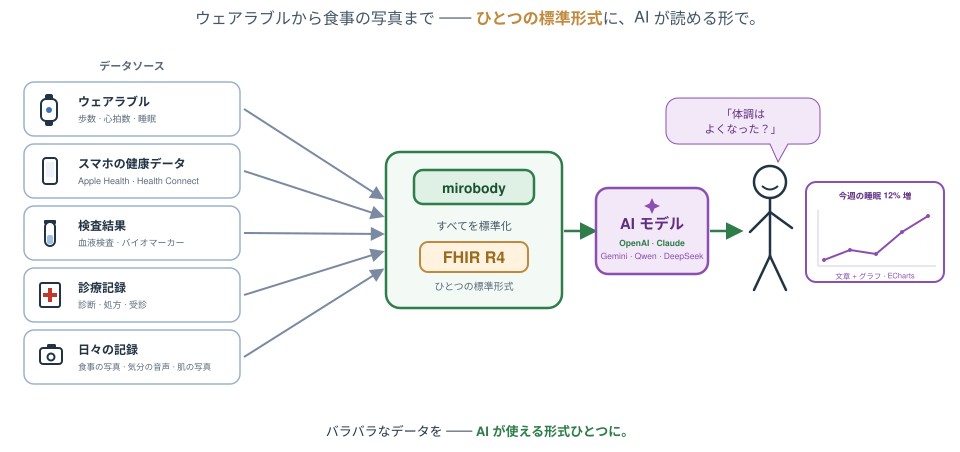
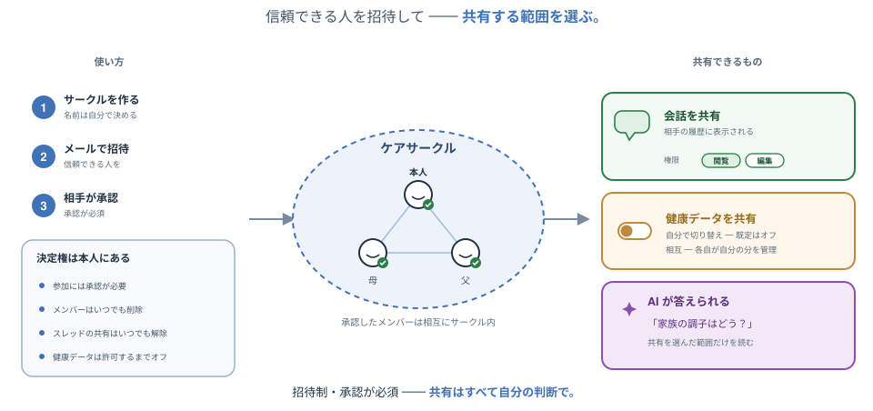

<div align="center">

# 🚀 Mirobody

**AIネイティブな健康データエンジン ―― 検査値・ウェアラブル・ゲノムを収集し、標準化し、そこから推論する。**

[](LICENSE)
[](pyproject.toml)
[](https://pepy.tech/projects/mirobody)
[](https://huggingface.co/healthmemoryarena)
[](https://arxiv.org/abs/2604.02834)
[](https://docs.mirobody.ai/)

**[📚 ドキュメント](https://docs.mirobody.ai/)** · **[💬 ホスト型チャット — chat.mirobody.ai](https://chat.mirobody.ai/)** · **[🔌 APIプラットフォーム — platform.mirobody.ai](https://platform.mirobody.ai/)**

**[English](README.md)** · **[简体中文](README.zh-CN.md)** · **[繁體中文](README.zh-TW.md)** · **日本語**

*血液検査、ウェアラブル、ゲノム、画像診断 ―― どれも断片化していて、互換性がない。
AIが健康データを理解する前に、まずこれらの信号を統合し、AIが実際に読める単一の標準に
落とし込む必要がある。それがこのエンジンの仕事である。*



</div>

本エンジンが行うことは3つ。コードベース(および後述の「コントリビューション」)もこの3段階 ―― [ドキュメント](https://docs.mirobody.ai/en/api-reference/)が使う**C・S・A**と同じ ―― に沿って構成されている。

| 段階                | 意味                                                                                                     | 場所                                                   |
| -------------------- | ----------------------------------------------------------------------------------------------------------------- | -------------------------------------------------------- |
| **① Collect(収集)** | 信号を取り込む:デバイスプロバイダ3種 + SQLソース・ファイル形式7種・Apple Health                                             | [`pulse/`](mirobody/pulse/) |
| **② Standardize(標準化)**    | 単一標準への統一:任意の測定値を正規コード(LOINC・SNOMED CT・RxNorm)に解決し、単位を正規化し、FHIRが認めるコード体系に載せる | [`indicator/`](mirobody/indicator/)                    |
| **③ Answers(応答)**  | 推論:エージェントが仮想ファイルシステム経由で*元の文書*を読み、グラフと引用付きで回答     | [`agent/`](mirobody/agent/)                  |

---

## ⚡ 60秒で試す

指標の解決はこのエンジンの正面玄関で、キーも設定もネットワークも要らない。

```bash
pip install mirobody
mirobody resolve "LDL cholesterol" "血红蛋白" "ヘモグロビン" "空腹血糖(GLU)"
```

```python
from mirobody.engine import resolve, resolve_reading

resolve("血红蛋白").loinc                                # '718-7'   どの言語でも同じコード
resolve("total cholesterol").loinc                     # '2093-3'  [質量/体積]
resolve_reading("total cholesterol", "5.0", "mmol/L")   # '14647-2' [モル/体積]
resolve_reading("total cholesterol", "193", "mg/dL")    # '2093-3'  単位がコードを決める
resolve("血脂").resolved                                 # False    観測ではなくカテゴリ
```

**値と単位が手元にあるなら一緒に渡すこと。** LOINCは単位*と*結果の種類を同一性に
織り込むので、同じ名前が別のコードに解決する ―― mmol/Lの結果をmg/dLのコードに入れる
のが、ひとつの系列に2つの単位が静かに混ざる原因だ。`resolve` は当てずっぽうより棄権を
選ぶ。`""` はもう一度確認する価値のある空白、`"refused"` が答えだ。
→ [エンジン](https://docs.mirobody.ai/en/engine/) ·
[指標](https://docs.mirobody.ai/en/concepts/indicators/)

---

## 標準化層とは実際に何なのか

ルックアップテーブルではない ―― 隣接するオープンソースが持っていないのはこの部分だ。

- **概念グラフ**：440,961ノード · 22,044,110本の語彙間エッジ · **595,746件の
  ソースid**を正規概念へ蒸留（LOINC · SNOMED CT · RxNormのブリッジ）。
- **49,253件の多言語エイリアス**(中文 22,578 · 日本語 16,809 · 他5言語：
  de·es·fr·ko·ru)。`hemoglobin`、`血红蛋白`、`血紅素`、`ヘモグロビン` がすべて
  LOINC 718-7に着地する。
- **繁體中文は2つの問題で、2つとして扱う。** 字体の畳み込みは機械的(同梱の3,336字
  zh-Hant → zh-Hans表)だが、語彙はそうではない ―― 台湾の臨床用語は語の選択が違い、
  `血紅素` を畳むとHbA1cのコードになる。その手の語は繁体表記で個別収録し、収録行は
  常に畳み込みに勝つ。
- **単位**は約310のUCUMファミリーへ正規化。次元解析、LOINCコードをキーとするモル質量
  ブリッジ、`%` と `10*9/L` に対する明示的な拒否を含む。標準pulse指標300種。
- **この主張は断言ではなく計測している。**
  [`test_engine_coverage.py`](mirobody/test_engine_coverage.py) は健診が実際に出す
  パネルでオフラインリゾルバを採点する。報告書が実際に印字する書き方で、英語・
  简体中文・繁體中文・日本語、さらにプラットフォームAPIが教えるウェアラブル語彙も。
  **今日は197/197。書いた日は32/94だった。** 採点するのは*臨床的*正しさで、
  `血红蛋白` にHbA1cのコードを答えれば失敗、`血脂` は何も返さないことが要求される。

```bash
pytest mirobody/test_engine_coverage.py -s   # オフライン、約1秒
```

→ [標準化](https://docs.mirobody.ai/en/api-reference/standardization/) ·
[アーキテクチャ](https://docs.mirobody.ai/en/concepts/architecture/) ·
[データフロー](https://docs.mirobody.ai/en/concepts/data-flow/)

---

## 📊 ベンチマーク ―― 「信じてくれ」ではなく、評価そのものを出す

私たちのヘルスAIベンチマークは、Hugging Faceの同カテゴリで**最もダウンロードされて
いる**(各4,000+)。

| ベンチマーク | 測るもの | DL数 |
| --- | --- | --- |
| [ESL-Bench](https://huggingface.co/datasets/healthmemoryarena/ESL-Bench) | イベント駆動の長期的ヘルスエージェント ―― 合成ユーザー100人、10,000問、プログラム的正解([arXiv:2604.02834](https://arxiv.org/abs/2604.02834)) | 4,800+ |
| [MedHall-Bench](https://huggingface.co/datasets/healthmemoryarena/MedHall-Bench) | 医療ハルシネーション | 4,500+ |
| [MedHarm-Bench](https://huggingface.co/datasets/healthmemoryarena/MedHarm-Bench) | 有害な医療アドバイス | 4,300+ |

いずれも **[mirobody-eval](https://github.com/thetahealth/mirobody-eval)** で
1コマンドで再現できる。同じツールがデプロイに合成(PHIを含まない)推移データを投入する。

---

## 🚀 一式を動かす

```bash
git clone https://github.com/thetahealth/mirobody.git && cd mirobody
git lfs pull          # エンジンのデータバンドル。`resolve` に必要
./deploy.sh           # Postgres + pgvector、Redis、サーバー、ワーカー
```

そして **http://localhost:18080** を開く。サーバーは受け付けるアカウントを起動時に
出力する ―― 同梱のものは `caregiver@mirobody.ai`、コード `111111`。名前がそのまま
役割だ：介護者としてサインインし、読む記録は他人のものになる。

メールプロバイダが無い? 要らない。サインインページは既定で**パスワード**を開き、
メールコードは3つめのタブとして残っている。

```bash
curl -X POST localhost:18080/password/register -H 'Content-Type: application/json' \
     -d '{"email":"you@example.com","password":"at-least-8-chars"}'
```

会話するにはLLMキーが必要。embeddingキーは任意だ。
→ [Dockerデプロイ](https://docs.mirobody.ai/en/deployment/docker/) ·
[設定](https://docs.mirobody.ai/en/configuration/) ·
[ローカルPython環境](https://docs.mirobody.ai/en/development/setup/)

### 👨‍👩‍👧 答えたうえで、ファイルを要求してくるデモ

`SEED_DEMO_DATA` は既定でオンなので、入った時点でケアサークルに合成ユーザーが1人
いる。**Demo (synthetic)**、2年分244指標、エージェントが `read_file` できる文書5件。
自分のデータは何もない。その記録は彼女のものだ。

<div align="center">

</div>

**データ一覧ではなく、問いから始める。** Askページで:

> *「彼女の直近のLDLは? 1年前と比べてどうか?」*

```
2024-04-16   3.4 mmol/L
2024-10-15   3.2
2025-04-15   3.1
```

……そのうえで、最新のパネルが1年以上前でもう一度受けるに値する、と自分から指摘して
くる。それが後半の合図だ。

**次にファイルを渡す。** `mirobody/demo/lab_report_2025-10-15.pdf` は彼女の*次の*
パネルで、投入からは意図的に外してある ―― だからアップロードは空振りではない。
Dataページに落とせば ① Collect と ② Standardize が働く。12項目が単位付きで出てきて、
それぞれがコードに解決され、LDLの系列に4点目が増える。同じ問いをもう一度投げれば、
答えが動く。

値はすべて合成 ―― [mirobody-eval](https://github.com/thetahealth/mirobody-eval) が
ESL-Bench向けに生成したものを同梱しているので、投入にネットワークもキーも要らない。
実データを載せるデプロイでは `SEED_DEMO_DATA=false` に。

---

## 🧩 拡張する

5つのディレクトリキーがプラグインのルートを指す。ファイルを置いて再起動するだけ。
ツールは追加配線なしでエージェントツールにもMCPツールにもなる。

| やりたいこと | 置く場所 | ドキュメント |
| --- | --- | --- |
| 新しいツール | `mirobody/agent/tools/` | [ツールの追加](https://docs.mirobody.ai/en/tools/adding-tools/) |
| Agent Skill(SKILL.md) | `mirobody/agent/skills/` | [Skills](https://docs.mirobody.ai/en/tools/skills/) |
| エージェント丸ごと | `mirobody/agent/` | [Agents](https://docs.mirobody.ai/en/tools/agents/) |
| デバイスprovider | `mirobody/pulse/providers/` | [Provider統合](https://docs.mirobody.ai/en/development/provider-integration/) |
| 他人のMCPサーバー | Settings → MCP | [MCP統合](https://docs.mirobody.ai/en/tools/mcp-integration/) |

エージェントが持つツールはすべて `/mcp` 経由でも提供され、ユーザー単位でゲートされる。
→ [組み込みツール](https://docs.mirobody.ai/en/tools/built-in/) ·
[MCPサーバー](https://docs.mirobody.ai/en/api-reference/mcp-servers/)

---

## 🔌 自分のコードから使う

| 面 | 向いている用途 | ドキュメント |
| --- | --- | --- |
| `pip install mirobody` | 解決とファイル解析、サーバー不要 | [エンジン](https://docs.mirobody.ai/en/engine/) |
| HTTP API | 自分のアプリからデプロイへ | [API概要](https://docs.mirobody.ai/en/api-reference/overview/) · [データ](https://docs.mirobody.ai/en/api-reference/data/) |
| MCP | Claude、Cursor、任意のMCPクライアントが記録を読む | [MCPサーバー](https://docs.mirobody.ai/en/api-reference/mcp-servers/) |
| Backboneモード | 自分のエージェント、こちらのデータ層 | [Backbone](https://docs.mirobody.ai/en/api-reference/backbone-mode/) |

どれか迷う? → [APIの選び方](https://docs.mirobody.ai/en/api-reference/choose-your-api/)

---

## 🏗️ リポジトリの構成

```
mirobody/
├── pulse/       ① Collect     ―― provider、ファイル解析、集計
├── indicator/   ② Standardize ―― リゾルバ、単位、タキソノミー(DBもネットワークも不要)
├── agent/       ③ Answers     ―― DeepAgent、ツール、skills、chat
├── mcp/         MCPサーバー
├── schema/      DDL。開発環境では起動時に再生される
└── demo/        ケアサークルのfixture
```

**機械で強制される1つのルール**：`indicator/` はエージェント層を決してimportしない。
だから `pip install mirobody` はフレームワークを引き込まず233 MBのエンジンのままだ。
2つのimport-linter契約がその線を守り、`lint-imports` がビルドを落とす。

→ [アーキテクチャ](https://docs.mirobody.ai/en/concepts/architecture/) ·
[CONTRIBUTING.md](CONTRIBUTING.md)

---

## 📚 ドキュメント

これより深い内容はすべて **[docs.mirobody.ai](https://docs.mirobody.ai/)** に ――
50ページ、英語と简体中文。

| | |
| --- | --- |
| [クイックスタート](https://docs.mirobody.ai/en/quickstart/) · [インストール](https://docs.mirobody.ai/en/installation/) · [セルフホスト](https://docs.mirobody.ai/en/self-host/) | まず動かす |
| [指標](https://docs.mirobody.ai/en/concepts/indicators/) · [Provider](https://docs.mirobody.ai/en/concepts/providers/) · [ファイル処理](https://docs.mirobody.ai/en/concepts/file-processing/) | 3段階の仕組み |
| [APIリファレンス](https://docs.mirobody.ai/en/api-reference/) · [ストリーミング](https://docs.mirobody.ai/en/api-reference/streaming/) · [関数呼び出し](https://docs.mirobody.ai/en/api-reference/function-calling/) | これを使って作る |
| [コントリビュート](https://docs.mirobody.ai/en/development/contributing/) · [セットアップ](https://docs.mirobody.ai/en/development/setup/) | 開発に参加する |

リポジトリ内、コントリビューター向け：[CONTRIBUTING.md](CONTRIBUTING.md) ·
[docs/roadmap.md](docs/roadmap.md) · [SECURITY.md](SECURITY.md)

---

## 🤝 コントリビュート

最もレバレッジが高い貢献は、リゾルバが間違える用語ひとつだ。
`mirobody resolve "<用語>"` を走らせ、答えが間違いか空なら
[`resolver_overrides.tsv`](mirobody/res/resolver_overrides.tsv) に1行、
[`test_engine_coverage.py`](mirobody/test_engine_coverage.py) にケースを1つ追加する
―― カバレッジのスコアがレビューだ。

```bash
pip install -e '.[test]' && pytest -q && lint-imports
```

→ [コントリビュートガイド](https://docs.mirobody.ai/en/development/contributing/) ·
[CONTRIBUTING.md](CONTRIBUTING.md)

---

<div align="center">

**[📚 ドキュメント](https://docs.mirobody.ai/)** · **[💬 Chat](https://chat.mirobody.ai/)** · **[🔌 プラットフォーム](https://platform.mirobody.ai/)** · **[🧪 Eval](https://github.com/thetahealth/mirobody-eval)**

Apache 2.0 · © 2026 [Theta Health](https://thetahealth.ai)

</div>
