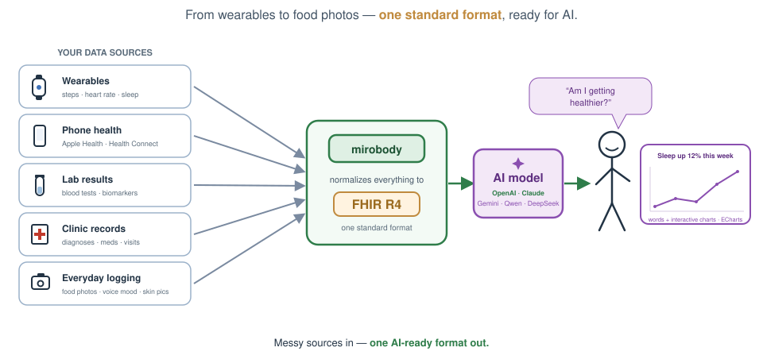

<div align="center">

# 🚀 Mirobody

**The AI-native health data engine — collect, standardize, and reason over labs, wearables & genomics.**

[](LICENSE)
[](pyproject.toml)
[](https://pepy.tech/projects/mirobody)
[](https://huggingface.co/healthmemoryarena)
[](https://arxiv.org/abs/2604.02834)
[](https://docs.mirobody.ai/)

**[📚 Documentation](https://docs.mirobody.ai/)** · **[💬 Hosted chat — chat.mirobody.ai](https://chat.mirobody.ai/)** · **[🔌 API platform — platform.mirobody.ai](https://platform.mirobody.ai/)**

*Blood tests, wearables, genomics, imaging — all fragmented, all incompatible.
Before AI can understand your health, someone has to unify these signals into a
single standard AI can actually read. That is what this engine does.*



</div>

The engine does three things, and the codebase (and [Contributing](#-contributing)) is organized around exactly these three stages — the same **C · S · A** the [documentation](https://docs.mirobody.ai/en/api-reference/) uses:

| Stage                | What it means                                                                                                     | Where                                                   |
| -------------------- | ----------------------------------------------------------------------------------------------------------------- | ------------------------------------------------------- |
| **① Collect** | Pull signals in: 4 production providers · 8 file formats · Apple Health                                             | [`pulse/`](mirobody/pulse/) |
| **② Standardize**    | One standard: resolve any reading to canonical codes (LOINC · SNOMED CT · RxNorm), normalize units, land as FHIR | [`indicator/`](mirobody/indicator/)                    |
| **③ Answers**  | Reason: agents read the*original documents* through a virtual filesystem and answer with charts & citations     | [`agent/`](mirobody/agent/)                  |

---

## ⚡ Try it in 60 seconds

No server, no key, no network — the terminology engine is a pip install:

```bash
pip install mirobody
mirobody resolve "LDL cholesterol" "血红蛋白" "ヘモグロビン"
```

```python
from mirobody.engine import resolve
resolve("血红蛋白").loinc   # -> '718-7'   offline: no key, no config, no network
```

Then self-host the full thing (see [Quick Start](#-quick-start)), sign in, and
mint your **personal MCP URL** (web client → Settings → MCP Url). Point any MCP
client (Claude Desktop, Cursor, Cherry Studio) at it and talk to your own
health-data engine:

```json
{ "mcpServers": { "mirobody": { "url": "http://localhost:18080/mcp/<your-personal-secret>" } } }
```

The MCP surface is small on purpose:

| Tool | What it does | Needs |
| --- | --- | --- |
| `resolve_indicator` | any-language indicator name → canonical LOINC | nothing — offline, no user data |
| `normalize_unit` | free-text unit → canonical UCUM + comparability family | nothing — offline, no user data |
| `query_health_indicators` | your own records — search, read and aggregate in **one** call; every result carries its LOINC identity | your account |
| `get_genetic_data` | your variants by rsid | your account |

`tools/list` is honest per account: the two account-bound tools are listed only
when your account actually holds that kind of data. The server speaks
[MCP 2026-07-28](https://modelcontextprotocol.io/specification/2026-07-28/) —
the current stateless revision (per-request `_meta`, `server/discover`,
deterministic tool ordering) — and negotiates down to `2024-11-05` for older
clients.

Runnable walkthroughs: [`examples/`](examples/README.md) — five scripts from offline resolution to a full-server preflight, each verified to run.

---

## ① Collect — every signal, one intake

- **Production device providers behind one plugin contract** — battle-tested providers for **Garmin, Oura, Whoop** plus [300+ devices](mirobody/pulse/providers/README.md) via the pulse platform. A provider is a directory: drop it in, and discovery, OAuth and pull scheduling are wired for you.

  > **What a self-hosted deployment needs to actually turn these on.** Each
  > provider is an OAuth client of that vendor, so it stays dormant until you
  > supply credentials **you** obtained from the vendor's developer program —
  > `GARMIN_CLIENT_ID`/`SECRET`, `OURA_CLIENT_ID`/`SECRET`,
  > `WHOOP_CLIENT_ID`/`SECRET` (plus each one's redirect URL) in
  > `config.{env}.yaml`. Without them the module still loads and logs
  > `declined to start (not configured)` — which is the honest state, not a
  > failure. [`mirobody_pgsql/`](mirobody/pulse/providers/mirobody_pgsql/) is
  > the one you can try immediately: set `ENABLE_PGSQL_DEVICE: 1` and the
  > platform logs `loaded 1 providers` on the next boot.
  > **Step by step: [docs/provider-setup.md](docs/provider-setup.md)** — the
  > exact callback URLs, the config keys, and how to tell "not configured"
  > apart from "broken" in the boot log.

- **Apple Health is push-only, and needs an iOS app you build** — the endpoints
  are here ([`/apple/health`, `/apple/statistics`, `/apple/cda`](mirobody/server/routers/apple_router.py),
  with [CDA processing](mirobody/pulse/apple/README.md)), but they *receive*
  data; nothing in this repo can pull from HealthKit. HealthKit is only readable
  from a signed iOS app, on-device, after the user grants permission per data
  type — there is no web OAuth flow and no server-to-server API. So a
  self-hosted web deployment shows no "connect Apple Health" button, correctly:
  the missing piece is an iOS client with the HealthKit entitlement, and the
  API above is what such a client would POST to.
- **8 file formats parsed with AI** — PDF lab reports, Excel, CSV, images, audio, archives, plain text, and **genetic exports (WeGene)**; LLM-powered indicator extraction ([`pulse/file_parser/`](mirobody/pulse/file_parser/), 13k lines).
- Ingest pipeline: staged intake → validate → normalize → daily rollups → [AI insights](mirobody/pulse/insight/) that feed back into the record — closing the loop.

## ② Standardize — one standard AI can actually read

The part none of the adjacent open-source projects have — a **semantic standardization layer**, not a lookup table:

- **Concept graph**: 440,961 nodes · 22,044,110 cross-vocabulary edges · **595,746 source ids** distilled into canonical concepts (LOINC · SNOMED CT · RxNorm bridges), shipped via Git LFS ([`indicator/`](mirobody/indicator/README.md)).
- **Embedding-based resolution**: free-text indicator names → canonical codes, with **50,240 multilingual aliases** (中文 22,578 · 日本語 16,809 · +6 languages) — `血红蛋白`, `ヘモグロビン` and `hemoglobin` all land on LOINC 718-7.
- **We measure that claim instead of asserting it.** [`test_engine_coverage.py`](mirobody/test_engine_coverage.py) scores the offline resolver against the panels a physical actually orders — lipid, CBC, metabolic, liver, thyroid, hormones, tumour markers, urinalysis, vitals — written the way a report prints them, in English, 中文 and 日本語 — plus the device/wearable vocabulary the platform API teaches (`steps`, `resting_heart_rate`, `sleep_duration`). **175/175 today; it scored 32/94 the day it was written.** It grades *clinical* correctness, not resolution rate: answering `血红蛋白` with the code for HbA1c is scored as a failure, and `血圧` (a panel, not an observation) is required to resolve to *nothing*, because a confident wrong code is worse than an honest miss.
- **Surface algebra, so the spelling doesn't decide the answer** ([`indicator/lexical.py`](mirobody/indicator/lexical.py)): NFKC-lite folding (full-width, superscripts, the six dash variants) plus a CJK-aware tokenizer, and a guarded strip of the `名称(缩写)` shape a lab report prints. `ＦＢＧ`, `LDL–C`, `fasting_glucose`, `空腹血糖(GLU)` and `Cholesterol, total` all reach the same codes as their plain forms. When the two halves of `名称(缩写)` disagree — `血糖(HbA1c)` — the term stays **unresolved** rather than picking one.
- **Unit normalization** to UCUM families (~310), 316 standard pulse indicators, FHIR R4 output.
- Taxonomy of 25 clinical categories (Vital signs, Lab & Clinical, Body measures, …).

## ③ Answers — agents that read the originals

There are **two ways to consume this layer**, and an agent for each — the difference is *who runs the tool loop*:

| | **DeepAgent** — you run the engine | **BaseAgent** — your model consumes ours |
| --- | --- | --- |
| Tool loop runs | here, in your deployment | in the **LLM provider**, against `/mcp` over HTTP |
| For | self-hosting the whole thing | Claude Desktop · Cursor · ChatGPT Apps · any MCP client |
| Extras | virtual filesystem, QuickJS, Agent Skills, charts | whatever the MCP tool surface exposes — nothing hidden |

- **DeepAgent** — the primary agent, on [deepagents](https://github.com/langchain-ai/deepagents) 0.7 / LangChain 1.3. Multi-provider (OpenAI, Gemini, Anthropic, OpenRouter, any OpenAI-compatible endpoint); a **PostgreSQL-backed virtual filesystem** (`/uploads`, `/library`, `/memories`, `/skills`) lets the model `read_file` your *original* PDF — multimodally — instead of a lossy extraction; in-process JS interpreter (QuickJS) for real computation; per-turn model-call budget with graceful stop.
- **BaseAgent** — no LangChain, on purpose. It hands the MCP server to the provider (OpenAI Responses `mcp_server`, Gemini Interactions) and streams the result. That makes it our own rehearsal of the third-party experience: **anything BaseAgent can't do unaided is something an outside MCP client can't do either.** It does not chart — the consuming client brings its own visualization.
- **MCP server built in** ([`mcp/`](mirobody/mcp/)) — every tool doubles as an MCP tool over HTTP; works as MCP client *and* OAuth-enabled MCP server. **Agent Skills** (SKILL.md) served via deepagents' native SkillsMiddleware from [`mirobody/agent/skills/`](mirobody/agent/skills/).
- Care-circle sharing with per-person consent:

<div align="center"></div>

---

## 🏗️ Architecture

The engine is three stages — **① Collect → ② Standardize → ③ Answers** — and the package
layout says the same thing.

```
mirobody/
│
│  ── the ENGINE (pip install mirobody · no agent framework, machine-enforced) ──
│
├── engine.py            ②  The front door: resolve() offline, parse_file() one-LLM-call
├── cli.py                   mirobody parse | resolve | serve | worker
├── pulse/               ①  COLLECT — every signal, one intake
│   ├── providers/           production device providers (Garmin/Oura/Whoop, 300+ devices)
│   ├── apple/               Apple Health import (zip + CDA)
│   ├── file_parser/         8 file formats → indicators via LLM extraction (needs DB)
│   ├── ingest/              StandardPulseData: the universal exchange format that
│   │                        every source above converges on (was `data_upload/`)
│   └── core/                domain models, daily rollups, insights (needs DB)
├── indicator/           ②  STANDARDIZE — one standard AI can actually read
│   └── fhir/                concept graph · embedding resolution · units → UCUM · taxonomy
├── res/                     the shipped data: LOINC/SNOMED bundles (Git LFS, see
│                            LICENSE-3RD-PARTY + *.NOTICE) · resolver_overrides.tsv · sql/
│
│  ── shared infrastructure: not a fourth stage, used BY the three ─────────
│
├── mcp/                     MCP server: every tool doubles as an MCP tool over HTTP
├── task/                    background workers (indicator sync, profile refresh)
│                              ← used by pulse, server
├── user/                    accounts, auth, care-circle consent
│                              ← used by agent, mcp, pulse, server
├── utils/                   config (encrypted YAML), direct LLM SDK access, db,
│                            locales ← used by EVERY other package. Keep it a
│                            leaf: it must import nothing above itself
│
│  ── the AGENT LAYER (pip install 'mirobody[agents]' · LangChain lives ONLY here) ──
│
├── agent/               ③  ANSWERS — one roof for everything conversational
│   ├── deep_agent.py        DeepAgent — model 1: YOU run the engine. deepagents/
│   │                        LangChain, PG virtual fs, QuickJS, Agent Skills
│   ├── base_agent.py        BaseAgent — model 2: someone else's model consumes us
│   │                        over MCP. Hands /mcp to the provider, which drives
│   │                        the tool loop. No LangChain, on purpose.
│   ├── base/ · deep/        the two agents' internals (backends, middleware)
│   ├── chat/                sessions · messages · history replay · sharing · profile
│   ├── tools/               the MCP tool surface (MCP_TOOL_DIRS): terminology
│   │                        (② Standardize, offline), health records, genetics
│   ├── skills/              Agent Skills (SKILL.md) — deepagents SkillsMiddleware
│   ├── prompts/             Jinja system prompts
│   └── resources/           MCP UI widgets for ChatGPT Apps (see its README)
└── server/                  HTTP lifecycle + the FastAPI routers (server/routers/)

frontend/                    the bundled web client, shipped as a FIXED build —
                             outside the package on purpose: wheels ship the
                             engine, not 8MB of JS. Served when `frontend/`
                             exists next to the process (Docker/source). The
                             API + MCP surface is the real contract: build your
                             own frontend against it.
```

### What you get at each install size

| Install | What works | Footprint |
| --- | --- | --- |
| *the wheel + numpy only* | `from mirobody.engine import resolve` — the offline resolver | **33 MB** of mirobody (76 MB with numpy) |
| `pip install mirobody` | + `mirobody parse` (one LLM key) · file parsing (PDF/Excel/audio) · FHIR output | 233 MB, 90 packages |
| `pip install 'mirobody[server]'` | + the HTTP API and MCP endpoint | needs Postgres + Redis |
| `pip install 'mirobody[agents]'` | + DeepAgent/BaseAgent and `mirobody serve` (includes `[server]`) | + the LangChain stack |
| `pip install 'mirobody[indicator-build]'` | rebuilding the terminology bundles themselves | needs LOINC/UMLS sources |

Sizes measured on a clean venv, not estimated. **24 MB of mirobody's 33 MB is
the shipped LOINC data** — that is the resolver, not overhead, and it is what
makes standardization work with the network unplugged.

#### The minimum usable scope, and what is deliberately not in it

`pip install mirobody` carries exactly what `resolve()` reads, and nothing else:

| Shipped | What reads it |
| --- | --- |
| `res/fhir_loinc_bundle.tar.gz` | the 921k-key alias index, the LOINC axis table, the commonness prior |
| `res/fhir_meta.csv.gz` | the 677k-name corpus the alias index points into |
| `res/aliases_src/*.tsv` | ~48k multilingual alias rows (中文 22,578 · 日本語 16,809 · +5) |
| `res/resolver_overrides.tsv` | the hand-written corrections, and the deliberate non-answers |

Four artifacts used to ship and no longer do — `fhir_concept_graph.bin`,
`fhir_id_map.npy`, `fhir_taxonomy.bin`, `fhir_snomed_ct_bundle.tar.gz`, **28 MB
between them**. Nothing at runtime read any of them: grep `server/`, `agent/`,
`pulse/`, `mcp/` and `task/` for `concept_graph` or `taxonomy` and it comes back
empty. Their readers are [`indicator/`](mirobody/indicator/)'s bundle-build
tooling, which works from a git checkout, and the v2 semantic pipeline, which in
addition needs an embedding matrix that is not distributed at all. Dropping the
SNOMED bundle also takes its Affiliate-Licence obligation off every pip user.
`scripts/check_wheel_data.py` now gates both directions — the five above present
and real, those four absent.

**What the minimum scope cannot do**: resolve a term the lexical layer misses.
Resolution is exact-key and alias-table lookup over shipped vocabularies, plus
the surface algebra in [`indicator/lexical.py`](mirobody/indicator/lexical.py).
There is no embedding recall — [`fhir/resolve/pipeline.py`](mirobody/indicator/fhir/resolve/)
implements it, and it needs a ~200 MB LOINC embedding matrix built by
[`scripts/build_loinc_embeddings.py`](scripts/build_loinc_embeddings.py) plus an
embedding API key. A miss here is an honest miss, and the fix is one row in
`resolver_overrides.tsv` — [see Contributing](#-contributing).

The database driver, HTTP server, S3 and email clients used to be in the default
install; they moved to `[server]`, which is what `[agents]` pulls in. If you only
want the engine as a library, you no longer pay for a Postgres driver.

### The one rule, machine-enforced

**The engine must import with no agent framework installed.** `langchain*`,
`deepagents` and `langgraph` are allowed only under `agent/` and `server/` —
the same layering langchain itself uses for `langchain-core`. Two
`[tool.importlinter.contracts]` in `pyproject.toml` fail the build on
violation, function-local imports included:

```bash
pip install -e '.[test]' && lint-imports
```

That is what lets `mirobody.engine` resolve an indicator with numpy as the only
third-party package present. `utils/` is deliberately a leaf — a top-level
`from sqlalchemy import text` in `utils/db.py` once made the whole database
stack a hard requirement of a function that never opens a connection.
`utils/`, `user/` and `task/` are not stages; they are the infrastructure the
three stand on. One deliberate seam crosses the boundary today, recorded with
its exit plan in `pyproject.toml`'s `ignore_imports` and in
[docs/roadmap.md](docs/roadmap.md).

### Data flow, end to end

```
vendor APIs / files / Apple Health          ① pulse
        └─> StandardPulseData ─> validate ─> normalize ─> daily rollups
                 └─> indicator names ─> ② indicator: canonical codes (LOINC·SNOMED·RxNorm)
                          └─> FHIR R4 rows in Postgres
                                   └─> ③ agent: read ORIGINAL documents through the
                                       virtual fs, compute, chart, answer — and insights
                                       feed back into the record, closing the loop
```

---

## 📊 Benchmarks — we don't say "trust us", we ship the eval

Our health-AI benchmarks are the **most-downloaded in their category on Hugging Face** (4,000+ each):

| Benchmark                                                                       | What it measures                                                                                                                                                | Downloads |
| ------------------------------------------------------------------------------- | --------------------------------------------------------------------------------------------------------------------------------------------------------------- | --------- |
| [ESL-Bench](https://huggingface.co/datasets/healthmemoryarena/ESL-Bench)         | Event-driven longitudinal health agents — 100 synthetic users, 10,000 queries, programmatic ground truth ([arXiv:2604.02834](https://arxiv.org/abs/2604.02834)) | 4,800+    |
| [MedHall-Bench](https://huggingface.co/datasets/healthmemoryarena/MedHall-Bench) | Medical hallucination                                                                                                                                           | 4,500+    |
| [MedHarm-Bench](https://huggingface.co/datasets/healthmemoryarena/MedHarm-Bench) | Harmful medical advice                                                                                                                                          | 4,300+    |

Reproduce any of them with one command via **[mirobody-eval](https://github.com/thetahealth/mirobody-eval)** — our open evaluation framework. Its generator also produces the synthetic (PHI-free) health data used in demos and tests.

We hold the engine itself to the same standard. **Resolver coverage** — can ② Standardize name the everyday tests on a real lab report? — runs in this repo, offline, in under a second:

```bash
pytest mirobody/test_engine_coverage.py -s
#   offline resolver coverage: 175/175 = 100%
```

It started at **32/94** — the benchmark has since grown to 175 cases. The gap was not the concept graph; it was that the index is built from LOINC long names, so it knew `LDL-C` but not `LDL cholesterol`, knew 葡萄糖 but not `血糖`, and answered `血红蛋白` with the code for HbA1c. Both classes of failure are one TSV row each to fix — [see Contributing](#-contributing).

---

## ⚡ Quick Start

### 📋 Prerequisites

- **Docker & Docker Compose**: Ensure these are installed and running.
- **Git**: To clone the repository.
- **Git LFS**: Required to pull binary data files (e.g. `fhir_concept_graph.bin`). Install via `apt install git-lfs` (Linux) or `brew install git-lfs` (macOS). Git for Windows includes it by default. Run `git lfs install` once after installing.

### Deploy via Docker

```bash
git clone https://github.com/thetahealth/mirobody.git
cd mirobody
./deploy.sh
```

This script will:

- Generate a secure `.env` file.
- Create a default configuration file (`config.localdb.yaml`).
- Build the Docker image.
- Start the services (Postgres, Redis, Mirobody).

Then open `http://localhost:18080` in your web browser.

Three keys and one gotcha worth knowing before anything else:

> - **LLM key**: `OPENROUTER_API_KEY` powers the Deep agent.
> - **Embedding key** — a *different* one: the worker's indicator sync embeds
>   names for standardization. `EMBEDDING_PROVIDER` defaults to `gemini`
>   (`GOOGLE_API_KEY`); set `EMBEDDING_PROVIDER: qwen` + `DASHSCOPE_API_KEY`
>   for the other supported provider. With only an OpenRouter key, chat works
>   but **Health indicators stays 0** — embedding fails quietly in the worker
>   log.
> - Keys go in `config.{env}.yaml`; Mirobody encrypts them at first load with
>   the generated `CONFIG_ENCRYPTION_KEY`.
> - First start takes ~1 minute (schema creation) — wait for
>   `SQL files initialization completed`.
>
> Full configuration guide: [CONFIG](mirobody/utils/config/README.md) ·
> [DATABASE](mirobody/schema/README.md) · [docs.mirobody.ai](https://docs.mirobody.ai/)

### 🐍 Local Python Development

Run the code on the host with pg/redis in Docker — the normal debug loop:

```bash
docker compose up -d pg redis
pip install -e '.[agents]'        # Python ≥3.12; engine-only is `pip install -e .`
echo "ENV=localdb" > .env
# create config.localdb.yaml overriding PG_HOST/PG_PORT/REDIS_* to the
# containers' published ports, add your LLM keys, then:
mirobody serve
```

The step-by-step walkthrough (ports, encryption key, `[cn]` extra) lives at
[docs.mirobody.ai](https://docs.mirobody.ai/) and in
[CONFIG](mirobody/utils/config/README.md).

**The CLI at a glance**

| Command | What it does |
| --- | --- |
| `mirobody parse <file>` | Lab report in, standardized LOINC table out — one LLM key, zero infrastructure |
| `mirobody resolve <terms…>` | Offline indicator-name resolution — no key, no config, no network |
| `mirobody serve` | Run the HTTP server (chat, MCP, API) — needs `[agents]` |
| `mirobody worker` | Run the background task worker (indicator sync, profile refresh) |

### 👤 First Login

Sign in with a pre-seeded demo account — the server prints these at startup:

- **Email**: `exp1@mirobody.ai` (also `exp2@` / `exp3@`)
- **Verification code**: `111111`

They come from `EMAIL_PREDEFINE_CODES` in `config.yaml`: with no SMTP
configured, only predefined addresses can sign in. Add your own address there,
or configure `EMAIL_SMTP_*` to send real codes.

### Extend It — Tools and Skills

Mirobody adopts a **"Tools-First"** philosophy: a tool is a plain Python function, a skill is a plain Markdown file. No registration, no binding logic.

#### 🐍 Python Tools

Tool modules are auto-discovered from the directories in `MCP_TOOL_DIRS` (default: [`mirobody/agent/tools/`](mirobody/agent/tools/) — add your own directory in `config.{env}.yaml`). Every function doubles as a REST tool **and** an MCP tool, local or remote HTTP. **👉 See [TOOLS](mirobody/agent/tools/README.md) for the developer guide.**

```python
# your_tools_dir/my_tools.py
def analyze_data(input_data: str) -> dict:
    """
    Description of this tool.

    Args:
        input_data: Description of this argument.

    Returns:
        Description of the return value.
    """
    return {"result": "analysis"}
```

> **🔐 JWT authentication**: if your tool needs the calling user, take a
> **`user_info: Dict[str, Any]`** parameter and leave it out of the docstring's
> `Args:`. The server fills it from the verified JWT and hides it from the tool
> schema, so the model never sees or supplies it:
>
> ```python
> async def my_tool(self, query: str, user_info: Dict[str, Any]) -> dict:
>     user_id = user_info.get("user_id")     # verified, not model-supplied
> ```
>
> **Do not take a `user_id` parameter.** This note used to say exactly that, and
> it produces a tool that is both broken and unsafe: `user_id` is not the
> injection hook, so the server does not fill it, and it stays visible in the
> tool's JSON Schema — meaning the model supplies it, and any MCP client can ask
> for another person's data by passing a different value. Tool loading now warns
> loudly when it sees this shape.

#### 📖 Agent Skills

Mirobody supports **[Agent Skills](https://agentskills.io/)** through [deepagents](https://docs.langchain.com/oss/python/deepagents/overview)' native `SkillsMiddleware` — the same machinery LangChain's own deep agents use, not a bespoke loader:

- A skill is a directory with a `SKILL.md` (YAML frontmatter: `name` + `description`; body: the instructions). Nothing else is required.
- Skill directories come from `SKILL_DIRS` in config; the packaged default [`mirobody/agent/skills/`](mirobody/agent/skills/) ships with the wheel and is mounted read-only at `/skills/` in the agent's virtual filesystem.
- **Progressive disclosure**: the agent sees every skill's frontmatter at startup, and reads the full body through the `/skills/` mount only when the task calls for it — rich capability, minimal standing context.

The shipped [`lab-report-walkthrough`](mirobody/agent/skills/lab-report-walkthrough/SKILL.md) skill is the reference: it encodes the read-the-original / flag-against-printed-ranges / no-diagnosis workflow and is exactly the shape to copy for your own.

```
mirobody/agent/skills/
└── lab-report-walkthrough/
    └── SKILL.md          # frontmatter (name, description) + instructions
```

#### 🌐 HTTP Remote MCP Server

Mirobody's MCP server supports **HTTP/HTTPS remote access**, enabling:

- **Cloud Deployments**: Deploy your MCP server on any cloud platform
- **ChatGPT Apps**: Integrate with OpenAI's ChatGPT Apps via HTTPS
- **Cross-Network Access**: Access tools from anywhere, not just localhost
- **OAuth Security**: Secure remote access with OAuth authentication

To enable remote HTTP access, set `MCP_PUBLIC_URL` in your `config.{env}.yaml`:

```yaml
MCP_PUBLIC_URL: "https://yourdomain.com"
```

Your MCP server will then be accessible at the configured HTTPS endpoint, ready for remote integrations.

#### 🔑 Your personal MCP URL

Every signed-in user can mint a **personal MCP URL**: open the web client →
**Settings → MCP Url → Copy**, and paste it into any MCP client (Claude
Desktop, Cursor, Cherry Studio…). The URL embeds a private credential scoped to
your account — no OAuth dance, and the client reads *your* indicators from the
first call. Treat it like a password.

---

## 🔌 The HTTP API

Two surfaces, on purpose.

**The records API — shaped like [Mirobody Cloud](https://docs.mirobody.ai/en/api-reference/).**
If you have read the platform docs, you already know these: same request bodies,
same response envelopes, same field names, so code you write against a
self-hosted deployment reads the same as code written against the hosted one.

| Endpoint | What it does |
| --- | --- |
| `POST /api/standardize` | Report text in, standardized readings out — `{object: "extraction", data: [...]}`. Dry-run unless `store=true`. |
| `POST /api/data` | Write structured records (`records[]`, ≤500 per call). Every write is standardized on the way in. |
| `GET /api/data` | Read them back, newest first — `{object: "list", data: [...], has_more}`, one object per reading with its `loinc_code`. |
| `DELETE /api/data` | Erase by `id`, by `indicator`, or `all=true`. |

```bash
curl localhost:18080/api/data -H "Authorization: Bearer $JWT" \
  -H 'Content-Type: application/json' \
  -d '{"records":[{"indicator":"fasting_glucose","value":5.6,"unit":"mmol/L","time":"2026-08-19T07:30:00Z"}]}'
# {"status":"ok","ingested":1,"standardized":1}
```

**Three deliberate differences from the hosted contract**, all in the same
direction — this is your machine, not a multi-tenant platform:

- **No `/v1` prefix.** These paths are not the hosted contract and should not
  claim to be versioned alongside it.
- **No `user` / `retention` / `session_id` / `mb_live_*` keys.** Subjects, expiry
  scheduling and billing are operator machinery for a plane with many tenants;
  here your JWT says who you are and a row lives until something deletes it.
  `retention` and `session_id` are *accepted and ignored* rather than rejected —
  a 400 for a field the platform docs told you to send helps nobody.
- **`DELETE /api/data` needs an explicit scope.** The hosted endpoint reads "no
  filter" as "everything", which is fine behind a key an operator minted on
  purpose. Here a mistyped curl is one keystroke from a person's whole record,
  so the widest scope is `all=true`.

**The web client's API** (`/api/v1/health-indicators`, `/api/chat`,
`/api/v1/pulse/*`, `/files/*`, `/invitation/*`) keeps the house
`{code, msg, data}` envelope. It is what the bundled frontend talks to; build
against it if you are replacing the frontend, and against the records API above
if you are feeding data in or reading it out.

## 🔐 Where you use it

| Surface | URL | What it is |
| --- | --- | --- |
| **Your web client** | `http://localhost:18080` | The bundled app your deployment serves — everything below. |
| **Your MCP endpoint** | `http://localhost:18080/mcp` | For Claude Desktop / Cursor; mint a personal URL in Settings. Set `MCP_PUBLIC_URL` for HTTPS/remote (ChatGPT Apps, OAuth). |
| **Hosted chat** | [chat.mirobody.ai](https://chat.mirobody.ai/) | The hosted client, if you'd rather not run your own. |
| **API platform** | [platform.mirobody.ai](https://platform.mirobody.ai/) | Keys, usage, and the health-data API for building on top. |

The bundled web client is a full consumer app, not a demo shell:

- **Data** (`/data`) — drag-and-drop lab PDFs, report photos (HEIC included),
  Excel/CSV, audio, text/Markdown and raw genotype files. Extraction turns them
  into standardized indicators; every reading links back to its **source file**
  and can be **corrected or deleted in place** (your own record only).
- **Ask** (`/ask`) — chat over your own records: DeepAgent finds the data,
  charts it, and reports per-answer **token usage** (tokens, not invented
  dollar figures). Pick a second model to compare answers side by side.
- **Care circle** — upload and ask on behalf of the people who share with you,
  gated by per-person consent.

Login: email verification codes (SMTP), Google/Apple OAuth, or the pre-seeded
demo accounts above — all configured in `config.{env}.yaml`.

---

## 🧪 Testing

```bash
pip install -e '.[test]'
pytest        # 342 tests, ~8s — no database, no network, no API key
```

Tests sit beside the code they cover, so bare `pytest` is the whole suite. Two
of them carry the project's public claims: `test_engine_coverage.py` is the
175/175 resolver number quoted above, and `pulse/gate_tests/` snapshots every
vendor payload against its standardized form.

**👉 [docs/testing.md](docs/testing.md)** — layout, markers, snapshot
regeneration, and the release gates (`lint-imports`, `check_wheel_data.py`).

---

## 📚 Documentation

**[docs.mirobody.ai](https://docs.mirobody.ai/)** is the documentation platform —
deployment, the API platform, and this open-source engine, kept in sync as both
evolve.

In-repo docs follow one rule: **each package carries a short `README.md` saying
what it is; long-form guides live in [`docs/`](docs/)** so a `pip install`
doesn't drag contributor documentation into `site-packages`.

| | Topic | Location |
| --- | --- | --- |
| | **Runnable examples** | [`examples/`](examples/README.md) |
| ① | Collect — the pulse engine | [`mirobody/pulse/`](mirobody/pulse/README.md) |
| ① | **Connecting Garmin / Oura / Whoop** | [docs/provider-setup.md](docs/provider-setup.md) |
| ① | Writing a data provider | [docs/provider-guide.md](docs/provider-guide.md) |
| ① | Provider directory layout | [`mirobody/pulse/providers/`](mirobody/pulse/providers/README.md) |
| ① | File-processing pipeline | [docs/file-processing.md](docs/file-processing.md) |
| ① | Apple Health / CDA import | [docs/apple-health.md](docs/apple-health.md) |
| ② | Indicator search & resolution | [`mirobody/indicator/`](mirobody/indicator/README.md) |
| ② | Health indicators & units | [`mirobody/pulse/standardize/`](mirobody/pulse/standardize/README.md) |
| ③ | Agent development | [`mirobody/agent/`](mirobody/agent/README.md) |
| ③ | Tool development | [`mirobody/agent/tools/`](mirobody/agent/tools/README.md) |
| ③ | ChatGPT Apps widgets | [`mirobody/agent/resources/`](mirobody/agent/resources/README.md) |
| | Configuration guide | [`mirobody/utils/config/`](mirobody/utils/config/README.md) |
| | Testing | [docs/testing.md](docs/testing.md) |
| | Known gaps & deferred work | [docs/roadmap.md](docs/roadmap.md) |
| | Changelog · Security | [CHANGELOG](CHANGELOG.md) · [SECURITY](SECURITY.md) |

---

## 🤝 Contributing

Contributions are organized around the engine's three stages — pick your lane:

| Lane                 | What to contribute                                                                                                                                                                                                                                                                                                               | Typical size |
| -------------------- | -------------------------------------------------------------------------------------------------------------------------------------------------------------------------------------------------------------------------------------------------------------------------------------------------------------------------------- | ------------ |
| **① Collect** | A new device provider — implement [`BasePullProvider`](mirobody/pulse/providers/platform/base.py) in one `mirobody_<slug>/` directory and the platform discovers it at startup; [`mirobody_pgsql/`](mirobody/pulse/providers/mirobody_pgsql/) is the smallest reference, [`mirobody_whoop/`](mirobody/pulse/providers/mirobody_whoop/) the OAuth2 one. Or a new file format for the parser | medium       |
| **② Standardize**    | **Make a term resolve.** Find one that comes back wrong or empty — `mirobody resolve "<term>"` — then add one row to [`resolver_overrides.tsv`](mirobody/res/resolver_overrides.tsv) and one case to [`test_engine_coverage.py`](mirobody/test_engine_coverage.py). Any language. This is the lowest-barrier useful PR in the repo, and it moves a number we publish. Also: unit mappings, taxonomy fixes | tiny         |
| **③ Answers**  | An Agent Skill (`SKILL.md` package under [`mirobody/agent/skills/`](mirobody/agent/skills/) — copy [`lab-report-walkthrough`](mirobody/agent/skills/lab-report-walkthrough/SKILL.md)), an MCP tool, a chart schema                                                                                                                                                                                                                             | medium       |

Found a lab report that parses wrong, or an indicator name that doesn't resolve? **That's a great issue** — attach the (de-identified) sample. See the [Contributing Guide](CONTRIBUTING.md) for PR mechanics.

---

<div align="center">

**[📚 docs.mirobody.ai](https://docs.mirobody.ai/)** · **[💬 chat.mirobody.ai](https://chat.mirobody.ai/)** · **[🔌 platform.mirobody.ai](https://platform.mirobody.ai/)**

Apache-2.0 · your data stays on your machine

</div>
