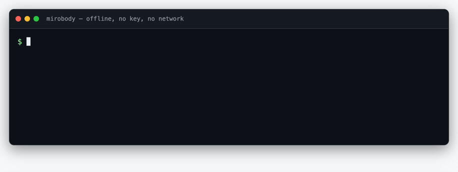
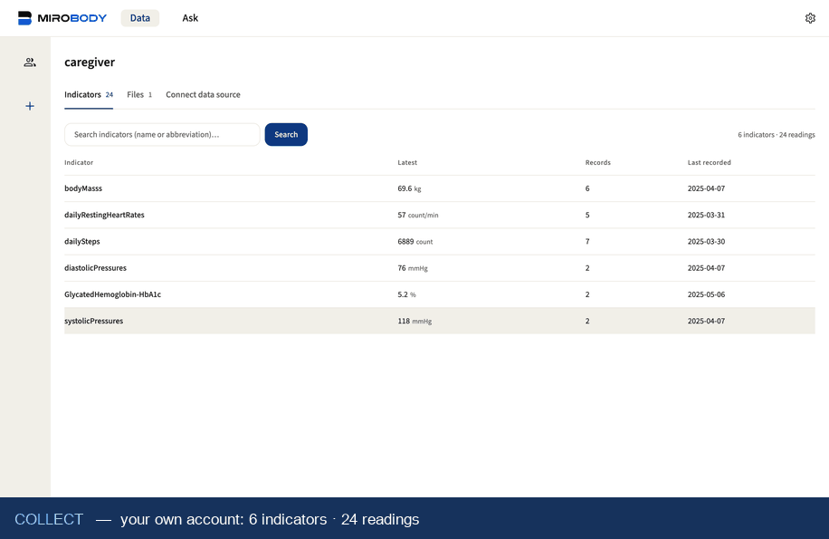
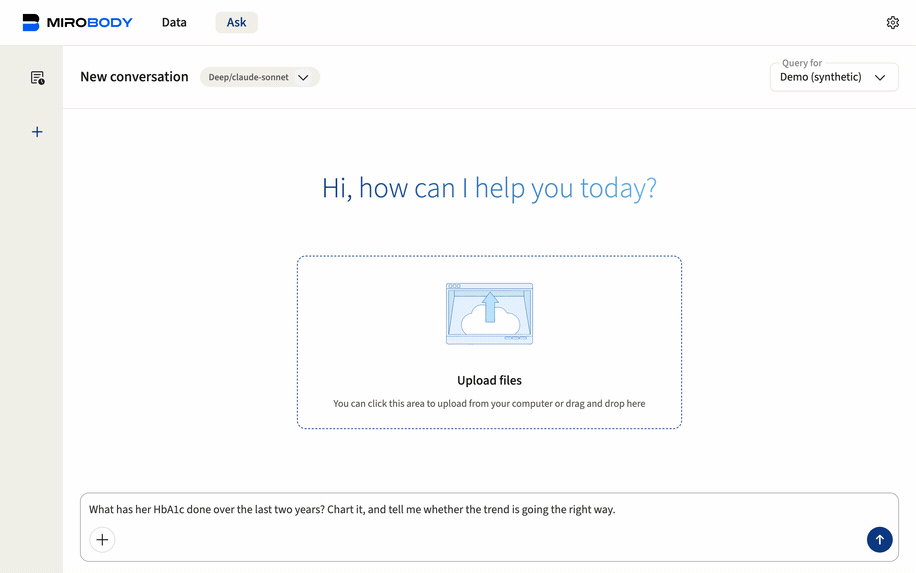
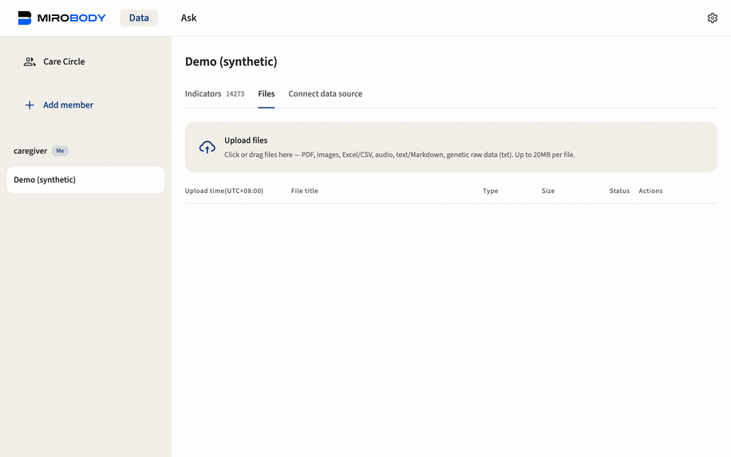
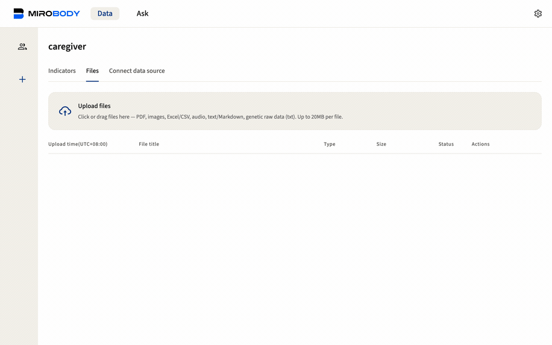

<div align="center">

# 🚀 Mirobody

**The AI-native health data engine — collect, standardize, and reason over labs, wearables & genomics.**

Mirobody powers **Theta Wellness**, a live consumer health product used by 5,000+ registered users with 500+ daily active users.

[](LICENSE)
[](pyproject.toml)
[](https://pepy.tech/projects/mirobody)
[](https://huggingface.co/healthmemoryarena)
[](https://arxiv.org/abs/2604.02834)
[](https://docs.mirobody.ai/)

**[📚 Documentation](https://docs.mirobody.ai/)** · **[💬 Hosted chat — chat.mirobody.ai](https://chat.mirobody.ai/)** · **[🔌 API platform — platform.mirobody.ai](https://platform.mirobody.ai/)**

**English** · **[简体中文](README.zh-CN.md)** · **[繁體中文](README.zh-TW.md)** · **[日本語](README.ja.md)**

*Blood tests, wearables, genomics, imaging — all fragmented, all incompatible.
Before AI can understand your health, someone has to unify these signals into a
single standard AI can actually read. That is what this engine does.*


</div>

The engine does three things, and the codebase (and [Contributing](#-contributing)) is organized around exactly these three stages — the same **C · S · A** the [documentation](https://docs.mirobody.ai/en/api-reference/) uses:

| Stage                | What it means                                                                                                     | Where                                                   |
| -------------------- | ----------------------------------------------------------------------------------------------------------------- | ------------------------------------------------------- |
| **① Collect** | Pull signals in: 3 device providers + a SQL source · 7 file formats · Apple Health (receive-only: a signed iOS client POSTs it in) | [`pulse/`](mirobody/pulse/) |
| **② Standardize**    | One standard: resolve any reading to canonical codes (LOINC · SNOMED CT · RxNorm), normalize units, land against FHIR-recognized code systems | [`indicator/`](mirobody/indicator/)                    |
| **③ Answers**  | Reason: agents read the *original documents* through a virtual filesystem and answer with charts & citations     | [`agent/`](mirobody/agent/)                  |

---

## ⚡ Try it in 60 seconds

Indicator resolution is the engine's front door and needs no key, no config and
no network:

```bash
pip install mirobody
mirobody resolve "LDL cholesterol" 血红蛋白 ヘモグロビン "空腹血糖(GLU)" 血脂
```

<p align="center">
  
</p>

> Real output, and the GIF is a build artifact — [`docs/demo/resolve.html`](docs/demo/resolve.html) rendered by [`scripts/make_demo_gifs.py`](scripts/make_demo_gifs.py), so it cannot drift away from the command it claims to show.

```python
from mirobody.engine import resolve, resolve_reading

resolve("血红蛋白").loinc                                # '718-7'   any language, one code
resolve("total cholesterol").loinc                     # '2093-3'  [Mass/volume]
resolve_reading("total cholesterol", "5.0", "mmol/L")   # '14647-2' [Moles/volume]
resolve_reading("total cholesterol", "193", "mg/dL")    # '2093-3'  the unit picks the code

resolve("中性粒细胞百分比").loinc                          # '26511-6' Neutrophils/Leukocytes
resolve_reading("中性粒细胞", "62 %", None).loinc          # '26511-6' a percentage...
resolve_reading("中性粒细胞", "4.2", "10*9/L").loinc       # '26499-4' ...and a count are two codes
resolve("血脂").resolved                                 # False    a category, not an observation
```

**Pass the value and the unit when you have them.** LOINC encodes the unit *and*
the result type into the identity, so the same name resolves to different codes —
filing a mmol/L result under a mg/dL code is how one series quietly ends up
holding two units. `resolve` abstains rather than guessing: `""` is a gap worth a
second look, `"refused"` is the answer.
→ [Engine reference](https://docs.mirobody.ai/en/engine/) ·
[Indicators](https://docs.mirobody.ai/en/concepts/indicators/)

---

## What the standardization layer provides

Standardization here is not a lookup table but a complete terminology-normalization system:

- **Concept graph**: 440,961 nodes · 22,044,110 cross-vocabulary edges ·
  **595,746 source ids** distilled into canonical concepts (LOINC · SNOMED CT ·
  RxNorm bridges).
- **49,253 multilingual aliases** (中文 22,578 · 日本語 16,809 · +5:
  de·es·fr·ko·ru). `hemoglobin`, `血红蛋白`, `血紅素` and `ヘモグロビン` all land
  on LOINC 718-7.
- **繁體中文 is two problems, handled as two.** Script folding is mechanical
  (a shipped 3,336-character zh-Hant → zh-Hans table); vocabulary is not — Taiwan
  usage picks different words, and folding `血紅素` yields the HbA1c code. Those
  terms are curated under their Traditional spelling, and a curated row always
  beats a fold.
- **Units** normalized to ~310 UCUM families, with dimensional analysis, a
  molar-mass bridge keyed by LOINC code, and an explicit refusal for `%` vs
  `10*9/L`. 305 standard pulse indicators.
- **A second tier exists, and stays opt-in.** Everything above is lexical, so it
  abstains on terms it does not know — an honest ceiling. Cosine recall
  ([`indicator/semantic.py`](mirobody/indicator/semantic.py)) reaches past it but
  **cannot abstain**: for a term it has never seen it returns its nearest
  neighbour with the confidence of a correct answer, and no threshold separates
  the two. **No matrix ships and none is published to download**: it is 108,248
  LOINC rows × 1024 dims (~221 MB) and it is specific to one (provider, model)
  pair, so `scripts/build_loinc_embeddings.py` builds yours against the
  embedding model you configure. A matrix from a different model does not
  error — it ranks confidently in the wrong space, which is why the build
  stamps `<matrix>.meta.json` and loading refuses a mismatch. Until you point
  `MIROBODY_SEMANTIC_INDEX` at one, `resolve()` is unchanged; after, use it to
  *suggest* a code a human confirms, never to mint an identity.
  → [Semantic recall](https://docs.mirobody.ai/en/concepts/semantic-recall/) — the
  benchmark, the two axis gates, and why `min_score` is not a correctness threshold.
- **We measure the claim instead of asserting it.**
  [`test_engine_coverage.py`](mirobody/test_engine_coverage.py) scores the offline
  resolver against the panels an ordinary checkup includes, written the way a report
  prints them, in English, 简体中文, 繁體中文 and 日本語 — plus the wearable
  vocabulary the platform API teaches. **211/211 today; it scored 32/94 the day it
  was written.** It grades *clinical* correctness: answering `血红蛋白` with the
  HbA1c code is a failure, and `血脂` is required to resolve to nothing.

```bash
pytest mirobody/test_engine_coverage.py -s   # offline, about a second
```

### Which LOINC, and what it does and does not cover

The shipped bundle is cut from **LOINC 2.82**, and the package says so at
runtime rather than in a comment that can drift:

```python
>>> import mirobody; mirobody.BUNDLE_VERSION
'loinc-2.82+2026.08.28-af2524b7a285'
```

The release, the cut date, and a digest over the bundle's own members — so a
build-time consumer of the vocabulary and a runtime `pip` pin can be asserted
to be the same corpus, which the package version alone never told you.
[LOINC's licence](https://loinc.org/license/) requires every copy to carry the
version number; `res/fhir_loinc_bundle.NOTICE` does, and
`scripts/stamp_bundle_version.py --check` keeps the stamp honest.

**Why 2.82 and not 2.83.** The axis table and the 677k-row corpus are coupled
through the folded `LONG_COMMON_NAME`, and 2.83 renamed 2,842 of them
(`Cerebral spinal fluid` → `Cerebrospinal Fluid` and that family). Measured:
upgrading the axis alone loses **3,486** name→code links and gains none, so a
real upgrade means rebuilding the corpus — which spans SNOMED CT, RxNorm, CVX
and DCM, each licensed separately and none redistributable here. The known
cost of staying: 650 codes that 2.83 has marked DISCOURAGED or DEPRECATED are
still answerable, which shows up as 52 of the 6,815 benchmark cases that
resolve. Withholding them was measured too and not taken — LOINC offers a
replacement for only 9 of the 658, so it would mostly turn a dated code into no
code, and a reading with no code cannot be grouped at all.

**LOINC covers more of the wearable world than people expect.** It is not only
lab panels: `BDYWGT.*` codes body composition (`101685-6` body bone mass,
`73964-9` body muscle mass, `101684-9` percentage of body water), `HRTRATE.*`
distinguishes resting heart rate (`40443-4`) from a spot reading, and there are
codes for step counts (`41950-7`), sleep stages (`93831-6` deep, `93830-8`
light), HRV SDNN (`112429-6`), VO₂ peak and elevation climbed. Where it stops
is vendor composites — Garmin's Body Battery and stress score have no code,
correctly, because they are one company's formula rather than a measurement.

**Coverage of a vocabulary is not the same as recall on it**, and the gap is
ours, not LOINC's: `Body bone mass` resolves to `101685-6` here, while the
Chinese `骨量` resolves to a dental volume code, because no alias routes it.
That is what [`res/resolver_overrides.tsv`](mirobody/res/resolver_overrides.tsv)
is for — a row written by a person beats a surface match in the index, every
time.

→ [loinc.org](https://loinc.org/) · [licence](https://loinc.org/license/) ·
[release notes](https://loinc.org/kb/) · the download is free but requires an
account, which is why the derived bundle ships and the source release does not.

→ [Standardization](https://docs.mirobody.ai/en/api-reference/standardization/) ·
[Architecture](https://docs.mirobody.ai/en/concepts/architecture/) ·
[Data flow](https://docs.mirobody.ai/en/concepts/data-flow/)

---

## 📊 Benchmarks — open and independently reproducible

Our health-AI benchmarks are the **most-downloaded in their category on Hugging
Face** (4,000+ each):

| Benchmark | What it measures | Downloads |
| --- | --- | --- |
| [ESL-Bench](https://huggingface.co/datasets/healthmemoryarena/ESL-Bench) | Event-driven longitudinal health agents — 100 synthetic users, 10,000 queries, programmatic ground truth ([arXiv:2604.02834](https://arxiv.org/abs/2604.02834)) | 4,800+ |
| [MedHall-Bench](https://huggingface.co/datasets/healthmemoryarena/MedHall-Bench) | Medical hallucination | 4,500+ |
| [MedHarm-Bench](https://huggingface.co/datasets/healthmemoryarena/MedHarm-Bench) | Harmful medical advice | 4,300+ |

Reproduce any of them with one command via
**[mirobody-eval](https://github.com/thetahealth/mirobody-eval)**, which also
seeds a deployment with synthetic (PHI-free) trajectories.

---

## 🚀 Run the whole thing

```bash
git clone https://github.com/thetahealth/mirobody.git && cd mirobody
git lfs install && git lfs pull   # the engine's data bundles; `resolve` needs them — `install` first, or a fresh clone holds pointer stubs
./deploy.sh           # Postgres + pgvector, Redis, server, worker
```

Then open **http://localhost:18060**. The server prints the accounts it accepts
at startup — the shipped one is `caregiver@mirobody.ai`, code `111111`, named for
the role it plays: you sign in as the caregiver and the record you read belongs to
someone else.

No mail provider? You do not need one. The sign-in page opens on **password**,
with email-code as a third tab:

```bash
curl -X POST localhost:18060/password/register -H 'Content-Type: application/json' \
     -d '{"email":"you@example.com","password":"at-least-8-chars"}'
```

**One key runs everything.** Set an [OpenRouter key](https://openrouter.ai/keys)
in `OPENROUTER_API_KEY` — for the Docker stack that means the `.env` file next
to `compose.yaml`, then `docker compose restart` (that alone suffices: the app
re-reads `/app/.env`; a shell `export` does not reach the containers) — and
conversation, vision file parsing and semantic
indicator search are all live — chat via Claude/GPT/DeepSeek, embeddings via
the open-weights Qwen3-Embedding-8B (self-hostable: serve the same model
behind any OpenAI-compatible `/v1/embeddings` and point
`OPENROUTER_BASE_URL` at it).

Indicator search embeds **your own indicator names**, not the LOINC corpus:
the worker's `IndicatorSyncTask` writes `th_series_dim.embedding_qwen3_8b` on
each ingest, and the query is matched against that. It needs `mirobody worker`
running, which `./deploy.sh` starts. That is a different index from the
downloadable-corpus matrix the second tier wants, and it is the one that comes
for free.

If openrouter.ai is unreachable from your network (the case in mainland
China), a [DashScope key](https://dashscope.console.aliyun.com/apiKey) in
`DASHSCOPE_API_KEY` is a drop-in replacement — chat via Qwen (DeepSeek/Kimi
one uncomment away), vision via qwen3-vl, embeddings via text-embedding-v4.

No further configuration either way; direct provider keys (Google, OpenAI)
remain supported — see `config.yaml`.
→ [Docker deployment](https://docs.mirobody.ai/en/deployment/docker/) ·
[Configuration](https://docs.mirobody.ai/en/configuration/) ·
[Local Python setup](https://docs.mirobody.ai/en/development/setup/)

### 👨‍👩‍👧 The whole engine, in four minutes

`SEED_DEMO_DATA` defaults to on, so the ① → ② → ③ chain is walkable the moment
`./deploy.sh` finishes — signing in and browsing the seeded record need no
key; the upload extraction in part 2 and the questions after it ride the one
key configured above. Four parts, each recorded against the running stack.

**1 · Arrive.** You sign in owning a **thin** record — a few weeks of
self-tracked vitals and one unremarkable checkup, seeded as your own — and find
one synthetic person sharing a **thick** one with you: **Demo (synthetic)**,
244 indicators and 14,273 readings across two years, five documents the agent
can `read_file`. Same question, two records: *your* HbA1c answers with one
boring-normal value from data you own; *hers* answers with a two-year story
from data you can only view. Isolation you can see, not just read about.

<p align="center">
  
</p>

<div align="center">

</div>

The switch in that diagram is a column, not a promise:
`care_circle_members.health_access`, `NOT NULL DEFAULT 0`, on **your own** row.
Being invited into a circle shares nothing — the member decides, and no other
person's action can raise it. The check that reads it raises rather than
returning a falsy value, so a route that forgets to look answers 403 instead of
handing over a record.
[`examples/06_care_circle_rules.py`](examples/06_care_circle_rules.py) prints
the whole decision table offline.

**2 · ③ Answers, on someone else's record.** Ask about her HbA1c and the agent
finds the data itself, cross-references the lab draws against the sensor-derived
series, and charts both — then tells you the improvement did not hold.

<p align="center">
  
</p>

```
lab-drawn HbA1c   7.2 % (2024-04)  →  6.5 % (2024-10)  →  6.6 % (2025-04)
                  only 3 lab draws in two years — the sensor eA1C has 104
```

**3 · ① Collect + ② Standardize, on your own.**
`demo/lab_report_2025-10-15.pdf` is a panel deliberately held out of the
seed, so uploading it is not a no-op. Drop it on the Data page and twelve
analytes come out with their values and units in seconds, each linking back to
the page it was read from.

<p align="center">
  
</p>

**4 · ③ Answers, on what you just uploaded.** Ask again, now about your own
record. The agent reads the report through the virtual filesystem, flags all
twelve results against their printed reference ranges — and says plainly that one
date is not a trend.

<p align="center">
  
</p>

That contrast is the demo's point: **two years of history buys a trend, one panel
buys an interpretation.** Both answers cite what they read.

Every value is synthetic — generated for ESL-Bench by
[mirobody-eval](https://github.com/thetahealth/mirobody-eval) and vendored, so the
seed needs no network and no key. Set `SEED_DEMO_DATA=false` for a deployment that
will hold real data. What the extraction pass does *not* yet do with those twelve
readings is written down in [docs/roadmap.md](docs/roadmap.md) rather than glossed
over here.

---

## 🧩 Extend it

Four directory keys point at plugin roots; drop a file in and restart — or
`pip install` a package that declares a `mirobody.providers` / `mirobody.tools`
/ `mirobody.agents` entry point. Tools become both agent tools and MCP tools
with no extra wiring.

| You want | Drop it in | Docs |
| --- | --- | --- |
| A new tool | `mirobody/agent/tools/` | [Adding tools](https://docs.mirobody.ai/en/tools/adding-tools/) |
| An Agent Skill (SKILL.md) | `mirobody/agent/skills/` | [Skills](https://docs.mirobody.ai/en/tools/skills/) |
| Your own agent harness | `AGENT_DIRS` → your directory (replaces the shipped agent) | [`mirobody/agent/README.md`](mirobody/agent/README.md) |
| A device provider | `mirobody/pulse/providers/` | [Provider integration](https://docs.mirobody.ai/en/development/provider-integration/) |
| These tools in Claude Desktop, Cursor, or your own agent loop | Settings → MCP (your personal `/mcp` URL) | [MCP servers](https://docs.mirobody.ai/en/api-reference/mcp-servers/) · [`examples/07_claude_agent_sdk.py`](examples/07_claude_agent_sdk.py) |

Every tool the agent has is also served over MCP at `/mcp`, gated per user.
→ [Built-in tools](https://docs.mirobody.ai/en/tools/built-in/) ·
[MCP servers](https://docs.mirobody.ai/en/api-reference/mcp-servers/)

---

## 🔌 Use it from your own code

| Surface | For | Docs |
| --- | --- | --- |
| `pip install mirobody` | Offline resolution and units — 2 packages, no key, no network | [Engine](https://docs.mirobody.ai/en/engine/) |
| `pip install 'mirobody[parse]'` | The above, plus turning a document into readings — PDF, image, Excel, Word, PowerPoint, text; a born-digital report needs a text model key only, and only a scanned page reaches a vision model | [Engine](https://docs.mirobody.ai/en/engine/) |
| `pip install 'mirobody[agent]'` | The deepagents harness as a library — middleware, virtual-filesystem backends, checkpointer, model clients — for an agent you run yourself | [Bringing your own agent](CONTRIBUTING.md#-bringing-your-own-agent) |
| `mirobody.bundle` | Build-time: the LOINC axis table and alias sources, for generating a seed or corpus | [`mirobody/bundle.py`](mirobody/bundle.py) |
| HTTP API | Your app talking to a deployment | [API overview](https://docs.mirobody.ai/en/api-reference/overview/) · [Data](https://docs.mirobody.ai/en/api-reference/data/) |
| MCP | Claude, Cursor, or any MCP client reading a user's record | [MCP servers](https://docs.mirobody.ai/en/api-reference/mcp-servers/) |
| Backbone mode | Your own agent, our data layer | [Backbone](https://docs.mirobody.ai/en/api-reference/backbone-mode/) |

Not sure which? → [Choose your API](https://docs.mirobody.ai/en/api-reference/choose-your-api/)

---

## 🏗️ Repository layout

```
mirobody/
├── engine.py    the front door — resolve() and parse_file()
├── units/       UCUM units, unit_family, conversions          ┐ the library:
├── lexical.py   surface folding + the CJK-aware tokenizer     │ numpy only,
├── bundle.py    build-time: the axis table and alias sources    │
├── res/         the shipped LOINC bundles, res/metrics.tsv       │
├── kernel/      what health data MEANS, as pure functions:       │
│                metrics · series · quality · overlay · meds ·    │
│                query · tools · ops · connect · sink · events ·  │
│                evidence · memory · vendors/                     ┘ 2 packages
├── documents/   a file becomes text, by kind — PDF text layer, OCR for scanned pages only, Office, text   [parse]
├── pulse/       ① Collect     — providers, file parsing, store, aggregate, read (Postgres)
├── indicator/   ② Standardize — resolver internals, concept graph, bundle build
├── agent/       ③ Answers     — the agent: models/ fs/ wire/ middleware/ tools/ chat/
├── mcp/         the MCP server
├── server/      the HTTP application — routers, auth, the bundled web client
├── utils/       mechanisms a consumer binds: config, db, sse, net, llm_output, prompts, log
├── user/        identity and the care circle — who may read whose record
└── schema/      the DDL, replayed at boot in dev

demo/            the care-circle demo fixture, beside frontend/ — a checkout
frontend/        the bundled web client                          has them, a
                                                                 pip install
                                                                 does not
```

**Two forms, and they want opposite things.** The PyPI package is a LIBRARY and
is meant to be small enough that nobody has to think about it: `pip install
mirobody` is **2 packages, 52 MB** — the entries above the `documents/` line, on numpy.
`[parse]` adds document reading, `[agent]` the harness as a library; `[app]` is everything, and the only thing that
installs it is `requirements.txt`, because the Docker application is
`git clone && ./deploy.sh` and never a pip install.

**Machine-enforced, not documented:** four import-linter contracts hold the
lines — the library layer imports nothing but numpy, and the engine never
imports the agent layer — and `lint-imports` fails the build. A separate gate, `scripts/check_wheel_data.py`, keeps the bundle-build passes and the
v2 semantic pipeline — 19,000 lines nobody who installs the package can run —
out of the artifact.

→ [Architecture](https://docs.mirobody.ai/en/concepts/architecture/) ·
[CONTRIBUTING.md](CONTRIBUTING.md)

---

## 📚 Documentation

For full documentation, see **[docs.mirobody.ai](https://docs.mirobody.ai/)**
(English and Simplified Chinese).

| | |
| --- | --- |
| [Quickstart](https://docs.mirobody.ai/en/quickstart/) · [Installation](https://docs.mirobody.ai/en/installation/) · [Self-host](https://docs.mirobody.ai/en/self-host/) | Getting it running |
| [Indicators](https://docs.mirobody.ai/en/concepts/indicators/) · [Providers](https://docs.mirobody.ai/en/concepts/providers/) · [File processing](https://docs.mirobody.ai/en/concepts/file-processing/) | How the three stages work |
| [API reference](https://docs.mirobody.ai/en/api-reference/) · [Streaming](https://docs.mirobody.ai/en/api-reference/streaming/) · [Function calling](https://docs.mirobody.ai/en/api-reference/function-calling/) | Building against it |
| [Contributing](https://docs.mirobody.ai/en/development/contributing/) · [Setup](https://docs.mirobody.ai/en/development/setup/) | Working on it |

### In-repo, for contributors

Each package carries a `README.md` saying what it is; long-form guides live in
[`docs/`](docs/). All of it is English, whichever README you arrived from.

| | Where |
| --- | --- |
| Runnable examples | [`examples/`](examples/README.md) |
| The kernel | [`kernel/`](mirobody/kernel/__init__.py) — the stage → module map · [pipeline](docs/pipeline.md) — eleven stages, ten invariants |
| ① Collect | [`pulse/`](mirobody/pulse/README.md) · [providers](mirobody/pulse/providers/README.md) · [aggregation](mirobody/pulse/aggregate/README.md) · [Apple Health](mirobody/pulse/apple/README.md) |
| ① guides | [connect a wearable](docs/provider-setup.md) · [write a provider](docs/provider-guide.md) · [file processing](docs/file-processing.md) · [`documents/`](mirobody/documents/__init__.py) · [Apple Health API](docs/apple-health.md) |
| ② Standardize | [`indicator/`](mirobody/indicator/README.md) · [indicators & units](mirobody/pulse/standardize/README.md) |
| ③ Answers | [`agent/`](mirobody/agent/README.md) · [tools](mirobody/agent/tools/README.md) · [the one data tool](docs/answers.md) · [medications](docs/medications.md) |
| Plumbing | [configuration](mirobody/utils/config/README.md) · [database schema](mirobody/schema/README.md) · [the web client](docs/frontend.md) · [backup & restore](docs/backup-restore.md) |
| Working on it | [CONTRIBUTING.md](CONTRIBUTING.md) · [AGENTS.md](AGENTS.md) · [testing](docs/testing.md) · [aggregator script](docs/aggregation-tests.md) · [roadmap](docs/roadmap.md) · [CHANGELOG](CHANGELOG.md) · [SECURITY](SECURITY.md) |

---

## 🤝 Contributing

The highest-leverage contribution is a term the resolver gets wrong. Run
`mirobody resolve "<term>"`, and if the answer is wrong or empty add a row to
[`resolver_overrides.tsv`](mirobody/res/resolver_overrides.tsv) plus a case to
[`test_engine_coverage.py`](mirobody/test_engine_coverage.py) — the coverage score
is the review.

```bash
pip install -e '.[test]' && pytest -q && lint-imports
```

→ [Contributing guide](https://docs.mirobody.ai/en/development/contributing/) ·
[CONTRIBUTING.md](CONTRIBUTING.md)

---

## 🙏 Acknowledgements

Mirobody standardizes health data and reasons over it; it does not try to be
the best way to connect a device. Projects that shaped the kernel's rules —
none of their code is included here:

- **[Open Wearables](https://github.com/the-momentum/open-wearables)** (MIT,
  © 2025 Momentum) — a self-hosted wearable integration platform with twelve
  provider connectors and mobile SDKs. Its data-standardization write-up
  enumerates the failure modes (daily totals summed with their own samples,
  offset-only day boundaries, silent unit assumptions, read-time election)
  that `mirobody.kernel.series`, `mirobody.kernel.quality` and `res/metrics.tsv` exist to
  close. If you need the connectors, run Open Wearables and point a mirobody
  decoder at its `/timeseries` API.
- **[Home Assistant](https://github.com/home-assistant/core)** — the
  `state_class` idea behind the indicator catalogue.
- **[Open mHealth](https://github.com/openmhealth/schemas) / IEEE 1752** —
  the `effective_*` / `modality` field names on a fact.
- **[wearipedia](https://github.com/Stanford-Health/wearipedia)** — seeded
  synthetic vendor payloads instead of real people's data.
- **[dlt](https://github.com/dlt-hub/dlt), [Airbyte](https://github.com/airbytehq/airbyte-python-cdk),
  [Singer](https://github.com/meltano/sdk)** — write dispositions and the
  check / discover / read shape of a connector.
- **[deepagents](https://github.com/langchain-ai/deepagents), LangChain,
  [langchain-quickjs](https://github.com/langchain-ai/langchain-quickjs)** —
  the agent harness, the file-system projection and the `eval` REPL.
- **Regenstrief Institute (LOINC), UCUM, HL7 FHIR, OHDSI OMOP** — the code
  systems and resource shapes the catalogue and the medication model are
  anchored to; see `LICENSE-3RD-PARTY`.

## ⭐ Star History

<div align="center">
<a href="https://star-history.dera.page/#thetahealth/mirobody&Date">
  <picture>
    <source media="(prefers-color-scheme: dark)" srcset="https://star-history.dera.page/svg?repos=thetahealth/mirobody&type=Date&theme=dark" />
    <source media="(prefers-color-scheme: light)" srcset="https://star-history.dera.page/svg?repos=thetahealth/mirobody&type=Date" />
    
  </picture>
</a>
</div>

---

<div align="center">

**[📚 Docs](https://docs.mirobody.ai/)** · **[💬 Chat](https://chat.mirobody.ai/)** · **[🔌 Platform](https://platform.mirobody.ai/)** · **[🧪 Eval](https://github.com/thetahealth/mirobody-eval)**

Apache 2.0 · © 2026 [Theta Health](https://thetahealth.ai)

</div>
