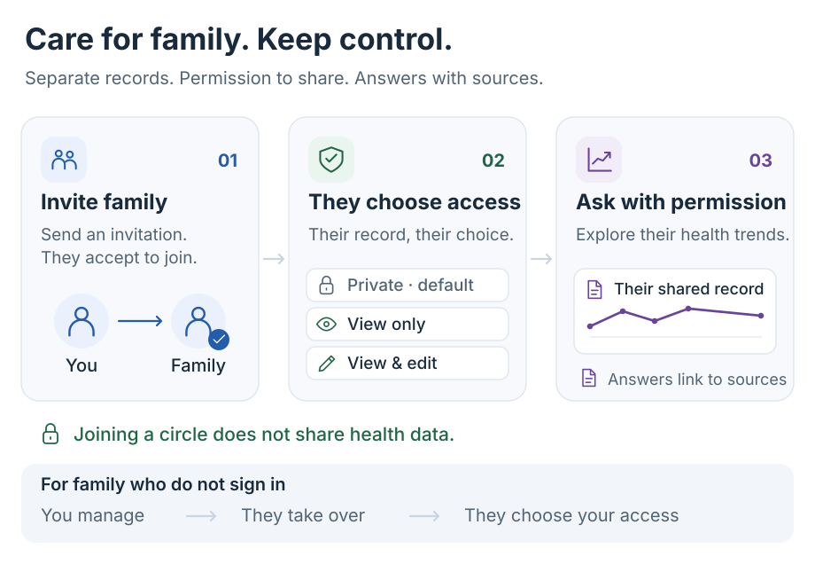

<div align="center">

<picture>
  <source media="(prefers-color-scheme: dark)" srcset="docs/images/mirobody-icon-dark.svg">
  
</picture>

# Mirobody

**Turn scattered health data into answers you can trace.**

A self-hosted AI health data engine for lab reports, wearables and genetic files.<br>
Start with Docker and one model key, or run every model on your own machine.

**English** · **[中文](README.zh-CN.md)**

[](https://pypi.org/project/mirobody/)
[](LICENSE)
[](https://github.com/thetahealth/mirobody/stargazers)

**[▶ Live demo](https://chat.mirobody.ai/demo)** · **[🐳 Start with Docker](#start-with-docker)** · **[📚 Documentation](https://docs.mirobody.ai/en/self-host)**

</div>

<p align="center">
  
</p>
<p align="center"><em>Three reports, three names for the same test. One trend, with the file behind every number.</em></p>

## Start with Docker

Docker with Compose is all the stack needs: no Python, Node.js or GPU. On Windows, run these in a WSL 2 terminal.

```bash
git clone --depth 1 https://github.com/thetahealth/mirobody.git && cd mirobody
./deploy.sh
```

Open the setup link the script prints and paste one model key: [OpenRouter](https://openrouter.ai/keys), [OpenAI](https://platform.openai.com/api-keys), [Gemini](https://aistudio.google.com/apikey), [Anthropic](https://platform.claude.com/settings/keys), DeepSeek, DashScope, or any OpenAI-compatible gateway. The key is kept only after one real request through it works. Postgres, the server, the worker and a synthetic demo record start together.

1. **Sign in** as `you@mirobody.ai`, code `111111`, on the Email code tab. The demo holds **2,019 readings** across two records: yours, and `mom@mirobody.ai`'s, which she shares with you view-only.
2. **Ask** "How has my cholesterol changed?" The answer charts the trend and names the file behind each number.
3. **Upload** a sample from [`demo/upload/`](demo/) on the Data page, or switch to mom's record and ask again.

<details>
<summary><strong>Prefer every model on your own machine? No model key needed.</strong></summary>

<br>

From the cloned folder, start the stack with llama.cpp's CPU image beside it:

```bash
COMPOSE_PROFILES=local-cpu ./deploy.sh
```

The script points Mirobody at [llama.cpp](https://github.com/ggml-org/llama.cpp), which serves a small answering model and a document reader; the setup page has nothing to ask. Allow 16 GB of memory, at least 8 GB of it for Docker, and a one-time download of about 3.7 GB. With no GPU a first answer takes minutes: 2–3 on an M1 Pro's cores, up to about 15 on a 4-vCPU x86 server. On a Mac, running `llama-server` natively uses the GPU: about 30 s per answer on a 16 GB M1 Pro.

<p align="center">
  
</p>

[Mac, NVIDIA and Windows setup](docs/local-models.md) · [Which model to choose](docs/model-choice.md)

</details>

→ [Self-host guide](https://docs.mirobody.ai/en/self-host) · [Walkthrough](docs/walkthrough.md) · [Deploy on a server](https://docs.mirobody.ai/en/deployment/production)

## What you can do

- **Compare reports across labs.** PDFs, phone photos and spreadsheets, 23 file types in all, land in one history. Every reading links to the page it was read from.
- **Bring in everyday data.** Import an Apple Health export, or connect Garmin, Oura and Whoop.
- **Look after your family.** Invite someone who shares their own record, or keep one for a parent who never signs in.
- **Write a health journal.** `headache since last night, BP 150/95, no fever` becomes a coded complaint and two coded readings; "no fever" is not logged as a fever.
- **Explore genetic data.** Upload a 23andMe, AncestryDNA or WeGene export, or a VCF, and ask by rsID, gene or region. Drug questions get CPIC coverage, never a change of medication.
- **Use your own agent.** Connect Claude Code, Codex or Cursor over MCP, or embed the offline engine in Python.

## Collect · Translate · Agent

<p align="center">
<picture>
  <source media="(prefers-color-scheme: dark)" srcset="docs/images/collect-translate-agent-dark.svg">
  
</picture>
</p>

| Stage | What it does | Where |
| --- | --- | --- |
| **① Collect** | Files, devices and journal entries come in; the source is kept, so every reading points back to it. | [`collect/`](mirobody/collect/) |
| **② Translate** | `A1c`, `HbA1c` and `Glycated Hemoglobin` resolve to one code, units to one standard, offline. A name it cannot place stays unresolved. | [`engine/`](mirobody/engine/) · [`translate/`](mirobody/translate/) |
| **③ Agent** | Ask over the coded record: trends, comparisons across labs and devices, a chart, and the file behind every number. | [`agent/`](mirobody/agent/) |

The model reads documents and reasons; the codes and units come from vocabularies bundled with the package, never from the model. [How a reading moves through the pipeline](docs/pipeline.md).

## Care for your family

<p align="center">
  <picture>
    <source media="(max-width: 640px) and (prefers-color-scheme: dark)" srcset="docs/images/care-circle-sharing-mobile-dark.svg">
    <source media="(max-width: 640px)" srcset="docs/images/care-circle-sharing-mobile.svg">
    <source media="(prefers-color-scheme: dark)" srcset="docs/images/care-circle-sharing-dark.svg">
    
  </picture>
</p>

Joining a care circle shares nothing by itself. Each member decides whether others may view or edit their own record. A parent who never signs in can be managed by you until they claim the record and choose what you keep. [See it in the walkthrough](docs/walkthrough.md).

## What stays on your machine

Your record lives in a Postgres you run, and nothing here reports usage anywhere. What leaves depends on who reads it:

| | With a model key | 100% on this machine |
| --- | --- | --- |
| Your documents and questions | sent to that model vendor, under its terms | stay here |
| A name to a code, a unit to UCUM (**② Translate**) | here, from the bundled vocabulary, with no network | the same |
| Model weights | none | downloaded once from Hugging Face |

Device vendors see data only after you link one. Before this reaches a network you do not control, read [SECURITY.md](SECURITY.md): it lists every address the server can call.

## Build on Mirobody

| You want | Start here |
| --- | --- |
| Your record in Claude Code, Codex, Cursor or Gemini CLI | **Settings → MCP link**, then [one line per client](https://docs.mirobody.ai/en/tools/mcp-integration) |
| Names and units resolved in your own code | `pip install mirobody`: offline, no key, numpy the only dependency ([library guide](docs/quickstart.md#a--the-library)) |
| Your coding agent taught the workflow | `npx skills add thetahealth/mirobody --skill translate-health-data` ([skills](skills/README.md)) |
| A new device provider or tool | Drop a file into `mirobody/collect/providers/` or `mirobody/agent/tools/` ([CONTRIBUTING](CONTRIBUTING.md)) |
| A hosted API instead | [Mirobody Cloud](https://docs.mirobody.ai/en/api-reference/quickstart) |

Over MCP the stack serves seven tools, each scoped to the signed-in person: four read your record (readings, medications, genotypes, pharmacogenomics) and three resolve names and units.

Try the vocabulary with no key, no network and, with `uvx`, no install:

```bash
uvx --python 3.12 mirobody resolve "LDL cholesterol" 血红蛋白 ヘモグロビン 血脂
```

```python
from mirobody.engine import resolve, resolve_reading

resolve("血红蛋白").loinc                                     # '718-7'   any language, one code
resolve_reading("total cholesterol", "5.0", "mmol/L").loinc  # '14647-2' the unit picks the code...
resolve_reading("total cholesterol", "193", "mg/dL").loinc   # '2093-3'  ...mass, not moles
resolve("中性粒细胞百分比").loinc                               # '26511-6' Neutrophils/Leukocytes
resolve("血脂").resolved                                     # False    a category, not one test
```

### Numbers you can check

| Claim | Check it |
| --- | --- |
| **317/317** on the tests an ordinary checkup prints, in English, Chinese, Japanese, Russian and Estonian | [`test_engine_coverage.py`](mirobody/tests/test_engine_coverage.py) prints the score |
| **330 UCUM units** with dimensional analysis, and **316 standard device indicators** | [Standardization](docs/standardization.md) · [Device crosswalk](docs/device-crosswalk.md) |
| The package names its vocabulary: `mirobody.BUNDLE_VERSION` is `loinc-2.83+2026.09.17-aacb2c715b56` | `python -c "import mirobody; print(mirobody.BUNDLE_VERSION)"` |
| Public health-agent benchmarks: [ESL-Bench](https://huggingface.co/datasets/mirobody/ESL-Bench), [MedHall-Bench](https://huggingface.co/datasets/mirobody/MedHall-Bench), [MedHarm-Bench](https://huggingface.co/datasets/mirobody/MedHarm-Bench) | [`mirobody-eval`](https://github.com/thetahealth/mirobody-eval) · [`benchmarks/`](benchmarks/README.md) |

Mirobody is the engine under [Theta Wellness](https://www.thetahealth.ai/), a live consumer health app.

## Contributing

The most useful contribution is a term the resolver gets wrong. Run `mirobody resolve "<term>"`; if the answer is wrong or empty, [report it](https://github.com/thetahealth/mirobody/issues/new?template=wrong-term.yml) or send a fix with a test case. [CONTRIBUTING.md](CONTRIBUTING.md) has the setup and the checks.

Built on [HL7 FHIR](https://hl7.org/fhir/), [LOINC](https://loinc.org/) from the [Regenstrief Institute](https://www.regenstrief.org/), [UCUM](https://ucum.org/), [ICPC-3](https://icpc-3.info/) (WONCA), [CPIC](https://cpicpgx.org/), [llama.cpp](https://github.com/ggml-org/llama.cpp) and [deepagents](https://github.com/langchain-ai/deepagents), with thanks. Terminology licences: [`LICENSE-3RD-PARTY`](LICENSE-3RD-PARTY).

<div align="center">

**If Mirobody helped you make sense of a report, a star helps the next person find it.**

[Documentation](docs/README.md) · [Roadmap](docs/roadmap.md) · [Changelog](CHANGELOG.md) · [Security](SECURITY.md) · [AGENTS.md](AGENTS.md)

Apache 2.0 · © 2026 [Theta Health](https://thetahealth.ai)

</div>

<!-- mcp-name: ai.thetahealth/mirobody -->
