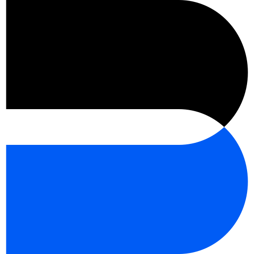
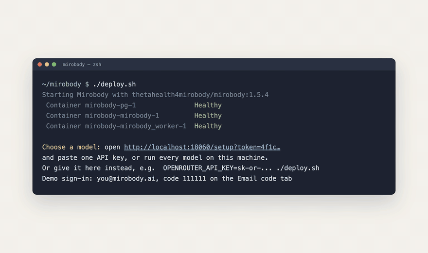
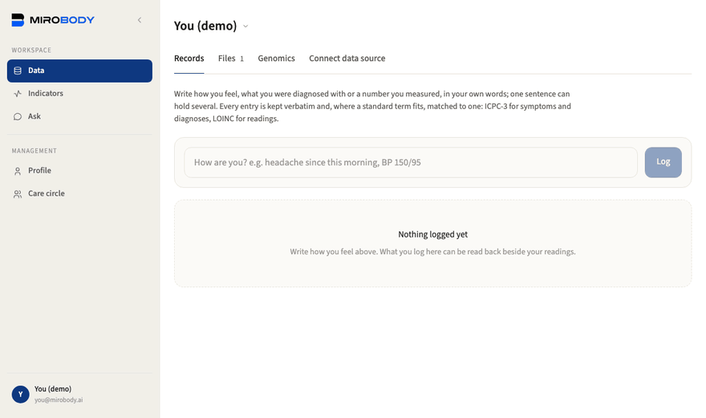
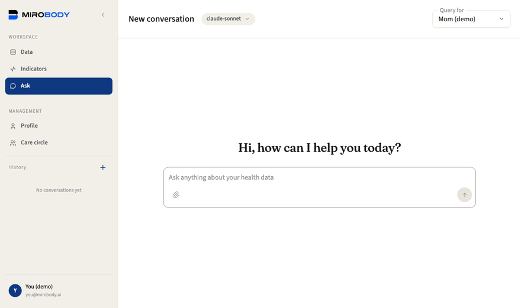
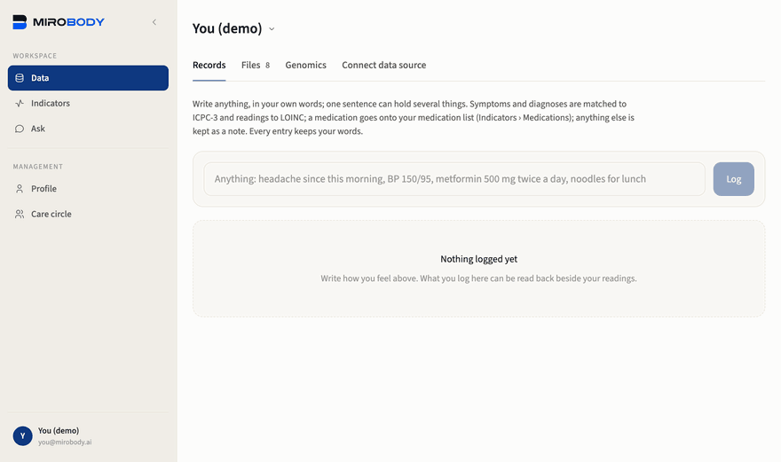
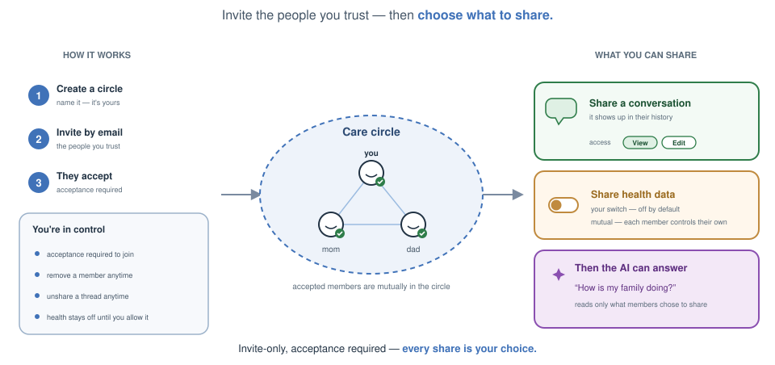
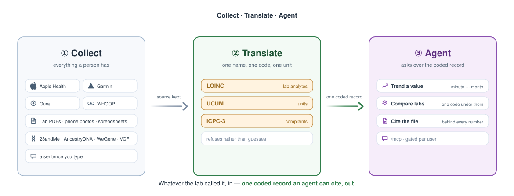
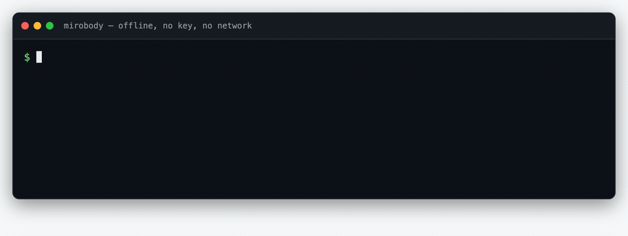

<div align="center">

<picture>
  <source media="(prefers-color-scheme: dark)" srcset="docs/images/mirobody-icon-dark.svg">
  
</picture>

# Mirobody

**Self-hosted AI health data engine: lab reports, wearables and genetic files in one record, and an agent that cites its sources.**

**English** · **[中文](README.zh-CN.md)**

[](https://pypi.org/project/mirobody/)
[](https://hub.docker.com/r/thetahealth4mirobody/mirobody)
[](https://pepy.tech/projects/mirobody)
[](LICENSE)
[](https://github.com/thetahealth/mirobody/stargazers)

**[▶ Live demo, no sign-up](https://chat.mirobody.ai/demo)** · **[📚 Documentation](https://docs.mirobody.ai/en/self-host)** · **[🐳 Docker Hub](https://hub.docker.com/r/thetahealth4mirobody/mirobody)** · **[☁ Cloud API](https://platform.mirobody.ai/)**

</div>

---

Last year's checkup wrote `A1c`, this year's panel `HbA1c`, the new clinic `Glycated Hemoglobin`. One test, three names, nothing to compare. Mirobody reads any source, any format, any language, settles every value onto one standard, and answers questions over that record with each number traced to its file. It runs on your machine, with one model key or with every model on that same machine, served by [llama.cpp](https://github.com/ggml-org/llama.cpp), and the record stays in a Postgres you run.

<p align="center">
  
</p>
<p align="center"><em>Three files, three names for the same test, one code. The agent finds all three, charts the trend, and names the file every number came from.</em></p>

## Run it in two commands

```bash
git clone --depth 1 https://github.com/thetahealth/mirobody.git && cd mirobody
./deploy.sh     # Postgres, server and worker; prints the link to the first-run page
```

The first-run page asks who reads your health data: paste one model key, or choose **100% on this machine** and pick the models a llama.cpp server on this computer serves. A key is kept only after one real request through it works; the choice is stored encrypted and can be changed later in Settings › Model. With a key already in hand, `OPENROUTER_API_KEY=sk-or-... ./deploy.sh` skips the page.

<p align="center">
  
</p>
<p align="center"><em>Recorded on a 16 GB laptop with the default local pair, MiniCPM5-2B answering and GLM-OCR-0.9B reading, both served by llama.cpp. The large size, Qwen3.8-27B, needs about 20 GB.</em></p>

| | Where the models run | You need | What leaves the machine |
| --- | --- | --- | --- |
| **A model key** | at the vendor whose key you paste: OpenRouter, OpenAI, Gemini, Anthropic, DeepSeek, DashScope, or any OpenAI-compatible gateway | Docker and one key | your questions, the rows the agent reads and the documents it reads go to that vendor |
| **100% on this machine** | **[llama.cpp](https://github.com/ggml-org/llama.cpp)'s `llama-server` serves the models**, beside the stack; Mirobody runs no model itself. By default MiniCPM5-2B answers and GLM-OCR-0.9B reads documents; Qwen3.8-27B answers better on more memory. The model names are yours to change ([guide](docs/local-models.md)) | Docker and 16 GB of memory for the default, no GPU, on Windows, Linux or macOS (about 20 GB for Qwen3.8-27B); a one-time 3.0 GB download (14.5 GB) | nothing about you. An answer takes about 30 s on a 16 GB M1 Pro; with no GPU, a first answer takes 2–3 minutes on 4 CPU cores (Qwen3.8-27B: about two minutes on an M4 Pro) |
| **The library alone** | no model: `pip install mirobody` or `uvx --python 3.12 mirobody` resolves names to LOINC and units to UCUM | Python 3.12 | nothing: the vocabulary ships in the package |

With a model key, Docker is the only requirement: no Python, Node.js, GPU or Git LFS, and not even Git (`curl -L https://github.com/thetahealth/mirobody/archive/refs/heads/main.tar.gz | tar xz && cd mirobody-main` is the same checkout). `deploy.sh` writes the secrets and your key into `.env` and pulls the prebuilt image, building it from the checkout when the pull fails. It stops and names the fix when a port is taken or another Mirobody stack already runs under this folder's name. The image runs beside its own Postgres, so `docker run` alone is not a way in. A key added later goes in `.env`, then `docker compose up -d`: a `restart` does not read `.env` again.

1. **Sign in.** The sign-in page offers the demo account, `you@mirobody.ai` with code `111111` on the Email code tab. `SEED_DEMO_DATA` is on by default, so two accounts already hold **2,019 readings**: you, and `mom@mirobody.ai`, who shares her record with you view-only.
2. **Drop a file on the Data page.** [`demo/upload/`](demo/) holds four files the seed leaves out. The lab PDF and the other lab's CSV are yours; the report photo and the spreadsheet are mom's, so drop those signed in as her. Each analyte comes out with a value, a unit and a code, linked to the page it was read from.
3. **Ask.** "How has my cholesterol moved?" finds every file that carries it, whatever the lab called it, charts the trend, and names the file behind each number. The same question on the shared record answers from data you can only view.
4. **Say how you feel.** Type `headache since last night, BP 150/95, no fever, metformin 500 mg morning and evening` under Data › Records. One sentence becomes a coded complaint, two coded readings and a medication on your list, and "no fever" is kept out of the record rather than logged as a fever.

<p align="center">
  
  
  
</p>

**Which key.** Any one of these runs every surface: [OpenRouter](https://openrouter.ai/keys) (`OPENROUTER_API_KEY`), [OpenAI](https://platform.openai.com/api-keys) (`OPENAI_API_KEY`), [Gemini](https://aistudio.google.com/apikey) (`GOOGLE_API_KEY`), [Anthropic](https://platform.claude.com/settings/keys) (`ANTHROPIC_API_KEY`), DeepSeek, DashScope, or any OpenAI-compatible gateway through `<PROVIDER>_BASE_URL`. [`config.llm.yaml`](config.llm.yaml) names the variable (`api_key: OPENROUTER_API_KEY`), never the secret; `mirobody doctor` prints what each surface selected.

**Which model.** [docs/model-choice.md](docs/model-choice.md) puts the local models beside five cloud ones, DeepSeek V4.1 Flash, Claude Sonnet 5.5, Claude Opus 5.5, Gemini 3.8 Flash and GPT-6 Luna, on the same questions, documents and journal sentences: how good the answers are, how fast, what they cost, and who reads your health data in each case.

**Coming in 1.6.0: a Mirobody model.** Small and fast enough for an ordinary computer, post-trained for Mirobody's own tools and documents, and served by llama.cpp like the others: the best fit for this harness, so that a fully private deployment needs nothing more than an ordinary computer.

→ [Self-host guide](https://docs.mirobody.ai/en/self-host) · [Configuration](https://docs.mirobody.ai/en/configuration) · [Deploy on a server](https://docs.mirobody.ai/en/deployment/production)

## What you get

- **Every source, one record.** Garmin, Oura and Whoop connect directly; anything a band, ring or scale writes into Apple Health comes with it; PDFs, phone photos, spreadsheets and exports, 23 file types in all, are read by kind.
- **One record for the whole family.** Invite a partner or a parent, or add a child who never signs in. Sharing is a **care circle**: invite-only, off by default, and one function, `resolve_subject`, is the only way an account reaches a record that is not its own.
- **Say how you feel, in your own words.** Type `headache since last night, BP 150/95, no fever, metformin 500 mg morning and evening` into the journal. Your model splits the sentence and types each part; the codes come from the vocabulary, never from the model.
- **No invented codes.** Every reading lands in one settled system, or the engine says it could not place it and keeps your words. Built and tested against real reports in English, Chinese, Japanese and Russian.
- **Genotypes as facts, not verdicts.** Upload a 23andMe, AncestryDNA, MyHeritage, FTDNA or WeGene export, or a VCF, and ask by rsID, gene or region. A drug question gets CPIC coverage, never a phenotype or a change of medication. [How genetics works](docs/genetics.md).
- **The agent reasons only over coded data, and it need not be ours.** Trends from minutes to months, drawn as a chart; comparisons across labs, files and devices, because one code sits under all of them. Every tool is also served at `/mcp`, gated per user.

<p align="center">
  <picture>
    <source media="(prefers-color-scheme: dark)" srcset="docs/images/your-care-circle-dark.svg">
    
  </picture>
</p>

→ [The four-minute walkthrough](docs/walkthrough.md) · [Device setup](docs/provider-setup.md) for Garmin, Oura and Whoop

## Collect · Translate · Agent

<p align="center">
<picture>
  <source media="(prefers-color-scheme: dark)" srcset="docs/images/collect-translate-agent-dark.svg">
  
</picture>
</p>

| Stage | What it does | Where |
| --- | --- | --- |
| **① Collect** | Lab reports, wearables, phone photos, genetic files, a sentence in the journal, all pulled in. The source is kept as it was, so every reading points back to the page it was read from. | [`collect/`](mirobody/collect/) |
| **② Translate** | One name to one code, one unit to UCUM, offline and deterministic. `A1c`, `HbA1c` and `Glycated Hemoglobin` become the same test here (LOINC), and `头疼` and `headache` the same complaint (ICPC-3). | [`engine/`](mirobody/engine/) · [`translate/`](mirobody/translate/) |
| **③ Agent** | Ask over the coded record. Trend a value by minute, hour, day, week or month; compare across labs and devices, because they share one code. It charts the result in its reply and names the file every number came from. | [`agent/`](mirobody/agent/) |

## Try the engine alone

One command, five spellings, no key, no network, and with `uvx` no install either.

```bash
uvx --python 3.12 mirobody resolve "LDL cholesterol" 血红蛋白 ヘモグロビン "空腹血糖(GLU)" 血脂
```

`--python 3.12` lets uv fetch the Python the package needs: on an older default interpreter it would pick a release from before 1.2 instead.

<p align="center">
  
</p>

`血红蛋白` and `ヘモグロビン`: two languages, one code, 718-7. `血脂` (lipids) names a category, not one observation, so it resolves to nothing rather than a guess.

```python
from mirobody.engine import resolve, resolve_reading, standardize_reading

resolve("血红蛋白").loinc                                     # '718-7'   any language, one code
resolve("total cholesterol").loinc                          # '2093-3'  [Mass/volume]
resolve_reading("total cholesterol", "5.0", "mmol/L").loinc  # '14647-2' [Moles/volume]: the unit picks the code
resolve_reading("total cholesterol", "193", "mg/dL").loinc   # '2093-3'
resolve("中性粒细胞百分比").loinc                               # '26511-6' Neutrophils/Leukocytes
resolve_reading("中性粒细胞", "62 %", None).loinc              # '26511-6' a percentage...
resolve_reading("中性粒细胞", "4.2", "10*9/L").loinc           # '26499-4' ...and a count are two codes
resolve("血脂").resolved                                     # False    a category, not an observation
standardize_reading("血红蛋白", "13.5", "g/dL")["code"]["coding"][0]["code"]  # '718-7'  the same answer as a FHIR Observation
```

Complaints and diagnoses have their own axis, ICPC-3, and the same rule: a code or a stated refusal, never a guess.

```python
from mirobody.translate import resolve_symptom, resolve_condition

resolve_symptom("头疼").code           # 'NS01'         Headache; 'headache', '頭痛' and 'головная боль' answer the same
resolve_symptom("疼").outcome         # 'refused'      too broad to code; the words are kept, the code is not invented
resolve_condition("2型糖尿病").code    # 'TD72'         Type 2 diabetes mellitus
resolve_condition("糖尿病").outcome    # 'needs-input'  which type? asked, not assumed
```

→ [Standardization in depth](docs/standardization.md) · [The library](https://docs.mirobody.ai/en/quickstart#a--the-library) · [`examples/`](examples/README.md)

### Or hand it to your agent

Two skills teach Claude Code, Codex, Cursor or Gemini CLI to use it. One turns raw health files, exports and symptoms into coded rows and reads a lab report against the resolver instead of memory, with no key; the other runs the stack and connects it over MCP:

```bash
npx skills add thetahealth/mirobody --skill translate-health-data
npx skills add thetahealth/mirobody --skill mirobody
```

Or, with no Node, from the plugin marketplace that Claude Code and Codex both read:

```bash
claude plugin marketplace add thetahealth/mirobody && claude plugin install mirobody@mirobody
codex plugin marketplace add thetahealth/mirobody && codex plugin add mirobody@mirobody
```

→ [`skills/`](skills/README.md)

### Or connect it to your agent over MCP

Every tool the built-in agent has is also served at `/mcp`, one link per person: **Settings → MCP link** makes one that opens your record and nothing else. On the same computer:

| Client | Setup |
| --- | --- |
| Claude Code | `claude mcp add --transport http mirobody <link>` |
| Codex | `codex mcp add mirobody --url <link>` |
| Cursor | `~/.cursor/mcp.json`: `{"mcpServers": {"mirobody": {"url": "<link>"}}}` |
| Gemini CLI | `gemini mcp add --transport http mirobody <link>` |
| Claude Desktop | `claude_desktop_config.json`: `{"mcpServers": {"mirobody": {"command": "npx", "args": ["-y", "mcp-remote", "<link>"]}}}`. Its "Add custom connector" connects from Anthropic's cloud, which cannot reach `localhost`. |
| ChatGPT, claude.ai | They connect from the cloud as well, so the stack needs an HTTPS address they can reach: [deploy it on a server](https://docs.mirobody.ai/en/deployment/production), and read [SECURITY.md](SECURITY.md) first. |

Without the stack, `uvx --python 3.12 mirobody mcp` serves the vocabulary over stdio, offline and with no key: names to LOINC, units, and a reading or a complaint to FHIR. Its one tool that reads a whole document, `standardize_report`, also needs the `[parse]` extra and a model key: `uvx --python 3.12 --from 'mirobody[parse]' mirobody mcp`.

## What stays on your machine

Your record lives in your own Postgres, in containers you run, and nothing here reports usage anywhere. What leaves depends on who reads it:

| | With a model key | 100% on this machine |
| --- | --- | --- |
| Your documents and questions | sent to that model vendor, under its terms | stay here |
| A name to a code, a unit to UCUM (**② Translate**) | here, from a bundle inside the package, with no network | the same |
| Model weights | none | downloaded once from Hugging Face (`HF_ENDPOINT` in `.env` names a mirror) |
| A device vendor (Garmin, Oura, Whoop) | only after you link one: its tokens and your own data | the same |
| Container images | pulled by `./deploy.sh` from Docker Hub, or from a mirror when Docker Hub does not answer (`DOCKER_MIRROR=` in `.env` turns the mirror off) | the same |

Encryption at rest covers chat, uploaded files, medication text and your profile, not yet readings or genotypes. Before this reaches a network you do not control, read [SECURITY.md](SECURITY.md), which lists every address the server can call.

## Numbers you can check

| Claim | Check it |
| --- | --- |
| **317/317** on the tests an ordinary checkup prints, written the way a report prints them, in English, Chinese (Simplified and Traditional), Japanese, Russian and Estonian | [`test_engine_coverage.py`](mirobody/tests/test_engine_coverage.py) prints the score when you run it |
| **328 UCUM units** with dimensional analysis, a molar-mass bridge, and an explicit refusal to convert a percentage into a count | [Standardization in depth](docs/standardization.md) |
| **316 standard device indicators** | [Device crosswalk](docs/device-crosswalk.md) |
| The package names the vocabulary that answered you: `mirobody.BUNDLE_VERSION` is `loinc-2.83+2026.09.17-aacb2c715b56` | `python -c "import mirobody; print(mirobody.BUNDLE_VERSION)"` |
| Three public benchmarks for health agents: [ESL-Bench](https://huggingface.co/datasets/mirobody/ESL-Bench) (longitudinal virtual users; paper [arXiv 2604.02834](https://arxiv.org/abs/2604.02834)), [MedHall-Bench](https://huggingface.co/datasets/mirobody/MedHall-Bench) (field-level hallucination: dose, unit, reference range, code) and [MedHarm-Bench](https://huggingface.co/datasets/mirobody/MedHarm-Bench) (red-team safety) | [`thetahealth/mirobody-eval`](https://github.com/thetahealth/mirobody-eval) runs them under one scoring discipline |

The engine powers **[Theta Wellness](https://www.thetahealth.ai/)**, a live consumer health product with 12,000+ registered users and 1,700+ daily active.

## Use it, extend it

| You want | Do this |
| --- | --- |
| Every model on your own machine | `./deploy.sh`, then **100% on this machine** on the page it links; [docs/local-models.md](docs/local-models.md) has the hardware, the models measured and the commands per platform |
| Offline resolution and units in your code | `pip install mirobody` on Python 3.12+: no key, no network, two packages |
| A document turned into readings | `pip install 'mirobody[parse]'`: PDF, image, Excel, Word, PowerPoint, text; only a scanned page reaches a vision model |
| These tools in Claude Code, Codex, Cursor, Claude Desktop or your own loop | Settings → MCP link, then [one line per client](#or-connect-it-to-your-agent-over-mcp) |
| A new tool or device provider | Drop a file into `mirobody/agent/tools/` or `mirobody/collect/providers/` and restart, or `pip install` a package declaring a `mirobody.providers` / `mirobody.tools` / `mirobody.agents` entry point |
| Your coding agent taught to use it | `npx skills add thetahealth/mirobody --skill translate-health-data` for the library, `--skill mirobody` for the stack; see [`skills/`](skills/README.md) |
| Your own agent harness | `pip install 'mirobody[agent]'` for the middleware and virtual-filesystem backends, or point `AGENT_DIRS` at your directory to replace the shipped agent outright |

→ [MCP integration](https://docs.mirobody.ai/en/tools/mcp-integration) · [Adding tools](https://docs.mirobody.ai/en/tools/adding-tools) · [Bringing your own agent](CONTRIBUTING.md#-bringing-your-own-agent)

## Contributing

The highest-leverage contribution is a term the resolver gets wrong. Run `mirobody resolve "<term>"`, or `resolve_symptom` for a complaint; if the answer is wrong or empty, [report it](https://github.com/thetahealth/mirobody/issues/new?template=wrong-term.yml) or add a row to [`resolver_overrides.tsv`](mirobody/res/loinc/resolver_overrides.tsv) plus a case to [`test_engine_coverage.py`](mirobody/tests/test_engine_coverage.py). The coverage score is the review.

```bash
pip install -e '.[app,test]'
pytest -q                                                            # the gates a clone ships
python -m unittest benchmarks.health_records.test_cases              # LOINC/UCUM and ICPC-3 decisions, five languages
python -m unittest discover -s benchmarks/genomics -p 'test_*.py'    # one genotype truth, ten file shapes
lint-imports && ruff check mirobody examples
```

→ [CONTRIBUTING.md](CONTRIBUTING.md) · [`benchmarks/`](benchmarks/README.md) · [AGENTS.md](AGENTS.md) for coding agents · [Repository layout](docs/repository-layout.md) · [Roadmap](docs/roadmap.md) · [CHANGELOG](CHANGELOG.md) · [SECURITY](SECURITY.md)

## Documentation, and what shaped this

**[docs.mirobody.ai](https://docs.mirobody.ai/en/self-host)** has the guides, in English and Chinese. This repository's [`docs/`](docs/README.md) holds the design notes the code is checked against: the pipeline, the answer surface, standardization.

Mirobody's design draws on the following standards and projects, with thanks:
[HL7 FHIR](https://hl7.org/fhir/), [Regenstrief Institute](https://www.regenstrief.org/) ([LOINC](https://loinc.org/)), [UCUM](https://ucum.org/), [ICPC-3](https://icpc-3.info/) (WONCA), [CPIC](https://cpicpgx.org/), [OHDSI OMOP](https://www.ohdsi.org/),
[Open Wearables](https://github.com/the-momentum/open-wearables), [Open mHealth](https://github.com/openmhealth/schemas) / IEEE 1752, [wearipedia](https://github.com/Stanford-Health/wearipedia), [dlt](https://github.com/dlt-hub/dlt) / [Airbyte](https://github.com/airbytehq/airbyte-python-cdk) / [Singer](https://github.com/meltano/sdk), [deepagents](https://github.com/langchain-ai/deepagents) and LangChain. Terminology licences: [`LICENSE-3RD-PARTY`](LICENSE-3RD-PARTY).

<div align="center">

<a href="https://www.star-history.com/#thetahealth/mirobody&Date">
  <picture>
    <source media="(prefers-color-scheme: dark)" srcset="https://api.star-history.com/svg?repos=thetahealth/mirobody&type=Date&theme=dark" />
    <source media="(prefers-color-scheme: light)" srcset="https://api.star-history.com/svg?repos=thetahealth/mirobody&type=Date" />
    
  </picture>
</a>

*If it read a report for you, a star helps the next person find it. Releases land most weeks; [Watch](https://github.com/thetahealth/mirobody/subscription) for them.*

Apache 2.0 · © 2026 [Theta Health](https://thetahealth.ai)

</div>

<!-- mcp-name: ai.thetahealth/mirobody -->
