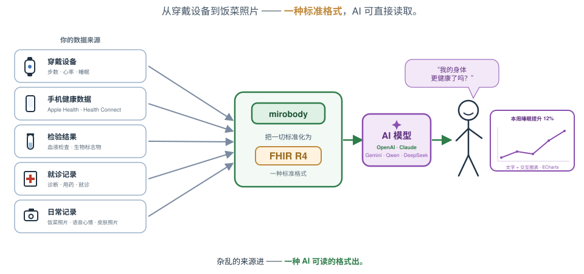
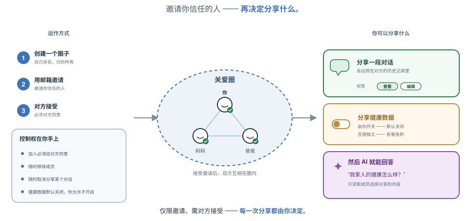

<div align="center">

# 🚀 Mirobody

**AI 原生的健康数据引擎——收集、标准化，并针对检验报告、穿戴设备与基因数据进行推理。**

[](LICENSE)
[](pyproject.toml)
[](https://pepy.tech/projects/mirobody)
[](https://huggingface.co/healthmemoryarena)
[](https://arxiv.org/abs/2604.02834)
[](https://docs.mirobody.ai/)

**[📚 文档](https://docs.mirobody.ai/)** · **[💬 云端聊天服务——chat.mirobody.ai](https://chat.mirobody.ai/)** · **[🔌 API 平台——platform.mirobody.ai](https://platform.mirobody.ai/)**

**[English](README.md)** · **简体中文** · **[繁體中文](README.zh-TW.md)** · **[日本語](README.ja.md)**

*血液检验、穿戴设备、基因数据、影像资料——全都零散破碎，彼此互不兼容。
在 AI 能真正理解你的健康状况之前，得先有人把这些信号统一成一种 AI
真正读得懂的标准格式。这正是这个引擎在做的事。*



</div>

这个引擎做三件事，整个代码库（包括「贡献方式」一节）也完全按照这三个阶段来组织——正是[文档](https://docs.mirobody.ai/en/api-reference/)里用的同一套 **C · S · A**：

| 阶段 | 含义 | 位置 |
| -------------------- | ----------------------------------------------------------------------------------------------------------------- | ------------------------------------------------------- |
| **① 收集** | 把信号拉进来：3 家设备提供者 + 一个 SQL 数据源 · 7 种文件格式 · Apple Health | [`pulse/`](mirobody/pulse/) |
| **② 标准化** | 一套标准：把任意一条读数解析成标准代码（LOINC · SNOMED CT · RxNorm），统一单位，落地到 FHIR 认可的码制 | [`indicator/`](mirobody/indicator/) |
| **③ 解答** | 推理：agent 通过虚拟文件系统读取*原始文件*，并用图表和引用来源作答 | [`agent/`](mirobody/agent/) |

---

## ⚡ 60 秒上手

不需要服务器、不需要密钥、不需要网络——这个术语引擎只是一次 pip install：

```bash
pip install mirobody
mirobody resolve "hemoglobin" "血红蛋白" "血紅素" "ヘモグロビン"
# all four -> LOINC 718-7
```

```python
from mirobody.engine import resolve
resolve("血红蛋白").loinc   # -> '718-7'   offline: no key, no config, no network
```

第三个词才是真正有意思的地方。`血紅素` 和 `血红蛋白` 不是同一个词换了套字形——
台湾和大陆对这个概念用的是**不同的词**，如果只做繁简字符转换，把 `血紅素` 转成
简体会得到 `血红素`，而一个未经校订的原始索引会用**糖化血红蛋白（HbA1c）**的
代码来回答它：那是完全不同的检验项目。单纯的字形转换在这里注定出错，词汇必须
经过人工校订。标准化这一层大部分的工作，做的都是这类事情，而不是那些一眼就能
对上号的简单情况。

### 你实际会调用的两个函数

`resolve()` 回答的是一个**名称**，`resolve_reading()` 回答的是一次**测量结果**
——两者给出的代码并不相同，因为 LOINC 把单位和结果类型都编进了身份标识里：

```python
from mirobody.engine import resolve, resolve_reading

resolve("total cholesterol").loinc                       # '2093-3'   [Mass/volume]
resolve_reading("total cholesterol", "5.0", "mmol/L")    # '14647-2'  [Moles/volume]
resolve_reading("total cholesterol", "193", "mg/dL")     # '2093-3'   unchanged

resolve("尿糖").loinc                                     # '2350-7'   [Mass/volume]
resolve_reading("尿糖", "阴性")                            # '2349-9'   [Presence]
resolve_reading("尿糖", "5.6", "mmol/L")                   # '15076-3'  [Moles/volume]
```

**如果你手上有数值和单位，就把它们一起传进去。**同一个指标会因为读数不同而走向
完全相反的代码——把一条 mmol/L 的结果归到 mg/dL 的代码下，或者把一条「阴性」的
结果归到质量浓度的代码下——这就是一个系列悄悄混进两种单位却没人发现的原因。这
两个函数都是离线运行、结果确定不变，并且可以安全地在循环里调用（第一次之后每
次约 25 微秒）。

每个答案都会说明自己是怎么得到的，而其中一种值和其他不一样：

```python
r = resolve("血红蛋白")
r.loinc, r.canonical, r.method     # '718-7', 'Hemoglobin [Mass/volume] in Blood', 'lexical'

resolve("绝对不存在的指标名xyzzy").method   # ''         never seen it
resolve("血糖(HbA1c)").method              # 'refused'  two different tests in one string
```

`""` 是一个空缺，值得找人再确认一遍；`"refused"` 才是真正的答案——`血糖(HbA1c)`
这个词，括号外是血糖、括号内是 HbA1c，`血脂` 则是四种分析物的统称，两者都没有
哪一个单一代码算对。但一个确实**有**组合代码的组合类词汇不算拒答：
`blood pressure`（血压）→ `85354-9`，这是 FHIR 生命体征规范强制要求的代码，
用来告诉调用方要预期收到多个子项目。
**只有 `method == "lexical"` 才能当作身份标识**（也就是分组键、「这些是同一个
系列」的判断依据、FHIR 镜像）。另一种情况见下文「语义召回」一节。

### 单位：只比较，不假设

```python
from mirobody.indicator.fhir.units import convert_value, convertible

convert_value(5.6, "mmol/L", "mg/dL", loinc_code="1558-6")   # 100.9  (molar-mass bridge)
convert_value(42.0, "U/L", "[IU]/L")                         # 42.0   (1:1, different families)
convert_value(24.0, "kg/m2", "mg/dL")                        # None   (BMI is not a concentration)
convertible("%", "10*9/L")                                   # False  (a fraction is not a count)
```

`None` 是一个答案，不是失败：应该把两条读数分开报告，而不是硬把一个换算成另一
个的样子。**不要**用 `unit_family()` 来判断能不能换算——它是一个 LOINC PROPERTY
分类器，用在这个问题上两个方向都会出错（`kg/m2` 和 `mg/dL` 属于同一个单位家族，
却无法互相换算；`U/L` 和 `[IU]/L` 属于不同家族，却是同一个单位）。

接下来，把整套系统自行部署起来（见下文「快速上手」一节），登录，然后生成你自
己的**个人 MCP 网址**（网页客户端 → Settings → MCP Url）。把任何 MCP 客户端
（Claude Desktop、Cursor、Cherry Studio）指向这个网址，就能和你自己的健康数据
引擎对话：

```json
{ "mcpServers": { "mirobody": { "url": "http://localhost:18080/mcp/<your-personal-secret>" } } }
```

MCP 对外的接口刻意做得很精简：

| 工具 | 功能 | 需要什么 |
| --- | --- | --- |
| `resolve_indicator` | 任意语言的指标名称 → 标准 LOINC 代码 | 不需要——离线运行，不涉及用户数据 |
| `normalize_unit` | 自由格式的单位文本 → 标准 UCUM 及可比较的单位家族 | 不需要——离线运行，不涉及用户数据 |
| `query_health_indicators` | 你自己的记录——搜索、读取、聚合，**一次调用**即可完成；每条结果都带有 LOINC 身份标识 | 需要你的账号 |
| `get_genetic_data` | 按 rsid 查询你的基因变异 | 需要你的账号 |

`tools/list` 会按账号如实回报：那两个绑定账号的工具，只有在你的账号确实拥有那
类数据时才会列出来。服务器使用的是
[MCP 2026-07-28](https://modelcontextprotocol.io/specification/2026-07-28/)
规范——当前这个无状态版本（按请求提供 `_meta`、`server/discover`、确定性的工
具排序）——并会针对较旧的客户端向下协商到 `2024-11-05`。

可运行的教程：[`examples/`](examples/README.md)——五个脚本，从离线解析一直到
完整服务器的预检流程，每一个都验证过确实能跑通。

---

## ① 收集——所有信号，一个入口

- **生产级设备提供者，统一走一套插件规范**——**Garmin、Oura、Whoop** 都有经过实
  战验证的提供者，再加上通过 pulse 平台支持的
  [300 多种设备](mirobody/pulse/providers/README.md)。一个提供者就是一个目
  录：把它放进去，发现机制、OAuth、拉取调度就自动为你接好了。

  > **一个自托管部署要真正打开这些提供者，需要什么。** 每个提供者都是对应厂商
  > 自己的一个 OAuth 客户端，所以在你提供**自己**从厂商开发者计划拿到的凭证之
  > 前，它会一直保持休眠——在 `config.{env}.yaml` 里填上
  > `GARMIN_CLIENT_ID`/`SECRET`、`OURA_CLIENT_ID`/`SECRET`、
  > `WHOOP_CLIENT_ID`/`SECRET`（以及各自的回调网址）。没有这些配置，模块照样
  > 会加载，只会记一行 `declined to start (not configured)`——这是老实的状
  > 态，不是故障。[`mirobody_pgsql/`](mirobody/pulse/providers/mirobody_pgsql/)
  > 是你可以立刻试用的一个：把 `ENABLE_PGSQL_DEVICE` 设成 `1`，平台下次启动就
  > 会记下 `loaded 1 providers`。
  > **详细步骤见 [docs/provider-setup.md](docs/provider-setup.md)**——里面写
  > 清楚了确切的回调网址、配置键，以及如何在启动日志里分辨「没配置」和「坏掉
  > 了」的区别。

- **Apple Health 只能接受推送，需要你自己写一个 iOS App**——对应的接口都在这里
  （[`/apple/health`、`/apple/statistics`、`/apple/cda`](mirobody/server/routers/apple_router.py)，
  配合[CDA 处理](mirobody/pulse/apple/README.md)），但它们只会*接收*数据；这
  个仓库里没有任何东西能主动从 HealthKit 拉取数据。HealthKit 只能从一个经过签
  名的 iOS App、在设备本机、且用户针对每种数据类型分别授权之后才能读取——没
  有网页版的 OAuth 流程，也没有服务器对服务器的 API。所以一个自托管的网页部署
  不会出现「连接 Apple Health」的按钮，这是对的：缺的那一块，是一个具备
  HealthKit entitlement 的 iOS 客户端，而上面那些接口，正是这种客户端会 POST
  过去的对象。
- **用 AI 解析 7 种文件格式**——PDF 检验报告、Excel、CSV、图片、音频、纯文本，
  还有**基因检测导出文件（WeGene）**；由 LLM 驱动的指标提取
  （[`pulse/file_parser/`](mirobody/pulse/file_parser/)，1.3 万行代码）。
- 接入流程：分阶段接收 → 校验 → 归一化 → 每日汇总 → 反馈回记录里的
  [AI 洞察](mirobody/pulse/insight/)——形成一个闭环。

## ② 标准化——一种 AI 真正读得懂的标准

这是同类开源项目都没有的部分——一个**语义标准化层**，不是一张查找表：

- **概念图谱**：440,961 个节点 · 22,044,110 条跨词表边 · **595,746 个源 id**，
  被提炼成标准概念（LOINC · SNOMED CT · RxNorm 之间的桥接），通过 Git LFS 分
  发（[`indicator/`](mirobody/indicator/README.md)）。
- **基于 embedding 的解析**：自由文本的指标名称 → 标准代码，配有**49,253 条
  多语言别名**（中文 22,578 · 日本語 16,809 · +5：de·es·fr·ko·ru）——
  `hemoglobin`、`血红蛋白`、`血紅素` 和 `ヘモグロビン` 最终都落到 LOINC
  718-7 上。
- **繁體中文其实是两个问题，要分开处理。** 字形转换是机械性的：查询会通过一
  张内置的 3,336 字对照表从繁体折算成简体
  （[`zh_fold.py`](mirobody/indicator/zh_fold.py)），和词库构建时对语料做的
  处理完全一致。但词汇选择不是机械的：台湾的临床用语会选用不同的词，把
  `血紅素` 折算成简体会得到 `血红素` → 对应的却是 HbA1c 的代码。这些词都是
  按繁体原文单独校订收录的，一条经过校订的记录，永远优先于自动折算的结果。
- **这句话我们拿数据来验证，而不是嘴上说说。**
  [`test_engine_coverage.py`](mirobody/test_engine_coverage.py) 用体检时真
  实会开的组合项目——血脂、血常规（CBC）、代谢、肝功能、甲状腺、激素、肿瘤
  标志物、尿常规、生命体征——按报告实际印刷的写法，用英文、简体中文、繁體
  中文和日本語分别写一遍，再加上平台 API 教给它的设备/穿戴词汇（`steps`、
  `resting_heart_rate`、`sleep_duration`），来给这个离线解析器打分。**现在
  是 197/197；这份基准刚写出来那天，得分是 32/94。** 它评的是*临床*上对不
  对，不是解析成功率：把 `血红蛋白` 解析成 HbA1c 的代码算作失败，`血脂`
  （一个类别，不是单一检验项目）必须解析成*什么都没有*才算对，因为一个自信
  满满却错误的代码，比一次老实的空缺更糟。
- **表层写法的代数运算，让拼写方式不再决定答案**
  （[`indicator/lexical.py`](mirobody/indicator/lexical.py)）：NFKC 简化折
  叠（全角字符、上标、六种破折号变体）加上一个 CJK 感知的分词器，再加上对检
  验报告常印的 `名称(缩写)` 这种写法做的有限剥离。`ＦＢＧ`、`LDL–C`、
  `fasting_glucose`、`空腹血糖(GLU)` 和 `Cholesterol, total` 最终都会落到跟
  它们的朴素写法相同的代码上。当 `名称(缩写)` 两边说的不是一回事时——比如
  `血糖(HbA1c)`——这个词会保持**未解析**状态，而不是随便选一边。
- **决定代码的是读数，不只是名称**
  （[`engine.resolve_reading`](mirobody/engine.py)）。LOINC 把单位*和*结果
  类型都编进了身份标识里，所以单位决定 `PROPERTY`，数值的类型决定
  `SCALE_TYP`。`5.0 mmol/L` → 14647-2，`193 mg/dL` → 2093-3，`阴性` → 对应
  `[Presence]` 的变体。内置语料里有一半不是 `Qn` 型（79,368 行里有 38,687
  行），所以一个只按数值约束的解析器，对其中一半是瞎的。
- **单位归一化**到 UCUM 单位家族（约 310 个），加上
  [单位换算](mirobody/indicator/fhir/units/convert.py)——量纲分析、按
  LOINC 代码索引的摩尔质量桥接，以及对 `%` 和 `10*9/L` 这类情况的明确拒绝换
  算。共 300 个标准 pulse 指标。
- 5 个根分类（人口学、身体测量、生命体征、生活方式与社会、检验与临床）共 25 个
  标签的体系——「检验与临床」下的 11 个身体系统是它的子级，不是同级。

### 🧪 语义召回：选择加入，为什么选择加入

上面这些都是词法层——依赖内置词库和表格查找。遇到不认识的词，它会拒答，这
既是它的天花板，也是它的优点。还有第二层
（[`indicator/semantic.py`](mirobody/indicator/semantic.py)）：对 LOINC 语
料做 embedding 后的余弦召回，由
[`scripts/build_loinc_embeddings.py`](scripts/build_loinc_embeddings.py) 构
建。

```python
from mirobody.engine import resolve_with_semantic_fallback

out = await resolve_with_semantic_fallback(["空腹血糖", "some unheard-of assay"])
out[0].method    # 'lexical'  — the lexical tier answered; the fallback never saw it
out[1].method    # ''         — no matrix installed, so nothing to fall back TO
                 # 'semantic' once one is, and that means "a suggestion", not an identity
```

**默认不随包分发任何矩阵**，所以在普通的 `pip install` 下这一层什么都不
做，返回的结果和 `resolve()` 完全一样。把 `MIROBODY_SEMANTIC_INDEX` 指向一
个矩阵文件就能启用它；一个矩阵大约 198 MB，需要一个 embedding 密钥，而且语
料和查询**必须**出自同一个模型——一对不匹配的模型不会报错，只会带着十足的
信心返回一堆毫无意义的结果。

即使装上之后，它依然维持选择加入的状态，原因是这一层本身的特性，而不是一个
能靠调参解决的问题：**余弦召回没办法拒答。** 问到一个它从没见过的词，它会
用回答对时同样的信心，返回离查询最近的邻居，而 LOINC 自己的问卷语料里，有
大把看起来像那么回事的邻居可供它去凑。没有哪个分数阈值能把这两种情况分开。

即便如此它依然有用，是因为一条读数走到这一步时，早就不是一个光秃秃的字符串
了。它前面的抽取步骤，遇到非健康内容会直接什么都不返回，交过来的是
`{indicator, value, unit}`，所以这一层可以按读数本身透露的信息去筛候选
项——`SCALE_TYP` 看数值的类型，`PROPERTY` 看单位的量纲——并跳过
`loinc_skip.txt` 里已经列出的非临床行。

所以：把它用来**建议**一个代码，再交给人或模型去确认。真正能拿来当身份标识
用的，是词法层给出的结果。

## ③ 解答——读原文的 agent

调用这一层有**两种方式**，各自对应一种 agent——区别在于*工具循环由谁来跑*：

| | **DeepAgent**——你自己跑引擎 | **BaseAgent**——你的模型来消费我们的引擎 |
| --- | --- | --- |
| 工具循环跑在哪 | 就在这里，跑在你自己的部署里 | 跑在**LLM 提供方**那边，通过 HTTP 访问 `/mcp` |
| 适用场景 | 整套自托管 | Claude Desktop · Cursor · ChatGPT Apps · 任何 MCP 客户端 |
| 额外能力 | 虚拟文件系统、QuickJS、Agent Skills、图表 | MCP 工具接口公开了什么，就有什么——没有任何隐藏能力 |

- **DeepAgent**——主力 agent，基于
  [deepagents](https://github.com/langchain-ai/deepagents) 0.7 / LangChain
  1.3。支持多个提供方（OpenAI、Gemini、Anthropic、OpenRouter，以及任何兼容
  OpenAI 接口的端点）；一个**由 PostgreSQL 支撑的虚拟文件系统**
  （`/uploads`、`/library`、`/memories`、`/skills`）让模型能够
  `read_file` 你*原始*的 PDF——以多模态方式——而不是依赖一次有损抽取；内
  置的进程内 JS 解释器（QuickJS）用来做真正的计算；每一轮对话有调用预算上
  限，超出时优雅地停下来。
- **BaseAgent**——刻意不用 LangChain。它把 MCP 服务器直接交给提供方（OpenAI
  Responses 的 `mcp_server`、Gemini 的 Interactions），然后把结果流式传回
  来。这让它变成我们自己对第三方体验的一次预演：**BaseAgent 单凭自己做不到
  的事，外部的 MCP 客户端同样做不到。**它不会画图表——图表由调用它的客户端
  自己负责。
- **内置 MCP 服务器**（[`mcp/`](mirobody/mcp/)）——每个工具同时也是一个通
  过 HTTP 提供的 MCP 工具；既能当 MCP 客户端，也能当支持 OAuth 的 MCP 服务
  器。**Agent Skills**（SKILL.md）通过 deepagents 原生的
  SkillsMiddleware，从 [`mirobody/agent/skills/`](mirobody/agent/skills/)
  提供。
- 按个人授权的关爱圈分享：

<div align="center"></div>

---

## 🏗️ 架构

这个引擎分三个阶段——**① 收集 → ② 标准化 → ③ 解答**——包结构说的也是同一
件事。

```
mirobody/
│
│  ── the ENGINE (pip install mirobody · no agent framework, machine-enforced) ──
│
├── engine.py            ②  The front door: resolve() offline, parse_file() one-LLM-call
├── cli.py                   mirobody parse | resolve | serve | worker
├── pulse/               ①  COLLECT — every signal, one intake
│   ├── providers/           production device providers (Garmin/Oura/Whoop, 300+ devices)
│   ├── apple/               Apple Health import (zip + CDA)
│   ├── file_parser/         7 file formats → indicators via LLM extraction (needs DB)
│   ├── ingest/              StandardPulseData: the universal exchange format that
│   │                        every source above converges on (was `data_upload/`)
│   └── core/                domain models, daily rollups, insights (needs DB)
├── indicator/           ②  STANDARDIZE — one standard AI can actually read
│   └── fhir/                concept graph · embedding resolution · units → UCUM · taxonomy
├── res/                     the shipped data: LOINC/SNOMED bundles (Git LFS, see
│                            LICENSE-3RD-PARTY + *.NOTICE) · resolver_overrides.tsv · sql/
│
│  ── shared infrastructure: not a fourth stage, used BY the three ─────────
│
├── mcp/                     MCP server: every tool doubles as an MCP tool over HTTP
├── task/                    background workers (indicator sync, profile refresh)
│                              ← used by pulse, server
├── user/                    accounts, auth, care-circle consent
│                              ← used by agent, mcp, pulse, server
├── utils/                   config (encrypted YAML), direct LLM SDK access, db,
│                            locales ← used by EVERY other package. Keep it a
│                            leaf: it must import nothing above itself
│
│  ── the AGENT LAYER (pip install 'mirobody[agents]' · LangChain lives ONLY here) ──
│
├── agent/               ③  ANSWERS — one roof for everything conversational
│   ├── deep_agent.py        DeepAgent — model 1: YOU run the engine. deepagents/
│   │                        LangChain, PG virtual fs, QuickJS, Agent Skills
│   ├── base_agent.py        BaseAgent — model 2: someone else's model consumes us
│   │                        over MCP. Hands /mcp to the provider, which drives
│   │                        the tool loop. No LangChain, on purpose.
│   ├── base/ · deep/        the two agents' internals (backends, middleware)
│   ├── chat/                sessions · messages · history replay · sharing · profile
│   ├── tools/               the MCP tool surface (MCP_TOOL_DIRS): terminology
│   │                        (② Standardize, offline), health records, genetics
│   ├── skills/              Agent Skills (SKILL.md) — deepagents SkillsMiddleware
│   ├── prompts/             Jinja system prompts
│   └── resources/           MCP UI widgets for ChatGPT Apps (see its README)
└── server/                  HTTP lifecycle + the FastAPI routers (server/routers/)

frontend/                    the bundled web client, shipped as a FIXED build —
                             outside the package on purpose: wheels ship the
                             engine, not 8MB of JS. Served when `frontend/`
                             exists next to the process (Docker/source). The
                             API + MCP surface is the real contract: build your
                             own frontend against it.
```

### 每种安装规模能拿到什么

| 安装方式 | 能用什么 | 体积 |
| --- | --- | --- |
| *只装 wheel + numpy* | `from mirobody.engine import resolve`——离线解析器 | mirobody 本体 **33 MB**（加上 numpy 是 76 MB） |
| `pip install mirobody` | + `mirobody parse`（一个 LLM 密钥）· 文件解析（PDF/Excel/音频）· 标准码输出 | 233 MB，90 个依赖包 |
| `pip install 'mirobody[server]'` | + HTTP API 和 MCP 端点 | 需要 Postgres + Redis |
| `pip install 'mirobody[agents]'` | + DeepAgent/BaseAgent 和 `mirobody serve`（包含 `[server]`） | + 完整的 LangChain 依赖栈 |
| `pip install 'mirobody[indicator-build]'` | 自己重建术语数据包 | 需要 LOINC/UMLS 源数据 |

以上体积都是在一个干净的 venv 里实测出来的，不是估算。**mirobody 这 33 MB
里有 24 MB 是内置的 LOINC 数据**——这就是解析器本身，不是额外开销，也正是
它能在断网状态下完成标准化的原因。

#### 最小可用范围，以及故意不放进来的东西

`pip install mirobody` 携带的，正好就是 `resolve()` 会读取的东西，一点不
多：

| 内置文件 | 谁在读它 |
| --- | --- |
| `res/fhir_loinc_bundle.tar.gz` | 92.1 万键的别名索引、LOINC 轴表、常见度先验 |
| `res/fhir_meta.csv.gz` | 别名索引指向的、67.7 万个名称的语料 |
| `res/aliases_src/*.tsv` | 49,253 条多语言别名记录（中文 22,578 · 日本語 16,809 · +5：de·es·fr·ko·ru） |
| `res/resolver_overrides.tsv` | 人工写的校正，以及刻意给出的「无答案」 |

曾经有四个文件会随包分发，现在不再分发了，合计 **28 MB**。运行时没有任何代
码读取过它们：在 `server/`、`agent/`、`pulse/`、`mcp/` 和 `task/` 里 grep
`concept_graph` 或 `taxonomy`，结果全是空。其中三个——
`fhir_concept_graph.bin`、`fhir_taxonomy.bin`、
`fhir_snomed_ct_bundle.tar.gz`——仍然留在仓库里，是给
[`indicator/`](mirobody/indicator/) 的数据包构建工具用的（这套工具从 git
checkout 里跑），也是给 v2 语义流水线用的（它还额外需要一个完全不随包分发
的 embedding 矩阵）。第四个，`fhir_id_map.npy`，**已经彻底从仓库里删掉
了**：它把标准 id 映射到 `fhir_indicators.id`，也就是某一个数据库自己的主
键，所以对别人从来没有意义——想要的话用 `indicator id-map` 自己重新生成一
份。去掉 SNOMED 数据包，也顺带把它带来的 Affiliate-Licence 义务，从每一个
pip 用户身上卸掉了。`scripts/check_wheel_data.py` 现在会双向把关——上面那
五个必须存在且是真实数据，这四个必须不存在。

**最小范围做不到的事**：解析一个词法层没覆盖到的词。这里的解析，靠的是内
置词库上的精确键匹配和别名表查找，加上
[`indicator/lexical.py`](mirobody/indicator/lexical.py) 里的表层写法代数
运算。这里没有 embedding 召回——
[`fhir/resolve/pipeline.py`](mirobody/indicator/fhir/resolve/) 实现了这部
分，它需要一个约 200 MB、由
[`scripts/build_loinc_embeddings.py`](scripts/build_loinc_embeddings.py) 构
建的 LOINC embedding 矩阵，外加一个 embedding API 密钥。这里的空缺是一个老
实的空缺，修法也很简单：往 `resolver_overrides.tsv` 里加一行——见「贡献方
式」一节。

数据库驱动、HTTP 服务器、S3 和邮件客户端，以前是默认安装就带的；现在都挪到
了 `[server]` 里，而 `[agents]` 会连带装上 `[server]`。如果你只想把这个引
擎当一个库来用，就不用再为一个 Postgres 驱动付体积代价了。

### 唯一一条规则，靠机器强制执行

**引擎必须能在不装任何 agent 框架的情况下正常 import。** `langchain*`、
`deepagents` 和 `langgraph` 只允许出现在 `agent/` 和 `server/` 之下——这
和 langchain 自己给 `langchain-core` 定的分层规则一样。`pyproject.toml`
里的两条 `[tool.importlinter.contracts]`，一旦违反就会让构建失败，连函数
内部的局部 import 也不放过：

```bash
pip install -e '.[test]' && lint-imports
```

正因为这样，`mirobody.engine` 才能在只有 numpy 这一个第三方包的情况下解析
出一个指标。`utils/` 被刻意设计成一个叶子模块——`utils/db.py` 里曾经有一
行顶层的 `from sqlalchemy import text`，结果让一个从来不会打开数据库连接的
函数，硬生生背上了整套数据库依赖栈。`utils/`、`user/` 和 `task/` 不是三个
阶段之一；它们是这三个阶段站立其上的基础设施。目前有一处刻意保留、跨越了这
条边界的口子，连同它的退出计划都记录在 `pyproject.toml` 的
`ignore_imports` 里，以及 [docs/roadmap.md](docs/roadmap.md) 中。

### 端到端的数据流

```
vendor APIs / files / Apple Health          ① pulse
        └─> StandardPulseData ─> validate ─> normalize ─> daily rollups
                 └─> indicator names ─> ② indicator: canonical codes (LOINC·SNOMED·RxNorm)
                          └─> coded rows in Postgres
                                   └─> ③ agent: read ORIGINAL documents through the
                                       virtual fs, compute, chart, answer — and insights
                                       feed back into the record, closing the loop
```

---

## 📊 基准测试——我们不说「相信我们」，我们直接放出测评

我们的健康 AI 基准测试，是 **Hugging Face 同类数据集里下载量最高的**（各自
都有 4,000 次以上下载）：

| 基准 | 测的是什么 | 下载量 |
| ------------------------------------------------------------------------------- | --------------------------------------------------------------------------------------------------------------------------------------------------------------- | --------- |
| [ESL-Bench](https://huggingface.co/datasets/healthmemoryarena/ESL-Bench) | 事件驱动的纵向健康 agent——100 个合成用户、10,000 条查询、程序化生成的标准答案（[arXiv:2604.02834](https://arxiv.org/abs/2604.02834)） | 4,800+ |
| [MedHall-Bench](https://huggingface.co/datasets/healthmemoryarena/MedHall-Bench) | 医疗幻觉 | 4,500+ |
| [MedHarm-Bench](https://huggingface.co/datasets/healthmemoryarena/MedHarm-Bench) | 有害医疗建议 | 4,300+ |

这几个基准，都能用
**[mirobody-eval](https://github.com/thetahealth/mirobody-eval)**——我们的
开放评测框架——一条命令复现。它的生成器也会产出用来填满一个新部署空库的
合成（不含 PHI）轨迹数据——见[灌入数据](#-灌入数据)。

我们对引擎本身也用同一个标准来要求。**解析器覆盖率**——② 标准化这一层，
能不能叫出一张真实检验报告上那些日常检验项目的名字？——这个测试就在本仓
库里，离线跑，一秒以内出结果：

```bash
pytest mirobody/test_engine_coverage.py -s
#   offline resolver coverage: 197/197 = 100%
```

这份基准最早只有 **32/94**——后来才逐步扩充到 197 个用例。当年的差距不在
概念图谱本身，而在于索引是从 LOINC 的长名称构建的，所以它认得 `LDL-C` 却
认不得 `LDL cholesterol`，认得葡萄糖却认不得 `血糖`，还把 `血红蛋白` 解析
成了 HbA1c 的代码。这两类失败，修起来都只是往 TSV 里加一行——见「贡献方
式」一节。

---

## ⚡ 快速上手

### 📋 前置条件

- **Docker 和 Docker Compose**：确保已安装并且在运行。
- **Git**：用来克隆仓库。
- **Git LFS**：拉取二进制数据文件（比如 `fhir_concept_graph.bin`）需要
  它。Linux 上用 `apt install git-lfs` 安装，macOS 上用
  `brew install git-lfs`；Windows 版 Git 默认已经带上了。安装完之后运行一
  次 `git lfs install`。

### 通过 Docker 部署

```bash
git clone https://github.com/thetahealth/mirobody.git
cd mirobody
./deploy.sh
```

这个脚本会：

- 生成一个安全的 `.env` 文件。
- 创建一个默认配置文件（`config.localdb.yaml`）。
- 构建 Docker 镜像。
- 启动各项服务（Postgres、Redis、Mirobody）。

然后在浏览器里打开 `http://localhost:18080`。

在做其他任何事之前，有三个密钥和一个坑值得先知道：

> - **LLM 密钥**：`OPENROUTER_API_KEY` 驱动 Deep agent。
> - **Embedding 密钥**——是*另外*一个密钥，确确实实是第二个：worker 做
>   指标同步时，会把名称嵌入进一个 `th_series_dim` 向量列，而能干这件事的
>   provider 只有两家。`EMBEDDING_PROVIDER` 默认是 `gemini`（对应
>   `GOOGLE_API_KEY`）；另一个是 `qwen`（对应 `DASHSCOPE_API_KEY`）。如果
>   只配了一个 OpenRouter 密钥，聊天能用，但**健康指标数会一直停在 0**
>   ——embedding 会在 worker 日志里报错。把 `EMBEDDING_PROVIDER` 设成
>   `openrouter` 并不能解决这个问题，也不会装作解决了：它会直接抛出异
>   常，点名说缺了哪一列，因为一次悄悄什么都没写进去的同步，和一次根本没
>   什么要做的同步，表面上看起来一模一样。`openrouter` 这个 provider，是
>   为 `text_embedding` 的调用方，以及前文「语义召回」一节提到的、以文件
>   为基础的语义层准备的，这两者都不会碰到数据库的字段。
> - 密钥都写在 `config.{env}.yaml` 里；Mirobody 第一次加载时，会用生成出
>   来的 `CONFIG_ENCRYPTION_KEY` 把它们加密。
> - 第一次启动大约需要 1 分钟（建表）——等到看见
>   `SQL files initialization completed` 就好了。
>
> 完整配置指南：[CONFIG](mirobody/utils/config/README.md) ·
> [DATABASE](mirobody/schema/README.md) ·
> [docs.mirobody.ai](https://docs.mirobody.ai/)

### 🐍 本地 Python 开发

让代码跑在主机上，pg/redis 跑在 Docker 里——这是常规的调试循环：

```bash
docker compose up -d pg redis
pip install -e '.[agents]'        # Python ≥3.12; engine-only is `pip install -e .`
echo "ENV=localdb" > .env
# create config.localdb.yaml overriding PG_HOST/PG_PORT/REDIS_* to the
# containers' published ports, add your LLM keys, then:
mirobody serve
```

一步一步的详细说明（端口、加密密钥、`[cn]` extra）在
[docs.mirobody.ai](https://docs.mirobody.ai/) 和
[CONFIG](mirobody/utils/config/README.md) 里都有。

**CLI 一览**

| 命令 | 功能 |
| --- | --- |
| `mirobody parse <file>` | 输入检验报告，输出标准化的 LOINC 表格——一个 LLM 密钥，零基础设施 |
| `mirobody resolve <terms…>` | 离线的指标名称解析——不需要密钥、不需要配置、不需要网络 |
| `mirobody serve` | 运行 HTTP 服务器（聊天、MCP、API）——需要 `[agents]` |
| `mirobody worker` | 运行后台任务 worker（指标同步、画像刷新） |

### 👤 首次登录

用一个预置的演示账号登录——服务器启动时会把它们打印出来：

- **邮箱**：`caregiver@mirobody.ai`——名字就是角色：你以照护者身份登录，
  读的是别人的记录
- **验证码**：`111111`

这些账号来自 `config.yaml` 里的 `EMAIL_PREDEFINE_CODES`：没配置 SMTP 的情
况下，只有预置的地址能登录。你可以把自己的地址加进去，或者配置
`EMAIL_SMTP_*` 来发送真实验证码。

这三个是白名单，不是注册的上限：任何通过验证的地址都会被就地创建
（`add_or_get_user`）。白名单管的是**验证**这一步——没有配置 SMTP 时，只有预置
的码能通过验证，所以"发送验证码"会返回 `No SMTP server configured.`，你直接填
已知的那个码。

**或者干脆不用验证码。** 验证码那条路需要 Mandrill 或 SMTP，而你 clone 下来试用
的部署两者都没有——所以登录页默认落在**登录 / 注册**，把**邮箱验证码**留作第三个
标签。底层 API 如果你想直接 curl：

```bash
curl -X POST localhost:18080/password/register -H 'Content-Type: application/json' \
     -d '{"email":"you@example.com","password":"at-least-8-chars"}'
```

它会返回 token 并创建账号；用同样的 body 打 `POST /password/login` 就能再次登录。
`username` 可以代替 `email`。哈希是 `pgcrypto` 在 Postgres 内部算的 bcrypt
（`crypt()` / `gen_salt('bf', 12)`），所以密码从不在 Python 里被哈希、比较或记日志，
本仓也不预置任何密码。对已经设过密码的账号，`register` 会拒绝而不是覆盖——这个端点
不校验所有权，允许它改密码就等于送出一个账号接管原语。密码错误和账号不存在返回完全
相同的消息，这是刻意的：区分开来就等于允许枚举账号。

要给 Docker 部署加自己的地址、又不改动被 git 跟踪的文件，就把整张表用环境变量
传进去——配置优先级是 `环境变量 > config.{env}.yaml > config.yaml`，而 JSON
字符串会被解析：

```bash
docker compose run -e EMAIL_PREDEFINE_CODES='{"you@example.com":"424242","caregiver@mirobody.ai":"111111"}' mirobody
```

它是**替换**而不是追加，所以还想留的 `exp*` 账号要一并列上。如果要给任意地址发
真实验证码，改为配置 `EMAIL_SMTP_*`，白名单就不再起作用。

### 👨‍👩‍👧 关爱圈 demo —— 先问，再上传

`compose.yaml` 里设了 `SEED_DEMO_DATA=true`，所以 Docker 这条路启动完，你的关爱圈
里已经有一位合成用户：**Demo (synthetic)**——两年跨度 244 个指标，另有五份 markdown
文档可供 agent `read_file`。用 `caregiver@mirobody.ai`（验证码 `111111`）登录，你
自己什么都没有；你读的是别人的记录。

**从提问开始，而不是从数据表开始。** 在 Ask 页问：

> *「她最近一次的 LDL 是多少？和一年前比怎么样？」*

在刚灌好的部署上，答案来自她真实的历史：

```
| 日期       | LDL (mmol/L) |
| 2024-04-16 | 3.4          |
| 2024-10-15 | 3.2          |
| 2025-04-15 | 3.1          |
```

……然后它会主动指出最近一次面板已经一年多了、值得再查一次。这正是 demo 后半段的
引子。

**接着给它一个文件。** `mirobody/demo/lab_report_2025-10-15.pdf` 是她**下一次**的
面板，刻意从灌入数据里留出——所以上传它不是空操作，而是库里确实没有的数据。把它
拖到 Data 页（或 Ask 页的 ＋），看着 ① 收集 和 ② 标准化 各就各位：PDF 被读取、
十二个分析物带着单位出来、每一个解析到标准码、LDL 序列多出第四个点。再问同一个
问题，答案就变了。

其他能落在灌入数据上的问题：*「她哪些结果超出参考区间？」*、*「她的睡眠和去年冬天
比有变化吗？」*、*「帮我总结她最近一次化验」*。

所有数值都是合成的。这条轨迹由
[mirobody-eval](https://github.com/thetahealth/mirobody-eval) 为
[ESL-Bench](https://huggingface.co/datasets/healthmemoryarena/ESL-Bench) 生成，
以一个 200 KB 文件加一份 5 KB PDF 固化在本仓，所以灌数据不需要联网、不需要从
HuggingFace 下载、也不需要任何 API key——PDF 抬头就印着 "SYNTHETIC SAMPLE"。灌入
是 upsert，重启不会灌重。要让部署承载真实数据，把 `SEED_DEMO_DATA` 设为 false。

回答问题需要 LLM key；浏览记录和上传文件不需要。指标名沿用数据源本身的拼写
（`AlanineAminotransferase-ALT`），而不是你自己上传时得到的展示名——那层打磨来自
dim/embedding 环节：配上 embedding key，`IndicatorSyncTask` 会把它们理顺。

### 🌱 灌入数据

新装完成后登录进去是一个空库——第一印象不好，而且对 agent 的任何改动都无法
评估。兄弟项目 [mirobody-eval](https://github.com/thetahealth/mirobody-eval)
会用一位合成用户五年的轨迹把它填满，然后给你的部署打分：

```bash
uv run python -m generator.eslbench.prepare_data                   # 从 HuggingFace 拉取约 20 MB
uv run python -m generator.eslbench.seed_mirobody --users user5086@demo
uv run python -m benchmark.basic_runner eslbench sample200-20260430 \
    --target-type mirobody --limit 20
```

灌数据需要 `pip install mirobody` 且配置指向你要填的那个部署，再加一个 embedding
key；打分需要该部署的 HTTP 服务在跑（`MIROBODY_BASE_URL`，默认
`http://localhost:18080`）。加上 `--hold-out-exams 1` 可以把最近一次化验面板留在
库外，再用 `generator.eslbench.labreport` 渲染成 PDF——这样文件上传这条路就有了
库里确实没有的数据。所有数值都是合成的，PDF 首页也写明了这一点。

### 扩展它——工具与技能

Mirobody 采用**「工具优先」**的理念：一个工具就是一个普通的 Python 函数，
一个技能就是一个普通的 Markdown 文件。不需要注册，不需要绑定逻辑。

#### 🐍 Python 工具

工具模块会从 `MCP_TOOL_DIRS` 里配置的目录自动发现（默认是
[`mirobody/agent/tools/`](mirobody/agent/tools/)——可以在
`config.{env}.yaml` 里加上你自己的目录）。每个函数同时也是一个 REST 工具
**和**一个 MCP 工具，本地或远程 HTTP 都行。**👉 开发指南见
[TOOLS](mirobody/agent/tools/README.md)。**

```python
# your_tools_dir/my_tools.py
def analyze_data(input_data: str) -> dict:
    """
    Description of this tool.

    Args:
        input_data: Description of this argument.

    Returns:
        Description of the return value.
    """
    return {"result": "analysis"}
```

> **🔐 JWT 认证**：如果你的工具需要知道调用者是谁，加一个
> **`user_info: Dict[str, Any]`** 参数，并且不要把它写进 docstring 的
> `Args:` 里。服务器会用经过验证的 JWT 把它填进去，并且对工具的 schema 隐
> 藏这个参数，所以模型永远看不到它、也不会自己去传它的值：
>
> ```python
> async def my_tool(self, query: str, user_info: Dict[str, Any]) -> dict:
>     user_id = user_info.get("user_id")     # verified, not model-supplied
> ```
>
> **不要用一个 `user_id` 参数。** 这条说明以前就是这么写的，而这样写出来
> 的工具，既是坏的又是不安全的：`user_id` 不是那个会被注入的钩子，服务器
> 不会帮你填它，它会继续留在工具的 JSON Schema 里可见——也就是说，是模型
> 在提供这个值，任何 MCP 客户端都能靠传一个不同的值，去问别人的数据。工
> 具加载现在遇到这种写法会大声警告。

#### 📖 Agent Skills

Mirobody 通过
[deepagents](https://docs.langchain.com/oss/python/deepagents/overview) 原
生的 `SkillsMiddleware` 支持**[Agent Skills](https://agentskills.io/)**
——用的是 LangChain 自己的 deep agents 那套机制，不是我们自己另写的加载
器：

- 一个技能就是一个目录，里面有一个 `SKILL.md`（YAML frontmatter：`name` +
  `description`；正文是具体指示）。不需要别的任何东西。
- 技能目录来自配置里的 `SKILL_DIRS`；打包好的默认目录
  [`mirobody/agent/skills/`](mirobody/agent/skills/) 随 wheel 一起分发，并
  以只读方式挂载在 agent 虚拟文件系统的 `/skills/` 下。
- **渐进式披露**：agent 启动时会看到每个技能的 frontmatter，只有任务真正
  需要时，才会通过 `/skills/` 挂载去读取完整正文——能力很丰富，但常驻上
  下文很少。

随包提供的
[`lab-report-walkthrough`](mirobody/agent/skills/lab-report-walkthrough/SKILL.md)
技能就是参考范本：它把「读原始文件 / 对照报告印刷的参考范围做标记 / 不下
诊断」这套流程编码了进去，写自己的技能时，照它的样子抄就行。

```
mirobody/agent/skills/
└── lab-report-walkthrough/
    └── SKILL.md          # frontmatter (name, description) + instructions
```

#### 🌐 HTTP 远程 MCP 服务器

Mirobody 的 MCP 服务器支持**HTTP/HTTPS 远程访问**，这样就能：

- **云端部署**：把你的 MCP 服务器部署到任意云平台上
- **ChatGPT Apps**：通过 HTTPS 和 OpenAI 的 ChatGPT Apps 集成
- **跨网络访问**：不局限于 localhost，从任何地方访问这些工具
- **OAuth 安全**：用 OAuth 认证保护远程访问的安全

要启用远程 HTTP 访问，在 `config.{env}.yaml` 里设置 `MCP_PUBLIC_URL`：

```yaml
MCP_PUBLIC_URL: "https://yourdomain.com"
```

这样一来，你的 MCP 服务器就能在配置好的 HTTPS 端点上被访问，随时可以接入
远程集成。

#### 🔑 你的个人 MCP 网址

每一个登录用户都能生成一个**个人 MCP 网址**：打开网页客户端 →
**Settings → MCP Url → Copy**，然后把它粘贴进任何 MCP 客户端（Claude
Desktop、Cursor、Cherry Studio……）。这个网址里嵌了一个只作用于你账号的私
密凭证——不需要走一遍 OAuth 流程，客户端从第一次调用起，读到的就是*你自
己*的指标。把它当成一个密码来对待。

---

## 🔌 HTTP API

刻意分成两个接口。

**记录 API——形状和 [Mirobody Cloud](https://docs.mirobody.ai/en/api-reference/)
一致。** 如果你看过平台文档，这些你已经很熟悉了：同样的请求体、同样的响
应外层结构、同样的字段名——所以针对自托管部署写的代码，和针对托管版写的
代码读起来是一样的。

| Endpoint | What it does |
| --- | --- |
| `POST /api/standardize` | 输入报告文本，输出标准化读数——`{object: "extraction", data: [...]}`。除非带 `store=true`，否则只是试运行，不落库。 |
| `POST /api/data` | 写入结构化记录（`records[]`，每次调用不超过 500 条）。每一条写入在进来的路上都会被标准化。 |
| `GET /api/data` | 读回记录，最新的排在最前——`{object: "list", data: [...], has_more}`，每条读数一个对象，带着它的 `loinc_code`。 |
| `DELETE /api/data` | 按 `id`、按 `indicator`，或者用 `all=true` 删除。 |

```bash
curl localhost:18080/api/data -H "Authorization: Bearer $JWT" \
  -H 'Content-Type: application/json' \
  -d '{"records":[{"indicator":"fasting_glucose","value":5.6,"unit":"mmol/L","time":"2026-08-19T07:30:00Z"}]}'
# {"status":"ok","ingested":1,"standardized":1}
```

**和托管版契约之间，有三处刻意做的不同**，方向都是一致的——因为这是你自
己的机器，不是一个多租户平台：

- **没有 `/v1` 前缀。** 这些路径不是托管版契约，不该装作和它共享同一套版
  本号。
- **没有 `user` / `retention` / `session_id` / `mb_live_*` 这些字段。** 主
  体识别、过期调度、计费，这些都是给多租户平台用的运营机器；这里你的 JWT
  就说明了你是谁，一条记录会一直存在，直到有东西把它删掉。`retention` 和
  `session_id` 会被*接受但忽略*，而不是直接拒绝——对着一个平台文档告诉
  你该传的字段返回 400，对谁都没好处。
- **`DELETE /api/data` 需要一个明确的范围。** 托管版的接口把「没有过滤条
  件」理解成「删除一切」，这在一个运营者特意生成的密钥背后没问题。但这
  里，一次打错字的 curl 离清空一个人的全部记录只差一个字符，所以最大的删
  除范围也得写成 `all=true`。

**网页客户端自己的 API**（`/api/v1/health-indicators`、`/api/chat`、
`/api/v1/pulse/*`、`/files/*`、`/invitation/*`）用的是内部统一的
`{code, msg, data}` 外层结构。这套 API 是随包前端在用的那一套；如果你要替
换掉这个前端，就对着它来写；如果你只是要往里灌数据或者把数据读出来，就用
上面的记录 API。

## 🔐 在哪里使用它

| Surface | URL | What it is |
| --- | --- | --- |
| **你的网页客户端** | `http://localhost:18080` | 你的部署提供的随包应用——下面说的这些都在里面。 |
| **你的 MCP 端点** | `http://localhost:18080/mcp` | 给 Claude Desktop / Cursor 用；在 Settings 里生成一个专属于你的网址。要用 HTTPS/远程访问（ChatGPT Apps、OAuth）就设置 `MCP_PUBLIC_URL`。 |
| **云端聊天服务** | [chat.mirobody.ai](https://chat.mirobody.ai/) | 如果你不想自己跑一套，这是托管版客户端。 |
| **API 平台** | [platform.mirobody.ai](https://platform.mirobody.ai/) | 密钥、用量，以及可以在其上构建应用的健康数据 API。 |

随包的网页客户端是一个完整的消费级应用，不是一个演示空壳：

- **Data**（`/data`）——把检验报告 PDF、报告照片（包括 HEIC）、
  Excel/CSV、音频、文本/Markdown 以及原始基因型文件拖进去就行。抽取会把
  它们变成标准化指标；每一条读数都会链接回它的**源文件**，并且可以**就
  地修改或删除**（只限于你自己的记录）。
- **Ask**（`/ask`）——针对你自己的记录聊天：DeepAgent 会找到数据、画成
  图表，并且按每次回答汇报**token 用量**（是 token 数，不是编出来的美元
  数字）。还可以选一个第二模型，把答案摆在一起对比。
- **关爱圈**——代表和你分享数据的人上传文件、发起提问，一切都由对方逐人
  授权来把关。

登录方式：邮箱验证码（SMTP）、Google/Apple OAuth，或者上面那些预置的演示
账号——都在 `config.{env}.yaml` 里配置。

---

## 🧪 测试

```bash
pip install -e '.[test]'
pytest        # 495 tests, ~9s — no database, no network, no API key
```

测试和它们覆盖的代码放在一起，所以直接跑 `pytest` 就是完整的测试集。其中
两个测试撑起了这个项目对外公开的说法：`test_engine_coverage.py` 就是上面
提到的 197/197 那个解析器数字，`pulse/gate_tests/` 则是把每一种厂商的原
始数据，和它标准化之后的样子做快照比对。

**👉 [docs/testing.md](docs/testing.md)**——目录结构、标记（marker）、快
照重新生成方法，以及发布关卡（`lint-imports`、`check_wheel_data.py`）。

---

## 📚 文档

**[docs.mirobody.ai](https://docs.mirobody.ai/)** 是统一的文档平台——部
署、API 平台，以及这个开源引擎，三者会随着各自的演进保持同步。

仓库内的文档只遵循一条规则：**每个包都带一个简短的 `README.md`，说明自己
是什么；篇幅长的指南都放在 [`docs/`](docs/) 里**，这样 `pip install` 就
不会把给贡献者看的文档也一起拖进 `site-packages`。

| | 主题 | 位置 |
| --- | --- | --- |
| | **可运行的示例** | [`examples/`](examples/README.md) |
| ① | 收集——pulse 引擎 | [`mirobody/pulse/`](mirobody/pulse/README.md) |
| ① | **接入 Garmin / Oura / Whoop** | [docs/provider-setup.md](docs/provider-setup.md) |
| ① | 编写一个数据提供者 | [docs/provider-guide.md](docs/provider-guide.md) |
| ① | 提供者目录结构 | [`mirobody/pulse/providers/`](mirobody/pulse/providers/README.md) |
| ① | 文件处理流水线 | [docs/file-processing.md](docs/file-processing.md) |
| ① | Apple Health / CDA 导入 | [docs/apple-health.md](docs/apple-health.md) |
| ② | 指标搜索与解析 | [`mirobody/indicator/`](mirobody/indicator/README.md) |
| ② | 健康指标与单位 | [`mirobody/pulse/standardize/`](mirobody/pulse/standardize/README.md) |
| ③ | Agent 开发 | [`mirobody/agent/`](mirobody/agent/README.md) |
| ③ | 工具开发 | [`mirobody/agent/tools/`](mirobody/agent/tools/README.md) |
| ③ | ChatGPT Apps 组件 | [`mirobody/agent/resources/`](mirobody/agent/resources/README.md) |
| | 配置指南 | [`mirobody/utils/config/`](mirobody/utils/config/README.md) |
| | 测试 | [docs/testing.md](docs/testing.md) |
| | 已知缺口与推迟的工作 | [docs/roadmap.md](docs/roadmap.md) |
| | 更新日志 · 安全 | [CHANGELOG](CHANGELOG.md) · [SECURITY](SECURITY.md) |

---

## 🤝 贡献方式

贡献的方式也是按引擎的三个阶段来组织的——挑一条自己的赛道：

| 赛道                 | 可以贡献什么                                                                                                                                                                                                                                                                                                               | 常见规模 |
| -------------------- | ---------------------------------------------------------------------------------------------------------------------------------------------------------------------------------------------------------------------------------------------------------------------------------------------------------------------- | ------------ |
| **① 收集** | 一个新的设备提供者——在一个 `mirobody_<slug>/` 目录里实现 [`BasePullProvider`](mirobody/pulse/providers/platform/base.py)，平台启动时会自动发现它；[`mirobody_pgsql/`](mirobody/pulse/providers/mirobody_pgsql/) 是最小的参考实现，[`mirobody_whoop/`](mirobody/pulse/providers/mirobody_whoop/) 是走 OAuth2 的那个。或者给解析器加一种新的文件格式 | 中等 |
| **② 标准化** | **让一个词能被解析出来。** 找一个解析结果错误或为空的词——`mirobody resolve "<term>"`——然后往 [`resolver_overrides.tsv`](mirobody/res/resolver_overrides.tsv) 里加一行，再往 [`test_engine_coverage.py`](mirobody/test_engine_coverage.py) 里加一个测试用例。任何语言都可以。这是这个仓库里门槛最低、却真正有用的 PR，而且它会推动我们公开的那个数字往前走一步。此外还有单位映射、分类体系修正 | 很小 |
| **③ 解答** | 一个 Agent Skill（[`mirobody/agent/skills/`](mirobody/agent/skills/) 下的一个 `SKILL.md` 包——可以照抄 [`lab-report-walkthrough`](mirobody/agent/skills/lab-report-walkthrough/SKILL.md)）、一个 MCP 工具、一份图表 schema | 中等 |

发现了一份解析出错的检验报告，或者一个解析不出来的指标名？**这就是一个很
好的 issue**——把（去标识化之后的）样本附上就行。PR 的具体流程见
[Contributing Guide](CONTRIBUTING.md)。

---

<div align="center">

**[📚 docs.mirobody.ai](https://docs.mirobody.ai/)** · **[💬 chat.mirobody.ai](https://chat.mirobody.ai/)** · **[🔌 platform.mirobody.ai](https://platform.mirobody.ai/)**

Apache-2.0 · 你的数据留在你自己的机器上

</div>
