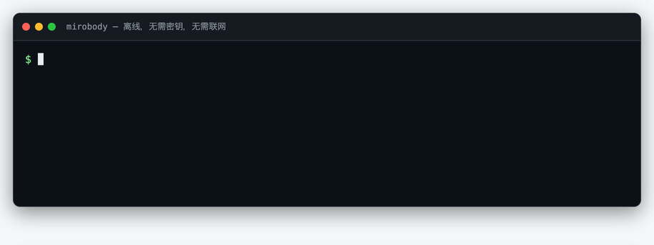
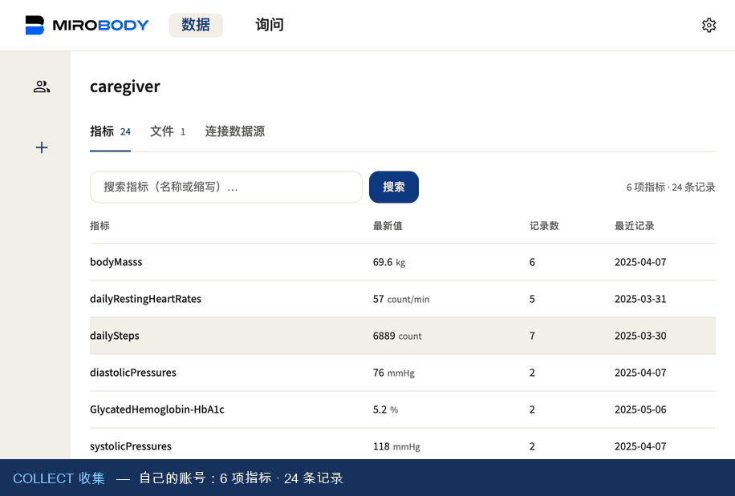
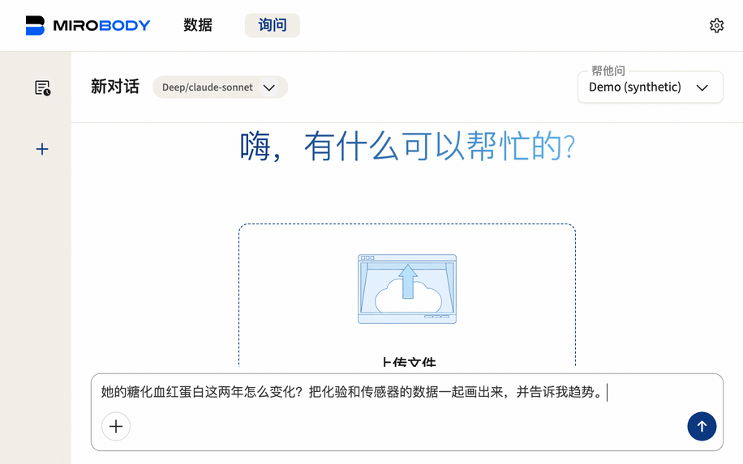
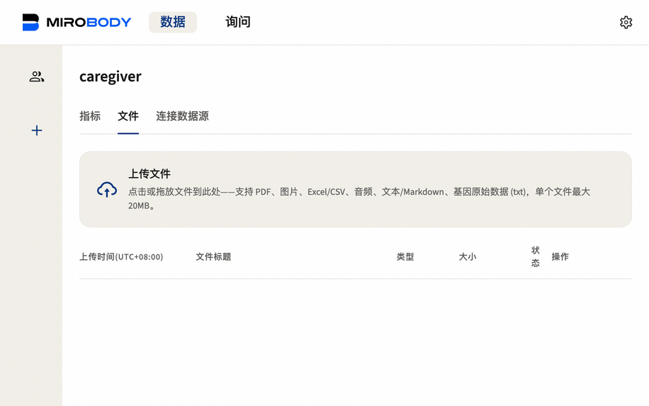
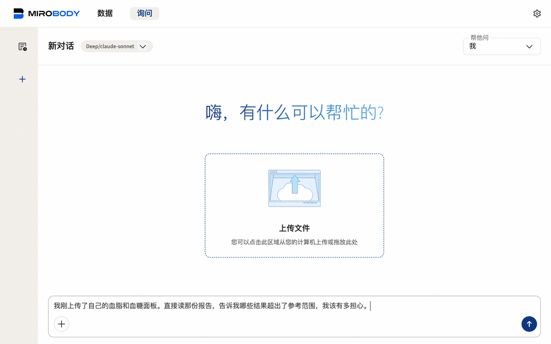

<div align="center">

# 🚀 Mirobody

**AI 原生的健康数据引擎——收集、标准化，并针对检验报告、穿戴设备与基因数据进行推理。**

[](LICENSE)
[](pyproject.toml)
[](https://pepy.tech/projects/mirobody)
[](https://huggingface.co/healthmemoryarena)
[](https://arxiv.org/abs/2604.02834)
[](https://docs.mirobody.ai/)

**[📚 文档](https://docs.mirobody.ai/)** · **[💬 云端聊天服务——chat.mirobody.ai](https://chat.mirobody.ai/)** · **[🔌 API 平台——platform.mirobody.ai](https://platform.mirobody.ai/)**

**[English](README.md)** · **简体中文** · **[繁體中文](README.zh-TW.md)** · **[日本語](README.ja.md)**

*血液检验、穿戴设备、基因数据、影像资料——全都零散破碎，彼此互不兼容。
在 AI 能够真正理解你的健康状况之前，必须先将这些信号统一为 AI
可直接读取的标准格式。这正是本引擎的职责。*


</div>

本引擎完成三件事，整个代码库（包括「贡献」一节）也严格按照这三个阶段组织——与[在线文档](https://docs.mirobody.ai/zh/api-reference/)采用同一套 **C · S · A** 体系：

| 阶段 | 含义 | 位置 |
| -------------------- | ----------------------------------------------------------------------------------------------------------------- | ------------------------------------------------------- |
| **① 收集** | 接入数据信号：3 家设备提供者 + 1 个 SQL 数据源 · 7 种文件格式 · Apple Health | [`pulse/`](mirobody/pulse/) |
| **② 标准化** | 将任意一条读数解析为标准代码（LOINC · SNOMED CT · RxNorm），统一单位，落入 FHIR 认可的码制 | [`indicator/`](mirobody/indicator/) |
| **③ 解答** | 推理：agent 通过虚拟文件系统读取*原始文件*，以图表和引用来源作答 | [`agent/`](mirobody/agent/) |

---

## ⚡ 60 秒快速体验

指标解析是本引擎的入口能力，无需 key、无需配置、无需联网：

```bash
pip install mirobody
mirobody resolve "LDL cholesterol" 血红蛋白 ヘモグロビン "空腹血糖(GLU)" 血脂
```

<p align="center">
  
</p>

> 以上为真实输出，且 GIF 本身是构建产物——由 [`scripts/make_demo_gifs.py`](scripts/make_demo_gifs.py)
> 渲染 [`docs/demo/resolve.html`](docs/demo/resolve.html) 生成，因此演示内容始终与命令的实际行为保持同步。

```python
from mirobody.engine import resolve, resolve_reading

resolve("血红蛋白").loinc                                # '718-7'   任何语言，同一个码
resolve("total cholesterol").loinc                     # '2093-3'  [质量/体积]
resolve_reading("total cholesterol", "5.0", "mmol/L")   # '14647-2' [摩尔/体积]
resolve_reading("total cholesterol", "193", "mg/dL")    # '2093-3'  单位决定了码

resolve("中性粒细胞百分比").loinc                          # '26511-6' 中性粒细胞/白细胞
resolve_reading("中性粒细胞", "62 %", None).loinc          # '26511-6' 百分比……
resolve_reading("中性粒细胞", "4.2", "10*9/L").loinc       # '26499-4' ……与绝对值是两个码
resolve("血脂").resolved                                 # False    这是类别，不是一次观测
```

**如有数值和单位，请一并传入。** LOINC 将单位**与**结果类型编入代码身份，因此同一
名称会解析到不同的码——将 mmol/L 的结果归入 mg/dL 的码下，正是同一序列混入两种
单位的常见根源。`resolve` 的策略是宁可弃答也不猜测：空串 `""` 表示留待人工确认，
`"refused"` 本身即是明确的答案。
→ [引擎参考](https://docs.mirobody.ai/zh/engine/) ·
[指标](https://docs.mirobody.ai/zh/concepts/indicators/)

---

## 标准化层的能力

标准化层并非简单的对照查表，而是一套完整的术语归一体系：

- **概念图谱**：440,961 个节点 · 22,044,110 条跨词表边 · **595,746 个来源 id**
  蒸馏成标准概念（LOINC · SNOMED CT · RxNorm 桥接）。
- **49,253 个多语言别名**（中文 22,578 · 日本語 16,809 · 另 5 种：de·es·fr·ko·ru）。
  `hemoglobin`、`血红蛋白`、`血紅素`、`ヘモグロビン` 全部落到 LOINC 718-7。
- **繁体中文按两个独立问题分别处理。** 字形折叠是机械转换（内置 3,336 字的
  zh-Hant → zh-Hans 对照表）；词汇差异则不是——台湾地区临床用词不同，直接折叠
  `血紅素` 会得到 HbA1c 的码。此类词汇按繁体拼写单独收录，收录条目的优先级始终
  高于机械折叠。
- **单位**归一到约 310 个 UCUM 家族，含量纲分析、按 LOINC 码索引的摩尔质量桥接，
  以及对 `%` 与 `10*9/L` 的明确拒绝。300 个标准 pulse 指标。
- **第二层语义召回，刻意保持可选。** 以上均为词法层能力，遇到未收录词汇即弃答——
  这是明确的能力边界。余弦召回（[`indicator/semantic.py`](mirobody/indicator/semantic.py)）
  可以越过该边界，但**它无法弃答**：面对从未见过的词汇，它会以与正确答案相同的置信度
  返回最近邻，任何阈值都无法区分二者。**仓库不含向量矩阵，也没有可下载的现成版本**：
  它是 108,248 条 LOINC 行 × 1024 维（约 221 MB），且与 (provider, model) 一一绑定，
  需用 `scripts/build_loinc_embeddings.py` 针对你配置的 embedding 模型自行构建。换成
  另一个模型的矩阵不会报错——它会在错误的向量空间里自信地排序，所以构建时会写出
  `<matrix>.meta.json`，加载时校验不符即拒绝。在你把 `MIROBODY_SEMANTIC_INDEX` 指向
  一个矩阵之前 `resolve()` 完全不受影响；指向之后，也只用于*建议*一个待人工确认的码，
  绝不直接写入标准码。
  → [语义召回](https://docs.mirobody.ai/zh/concepts/semantic-recall/)：基准数字、两道轴向
  闸门，以及为什么 `min_score` 不是正确性阈值。
- **上述能力经过量化验证，而非单方声明。**
  [`test_engine_coverage.py`](mirobody/test_engine_coverage.py) 以真实体检套组、
  按检验报告的实际书写形式为离线解析器打分，覆盖英文、简体中文、繁体中文、日文，
  以及可穿戴平台 API 的词汇。**当前 211/211；该测试初版时为 32/94。** 其评判标准为
  **临床**正确性：将 `血红蛋白` 解析为 HbA1c 的码计为失败，`血脂` 则必须解析为空。

```bash
pytest mirobody/test_engine_coverage.py -s   # 离线，约一秒
```

### 用的是哪一版 LOINC,它覆盖什么、不覆盖什么

随包分发的语料切自 **LOINC 2.82**,而且这件事由运行时报出,不是写在一句会漂的注释里:

```python
>>> import mirobody; mirobody.BUNDLE_VERSION
'loinc-2.82+2026.08.28-af2524b7a285'
```

版本、切分日期,加上一段对语料成员本身算出的摘要——所以「构建期消费这份词表」和
「运行时 pin 的这个包」是不是同一份语料,可以被断言;光看包版本永远看不出来。
[LOINC 许可](https://loinc.org/license/)要求每一份拷贝都带上版本号,
`res/fhir_loinc_bundle.NOTICE` 带了,`scripts/stamp_bundle_version.py --check` 保证它不撒谎。

**为什么是 2.82 而不是 2.83。** axis 表与那 677k 行语料是通过折叠后的
`LONG_COMMON_NAME` 绑在一起的,而 2.83 系统性改名了其中 2,842 条
(`Cerebral spinal fluid` → `Cerebrospinal Fluid` 这一类)。实测:只升 axis 会丢
**3,486** 条「语料名 → 码」的连接,且新增为零。真要升就得连语料一起重建——那份语料
横跨 SNOMED CT、RxNorm、CVX、DCM,各自单独授权,都不可在此再分发。留在 2.82 的
已知代价:650 个被 2.83 标为 DISCOURAGED / DEPRECATED 的码仍可被答出,反映到基准上
是 6,815 条能解析的案例里的 52 条。「干脆拒答这些码」也量过,没有采纳——658 个里
LOINC 只为 9 个给出了替代码,拒答基本等于把「一个有点旧但正确的码」变成「没有码」,
而没有码的读数根本无法归组。

**LOINC 对可穿戴领域的覆盖比多数人以为的宽。** 它不只是化验套餐:`BDYWGT.*` 编身体成分
(`101685-6` 骨量、`73964-9` 肌肉量、`101684-9` 体水分率),`HRTRATE.*` 把静息心率
(`40443-4`)与单次测量区分开,另有步数(`41950-7`)、睡眠分期(`93831-6` 深睡、
`93830-8` 浅睡)、HRV SDNN(`112429-6`)、VO₂ peak、爬升高度等码。它停在厂商复合指标上
——Garmin 的身体电量与压力分数没有码,而这是对的:那是一家公司的算法,不是一个测量。

**覆盖不等于召回,而且这道差距是我们的、不是 LOINC 的**:`Body bone mass` 在这里能解析到
`101685-6`,中文的 `骨量` 却落到一个牙科体积码上,因为没有别名把它路由过去。
这正是 [`res/resolver_overrides.tsv`](mirobody/res/resolver_overrides.tsv) 存在的理由
——一行由人写下的意图,永远赢过索引里的表面匹配。

→ [loinc.org](https://loinc.org/) · [许可](https://loinc.org/license/) ·
[发布说明](https://loinc.org/kb/) · 下载免费,但需要注册账号并同意条款,
这也是随包分发派生语料、而不分发原始发布的原因。

→ [标准化](https://docs.mirobody.ai/zh/api-reference/standardization/) ·
[架构](https://docs.mirobody.ai/zh/concepts/architecture/) ·
[数据流](https://docs.mirobody.ai/zh/concepts/data-flow/)

---

## 📊 基准——评测全部开源，可独立复现

本项目的健康 AI 基准在 Hugging Face 同类数据集中**下载量最高**（各 4,000+）：

| 基准 | 测什么 | 下载量 |
| --- | --- | --- |
| [ESL-Bench](https://huggingface.co/datasets/healthmemoryarena/ESL-Bench) | 事件驱动的纵向健康 agent——100 个合成用户、10,000 个问题、程序化标准答案（[arXiv:2604.02834](https://arxiv.org/abs/2604.02834)） | 4,800+ |
| [MedHall-Bench](https://huggingface.co/datasets/healthmemoryarena/MedHall-Bench) | 医疗幻觉 | 4,500+ |
| [MedHarm-Bench](https://huggingface.co/datasets/healthmemoryarena/MedHarm-Bench) | 有害医疗建议 | 4,300+ |

任一基准均可通过 **[mirobody-eval](https://github.com/thetahealth/mirobody-eval)**
一条命令复现；该工具同时可为部署预置合成（不含 PHI）的健康轨迹数据。

---

## 🚀 完整部署

```bash
git clone https://github.com/thetahealth/mirobody.git && cd mirobody
git lfs pull          # 引擎的数据包，`resolve` 需要它
./deploy.sh           # Postgres + pgvector、Redis、服务、worker
```

随后打开 **http://localhost:18060**。服务启动时会打印可用的登录账号——内置账号为
`caregiver@mirobody.ai`，验证码 `111111`。账号名即角色：你以照护者（caregiver）
身份登录，查看他人共享的记录。

无需邮件服务。登录页默认为**密码**方式，邮箱验证码为第三个标签页：

```bash
curl -X POST localhost:18060/password/register -H 'Content-Type: application/json' \
     -d '{"email":"you@example.com","password":"at-least-8-chars"}'
```

**一把 key 即可启用全部能力。** 将 [OpenRouter key](https://openrouter.ai/keys)
配置为 `OPENROUTER_API_KEY`——Docker 部署下即写入 `compose.yaml` 旁的 `.env`
文件并 `docker compose restart`（重启即可生效：应用会重读 `/app/.env`；shell 里
`export` 不会传入容器）——对话、文件视觉解析、指标语义搜索即全部就绪——对话
使用 Claude/GPT/DeepSeek，语义搜索使用开源权重的 Qwen3-Embedding-8B（支持自主
部署：以任何 OpenAI 兼容的 `/v1/embeddings` 服务部署同一模型，并将
`OPENROUTER_BASE_URL` 指向该服务即可）。

指标搜索编码的是**你自己的指标名**，不是 LOINC 全表：worker 的
`IndicatorSyncTask` 在每次 ingest 后写入 `th_series_dim.embedding_qwen3_8b`，
查询即与之比对。它需要 `mirobody worker` 在跑，`./deploy.sh` 会一并启动。
这与上文第二层要的那份「可下载的全表矩阵」是两个不同的索引，而这一个是白送的。

若所在网络无法访问 openrouter.ai（中国大陆境内即属此情形），可将
[DashScope（阿里云百炼）key](https://dashscope.console.aliyun.com/apiKey) 配置为
`DASHSCOPE_API_KEY` 作为等价替代——对话使用 Qwen（取消对应注释即可启用
DeepSeek/Kimi），视觉解析使用 qwen3-vl，语义搜索使用 text-embedding-v4，所有
模型 id 均经线上端点实测验证。如 PyPI 官方源缓慢，可为 pip 配置国内镜像
（Docker 部署可直接 `PIP_INDEX_URL=<镜像地址> ./deploy.sh`）。

两条路径均无需额外配置；各厂商的直连 key（Google、OpenAI）同样受支持——详见
`config.yaml`。
→ [Docker 部署](https://docs.mirobody.ai/zh/deployment/docker/) ·
[配置](https://docs.mirobody.ai/zh/configuration/) ·
[本地 Python 环境](https://docs.mirobody.ai/zh/development/setup/)

### 👨‍👩‍👧 四分钟走一遍整个引擎

`SEED_DEMO_DATA` 默认开启，`./deploy.sh` 完成后即可完整走通 ① → ② → ③ 全链路——
登录与浏览种子数据无需任何 key；第 2 步的上传抽取与其后的提问共用上文配置的那
一把 key。以下四段演示均录制自真实运行的服务。

**1 · 登录。** 登录后你名下已有一份**轻量**记录——数周的自测体征与一次结果正常的
年度体检；同时，关爱圈中已有一位合成用户向你共享了一份**完整**记录：
**Demo (synthetic)**，两年跨度、244 个指标、14,273 条读数，以及五份 agent 可通过
`read_file` 读取的文档。同一个问题对应两份相互独立的记录：查询*你自己*的 HbA1c，
答案是你名下的一条正常值；查询*她*的，答案来自一份你仅有查看权限的两年记录。
数据隔离由此直接可见。

<p align="center">
  
</p>

<div align="center">

</div>

她的 HbA1c 是最该先打开的一条序列——因为它改善过，然后没保住：

```
2024-04-16   7.2 %
2024-10-15   6.5
2025-04-15   6.6      ← 之后就没有了
```

**问它。** 用中文问她这两年的糖化血红蛋白怎么变化，agent 自己去找数据：化验室只有
**2 条**直接检测，而传感器推算的 eA1C 有 **88 条**，它把两者画在同一张图上，用 GMI
交叉验证，然后告诉你这两年一直贴着 6.5% 的临界值窄幅波动——没有明显趋势。它也主动
说了自己的局限：只有两次化验，CGM 推算与化验不是一回事。

<p align="center">
  
</p>

**接着给它一个文件。** `mirobody/demo/lab_report_2025-10-15.pdf` 是她**下一次**的
面板，刻意从灌入数据里留出，所以上传它不是空操作。拖到 Data 页，① 收集 和 ② 标准化
在几秒内跑完：十二个分析物带着数值和单位出来，每一个都能点回它被读出来的那一页。

<p align="center">
  
</p>

**再问它一次，这次是你自己刚上传的那份。** 同一个 agent，换一份数据：它读那份报告
本身，把每个结果对照参考区间标出来。

<p align="center">
  
</p>

这个对比就是这段演示的用意：**两年历史买到的是趋势，一份面板买到的是解读。**两个回答
都会引用自己读到的东西。

所有数值都是合成的——由 [mirobody-eval](https://github.com/thetahealth/mirobody-eval)
为 ESL-Bench 生成后固化在仓里，所以灌数据不需要联网、不需要 key。要让部署承载真实
数据，把 `SEED_DEMO_DATA` 设为 false。抽取这一步对那十二条读数**还做不到**什么，写在
[docs/roadmap.md](docs/roadmap.md) 里，而不是在这里含糊过去。

---

## 🧩 扩展

五个目录配置键分别指向插件根目录；放入文件并重启即可生效。新增工具会同时注册为
agent 工具与 MCP 工具，无需额外接线。

| 扩展目标 | 放入位置 | 文档 |
| --- | --- | --- |
| 新增工具 | `mirobody/agent/tools/` | [添加工具](https://docs.mirobody.ai/zh/tools/adding-tools/) |
| Agent Skill（SKILL.md） | `mirobody/agent/skills/` | [Skills](https://docs.mirobody.ai/zh/tools/skills/) |
| 完整 agent | `mirobody/agent/` | [Agents](https://docs.mirobody.ai/zh/tools/agents/) |
| 设备 provider | `mirobody/pulse/providers/` | [Provider 接入](https://docs.mirobody.ai/zh/development/provider-integration/) |
| 外部 MCP 服务 | Settings → MCP | [MCP 集成](https://docs.mirobody.ai/zh/tools/mcp-integration/) |

agent 的每个工具同时通过 `/mcp` 对外提供，并按用户进行访问门控。
→ [内置工具](https://docs.mirobody.ai/zh/tools/built-in/) ·
[MCP 服务](https://docs.mirobody.ai/zh/api-reference/mcp-servers/)

---

## 🔌 编程接入

| 接口 | 适合 | 文档 |
| --- | --- | --- |
| `pip install mirobody` | 指标解析与文件解析，无需运行服务 | [引擎](https://docs.mirobody.ai/zh/engine/) |
| HTTP API | 将你的应用对接到一个部署实例 | [API 总览](https://docs.mirobody.ai/zh/api-reference/overview/) · [数据](https://docs.mirobody.ai/zh/api-reference/data/) |
| MCP | Claude、Cursor 或任何 MCP 客户端读取用户记录 | [MCP 服务](https://docs.mirobody.ai/zh/api-reference/mcp-servers/) |
| Backbone 模式 | 你的 agent，配合本项目的数据层 | [Backbone](https://docs.mirobody.ai/zh/api-reference/backbone-mode/) |

接口选型参考：[如何选择 API](https://docs.mirobody.ai/zh/api-reference/choose-your-api/)

---

## 🏗️ 仓库结构

```
mirobody/
├── engine.py    正门 —— resolve() 与 parse_file()
├── units/       UCUM 单位、unit_family、换算            ┐ 库的部分：
├── lexical.py   表层折叠 + CJK 感知分词器                │ 只依赖 numpy，
├── bundle.py    构建期：轴表与别名源                        │
├── res/         随包分发的 LOINC 语料                    ┘ 共 2 个包
├── pulse/       ① 收集     —— provider、文件解析、聚合
├── indicator/   ② 标准化   —— 解析器内部、概念图、语料构建
├── agent/       ③ 回答     —— DeepAgent、工具、skills、chat
├── mcp/         MCP 服务
├── schema/      DDL，开发环境启动时重放
└── demo/        关爱圈演示数据
```

**两种形态，诉求正好相反。** PyPI 包是**库**，小到不必让人想起它：
`pip install mirobody` 是 **2 个包、52 MB** —— 上面前四项，外加 numpy。
`[parse]` 加上读文档的能力；`[app]` 是全部，而唯一安装它的是 `requirements.txt`
—— Docker 应用是 `git clone && ./deploy.sh`，从来不是 pip 安装出来的。

**由工具强制执行，而非写在文档里**：三条 import-linter 契约守住这两条线——库层除
numpy 外不导入任何东西，引擎永不导入 agent 层——违反即 `lint-imports` 构建失败。第四道闸门 `scripts/check_wheel_data.py`
把语料构建流程与 v2 语义管线——19,000 行装了也跑不了的代码——挡在产物之外。

→ [架构](https://docs.mirobody.ai/zh/concepts/architecture/) ·
[CONTRIBUTING.md](CONTRIBUTING.md)

---

## 📚 文档

更多细节请参考 **[docs.mirobody.ai](https://docs.mirobody.ai/)** 在线文档
（英文与简体中文）。

| | |
| --- | --- |
| [快速开始](https://docs.mirobody.ai/zh/quickstart/) · [安装](https://docs.mirobody.ai/zh/installation/) · [自托管](https://docs.mirobody.ai/zh/self-host/) | 快速上手 |
| [指标](https://docs.mirobody.ai/zh/concepts/indicators/) · [Provider](https://docs.mirobody.ai/zh/concepts/providers/) · [文件处理](https://docs.mirobody.ai/zh/concepts/file-processing/) | 三个阶段的工作原理 |
| [API 参考](https://docs.mirobody.ai/zh/api-reference/) · [流式](https://docs.mirobody.ai/zh/api-reference/streaming/) · [函数调用](https://docs.mirobody.ai/zh/api-reference/function-calling/) | 接口开发 |
| [贡献](https://docs.mirobody.ai/zh/development/contributing/) · [环境搭建](https://docs.mirobody.ai/zh/development/setup/) | 参与开发 |

### 仓库内文档（面向贡献者）

每个包均附带 `README.md` 说明其职责；较长的专题指南位于 [`docs/`](docs/)。
以下文档均为英文。

| | Where |
| --- | --- |
| 可运行示例 | [`examples/`](examples/README.md) |
| ① 收集 | [`pulse/`](mirobody/pulse/README.md) · [providers](mirobody/pulse/providers/README.md) · [aggregation](mirobody/pulse/aggregate/README.md) · [Apple Health](mirobody/pulse/apple/README.md) |
| ① 指南 | [connect a wearable](docs/provider-setup.md) · [write a provider](docs/provider-guide.md) · [file processing](docs/file-processing.md) · [Apple Health API](docs/apple-health.md) |
| ② 标准化 | [`indicator/`](mirobody/indicator/README.md) · [indicators & units](mirobody/pulse/standardize/README.md) |
| ③ 回答 | [`agent/`](mirobody/agent/README.md) · [tools](mirobody/agent/tools/README.md) · [ChatGPT widgets](mirobody/agent/resources/README.md) |
| 底层设施 | [configuration](mirobody/utils/config/README.md) · [database schema](mirobody/schema/README.md) · [the web client](docs/frontend.md) |
| 参与开发 | [CONTRIBUTING.md](CONTRIBUTING.md) · [testing](docs/testing.md) · [aggregator script](docs/aggregation-tests.md) · [roadmap](docs/roadmap.md) · [CHANGELOG](CHANGELOG.md) · [SECURITY](SECURITY.md) |

---

## 🤝 贡献

最有价值的贡献是修正解析器解析错误的词条。运行 `mirobody resolve "<词>"`，若结果
错误或为空，请在 [`resolver_overrides.tsv`](mirobody/res/resolver_overrides.tsv)
中添加对应词条，并在 [`test_engine_coverage.py`](mirobody/test_engine_coverage.py)
中补充测试用例——覆盖率测试即是评审标准。

```bash
pip install -e '.[test]' && pytest -q && lint-imports
```

→ [贡献指南](https://docs.mirobody.ai/zh/development/contributing/) ·
[CONTRIBUTING.md](CONTRIBUTING.md)

---

<div align="center">

**[📚 文档](https://docs.mirobody.ai/)** · **[💬 Chat](https://chat.mirobody.ai/)** · **[🔌 平台](https://platform.mirobody.ai/)** · **[🧪 Eval](https://github.com/thetahealth/mirobody-eval)**

Apache 2.0 · © 2026 [Theta Health](https://thetahealth.ai)

</div>
