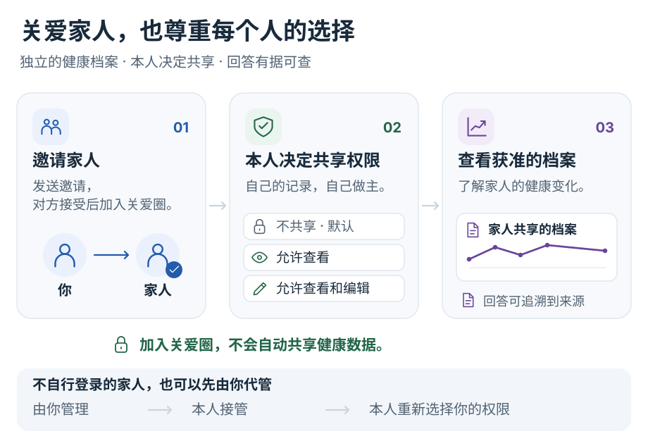

<div align="center">

<picture>
  <source media="(prefers-color-scheme: dark)" srcset="docs/images/mirobody-icon-dark.svg">
  
</picture>

# Mirobody

**把分散的健康数据，变成有据可查的答案。**

开源、自部署的 AI 健康数据引擎，把体检报告、可穿戴设备和基因数据汇成一份标准化的记录。<br>
Docker 启动后配置一个模型 Key 即可使用，也可以让所有模型在本机运行。

**[English](README.md)** · **中文**

[](https://pypi.org/project/mirobody/)
[](LICENSE)
[](https://github.com/thetahealth/mirobody/stargazers)

**[▶ 在线体验](https://chat.mirobody.ai/demo)** · **[🐳 Docker 启动](#docker-启动直接体验)** · **[📚 使用文档](https://docs.mirobody.ai/zh/self-host)**

</div>

<p align="center">
  
</p>
<p align="center"><em>不同医院，不同写法。放进同一条趋势，回看每个数值的来源。</em></p>

## Docker 启动，直接体验

只需要带 Compose 的 Docker，不需要 Python、Node.js 或显卡。Windows 请在 WSL 2 终端里执行。

```bash
git clone --depth 1 https://github.com/thetahealth/mirobody.git && cd mirobody
./deploy.sh
```

打开终端打印的设置链接，填写一个模型 API Key：[OpenRouter](https://openrouter.ai/keys)、[OpenAI](https://platform.openai.com/api-keys)、[Gemini](https://aistudio.google.com/apikey)、[Anthropic](https://platform.claude.com/settings/keys)、DeepSeek、DashScope，或任何 OpenAI 兼容网关均可。Key 经一次真实请求验证通过后才会保存。Postgres、服务端、后台任务和一份合成示例数据随部署一起启动。

1. **登录。** 在「邮箱验证码」标签使用 `you@mirobody.ai`，验证码 `111111`。示例含两份档案、**2,019 条读数**：你自己的，以及 `mom@mirobody.ai` 以只读方式共享给你的。
2. **提问。** 问「我的胆固醇有什么变化？」，回答会画出趋势，并标出每个数字来自哪份文件。
3. **上传。** 在「数据」页上传 [`demo/upload/`](demo/) 里的一份样例，或切换到妈妈的档案再问一次。

<details>
<summary><strong>模型也留在本机：无需模型 API Key</strong></summary>

<br>

在克隆下来的目录里，改用下面这条命令，让 llama.cpp 的 CPU 镜像随服务一起启动：

```bash
COMPOSE_PROFILES=local-cpu ./deploy.sh
```

脚本会把 Mirobody 指向 [llama.cpp](https://github.com/ggml-org/llama.cpp)，由它运行一个小型回答模型和一个文档识别模型，设置页无需再做选择。建议主机有 16 GB 内存，至少分配 8 GB 给 Docker；首次需下载约 3.7 GB。没有显卡时，第一个回答需要几分钟：Apple 芯片笔记本的 CPU 上约 2–3 分钟，4 vCPU 的 x86 服务器上最长约 15 分钟。在 Mac 上直接运行 `llama-server` 可以用上 GPU，16 GB 的 Apple 芯片笔记本每个回答约 30 秒。

<p align="center">
  
</p>

[Mac、NVIDIA 与 Windows 的配置方法](docs/local-models.zh-CN.md) · [如何选择模型](docs/model-choice.zh-CN.md)

</details>

→ [自部署指南](https://docs.mirobody.ai/zh/self-host) · [完整演示](docs/walkthrough.zh-CN.md) · [部署到服务器](https://docs.mirobody.ai/zh/deployment/production)

## 你可以做什么

- **跨医院比较报告。** PDF、手机照片、表格等 23 种文件类型汇入同一份记录，每条读数都能回到它所在的那一页。
- **汇入日常数据。** 导入 Apple Health 导出包，或连接 Garmin、Oura、Whoop。
- **照顾家人。** 邀请家人共享他们自己的档案，或替不登录的长辈代管一份档案。
- **记健康日记。** 一句 `昨晚开始头疼，血压150/95，没发烧` 会变成一条带编码的症状和两条带编码的读数，「没发烧」不会被记成发烧。
- **查询基因数据。** 上传 23andMe、AncestryDNA、WeGene 的原始数据或 VCF，按 rsID、基因或区间查询。用药相关问题只给出 CPIC 覆盖情况，不建议调整用药。
- **接入你自己的 agent。** 通过 MCP 连接 Claude Code、Codex 或 Cursor，或在 Python 里直接调用离线引擎。

## 收集 · 转译 · 智能体

<p align="center">
<picture>
  <source media="(prefers-color-scheme: dark)" srcset="docs/images/collect-translate-agent-dark.zh-CN.svg">
  
</picture>
</p>

| 阶段 | 做什么 | 在哪 |
| --- | --- | --- |
| **① 收集 Collect** | 文件、设备和日记汇入系统；原始来源保留下来，每条读数都能指回它。 | [`collect/`](mirobody/collect/) |
| **② 转译 Translate** | `A1c`、`HbA1c`、`糖化血红蛋白` 解析为同一个编码，单位统一到同一标准，全程离线。无法确定的名称保持未解析。 | [`engine/`](mirobody/engine/) · [`translate/`](mirobody/translate/) |
| **③ 智能体 Agent** | 在编码后的记录上提问：看趋势、跨医院和设备比较、画图，并标出每个数字来自哪份文件。 | [`agent/`](mirobody/agent/) |

模型负责读取文档和推理；编码和单位来自随包发布的词表，不由模型生成。[一条读数如何走完整个流程](docs/pipeline.md)。

## 照顾家人

<p align="center">
  <picture>
    <source media="(max-width: 640px) and (prefers-color-scheme: dark)" srcset="docs/images/care-circle-sharing-mobile-dark.zh-CN.svg">
    <source media="(max-width: 640px)" srcset="docs/images/care-circle-sharing-mobile.zh-CN.svg">
    <source media="(prefers-color-scheme: dark)" srcset="docs/images/care-circle-sharing-dark.zh-CN.svg">
    
  </picture>
</p>

加入关爱圈本身不会共享任何健康数据。每位成员自己决定，是否允许别人查看或编辑自己的档案。不自行登录的长辈可以先由你代管，本人接管后再决定保留你的哪种权限。[在完整演示中查看](docs/walkthrough.zh-CN.md)。

## 什么留在你的机器上

你的记录存放在你自己运行的 Postgres 里，这里不会向任何地方上报使用情况。什么会离开，取决于由谁来读：

| | 使用模型 Key | 100% 在本机运行 |
| --- | --- | --- |
| 你的文档和提问 | 发给该模型服务商，受其条款约束 | 留在本机 |
| 名称到编码、单位到 UCUM（**② 转译**） | 在本机，查随包词表，不联网 | 同左 |
| 模型权重 | 无 | 从 Hugging Face 下载一次 |

只有在你连接设备厂商之后，厂商才会收到相应数据。部署到你无法控制的网络之前，请先阅读 [SECURITY.md](SECURITY.md)，其中列出了服务端会访问的所有地址。

## 接入你自己的应用和 agent

| 你想要 | 从这里开始 |
| --- | --- |
| 在 Claude Code、Codex、Cursor 或 Gemini CLI 里查询你的记录 | **设置 → MCP 链接**，再按[各客户端的一行配置](https://docs.mirobody.ai/zh/tools/mcp-integration) |
| 在自己的代码里解析名称和单位 | `pip install mirobody`：离线、无需 Key，只依赖 numpy（[库的用法](docs/quickstart.zh-CN.md#a--the-library)） |
| 让你的编码 agent 学会这套流程 | `npx skills add thetahealth/mirobody --skill translate-health-data`（[skills](skills/README.md)） |
| 新增设备 provider 或工具 | 把文件放进 `mirobody/collect/providers/` 或 `mirobody/agent/tools/`（[CONTRIBUTING](CONTRIBUTING.md)） |
| 使用托管 API | [Mirobody Cloud](https://docs.mirobody.ai/zh/api-reference/quickstart) |

通过 MCP，整套服务提供七个工具，都限定在当前登录者的范围内：四个读取你的记录（读数、用药、基因型、药物基因组），三个解析名称和单位。

不需要 Key、不联网，用 `uvx` 连安装都省了，先试试词表：

```bash
uvx --python 3.12 mirobody resolve "LDL cholesterol" 血红蛋白 ヘモグロビン 血脂
```

```python
from mirobody.engine import resolve, resolve_reading

resolve("血红蛋白").loinc                                     # '718-7'   任何语言，同一个编码
resolve_reading("total cholesterol", "5.0", "mmol/L").loinc  # '14647-2' 单位决定编码……
resolve_reading("total cholesterol", "193", "mg/dL").loinc   # '2093-3'  ……质量浓度，不是摩尔浓度
resolve("中性粒细胞百分比").loinc                               # '26511-6' Neutrophils/Leukocytes
resolve("血脂").resolved                                     # False    一个类别，不是一项检查
```

### 每一个数字，都可以复现

| 说法 | 怎么验证 |
| --- | --- |
| **317/317**：常规体检会打印的项目，覆盖英文、中文、日文、俄文和爱沙尼亚文 | 运行 [`test_engine_coverage.py`](mirobody/tests/test_engine_coverage.py) 会打印分数 |
| **330 个 UCUM 单位**，带量纲分析；**316 项标准设备指标** | [标准化详解](docs/standardization.zh-CN.md) · [设备对照表](docs/device-crosswalk.md) |
| 包会说明是哪份词表在回答：`mirobody.BUNDLE_VERSION` 是 `loinc-2.83+2026.09.17-aacb2c715b56` | `python -c "import mirobody; print(mirobody.BUNDLE_VERSION)"` |
| 公开的健康 agent 评测集：[ESL-Bench](https://huggingface.co/datasets/mirobody/ESL-Bench)、[MedHall-Bench](https://huggingface.co/datasets/mirobody/MedHall-Bench)、[MedHarm-Bench](https://huggingface.co/datasets/mirobody/MedHarm-Bench) | [`mirobody-eval`](https://github.com/thetahealth/mirobody-eval) · [`benchmarks/`](benchmarks/README.md) |

Mirobody 也是 [Theta Wellness](https://www.thetahealth.ai/) 这款已上线的个人健康产品所用的引擎。

## 参与贡献

最有价值的贡献，是找出解析器答错的术语。运行 `mirobody resolve "<术语>"`，结果错误或为空时，[提交 issue](https://github.com/thetahealth/mirobody/issues/new?template=wrong-term.yml)，或附上测试用例直接提交修复。环境搭建和检查命令见 [CONTRIBUTING.md](CONTRIBUTING.md)。

本项目基于 [HL7 FHIR](https://hl7.org/fhir/)、[Regenstrief Institute](https://www.regenstrief.org/) 的 [LOINC](https://loinc.org/)、[UCUM](https://ucum.org/)、[ICPC-3](https://icpc-3.info/)（WONCA）、[CPIC](https://cpicpgx.org/)、[llama.cpp](https://github.com/ggml-org/llama.cpp) 与 [deepagents](https://github.com/langchain-ai/deepagents)，在此致谢。术语许可见 [`LICENSE-3RD-PARTY`](LICENSE-3RD-PARTY)。

<div align="center">

**如果 Mirobody 帮你把健康数据用起来，点一颗 Star，让更多人发现它。**

[文档目录](docs/README.md) · [路线图](docs/roadmap.md) · [更新日志](CHANGELOG.md) · [安全](SECURITY.md) · [AGENTS.md](AGENTS.md)

Apache 2.0 · © 2026 [Theta Health](https://thetahealth.ai)

</div>

<!-- mcp-name: ai.thetahealth/mirobody -->
