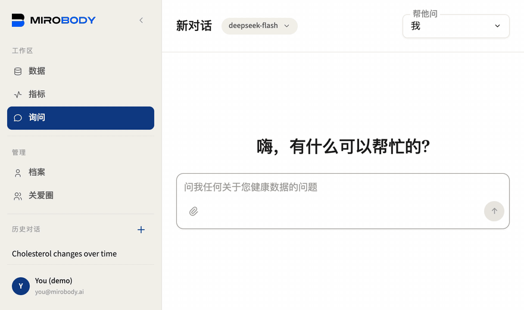
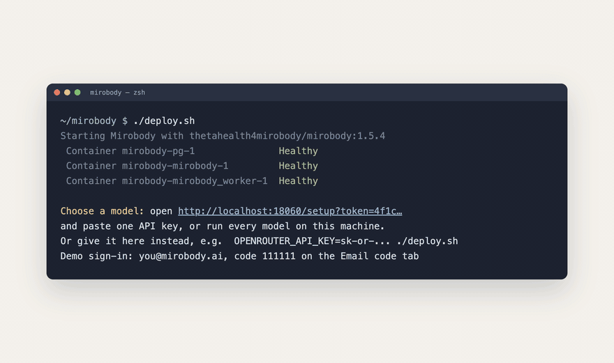
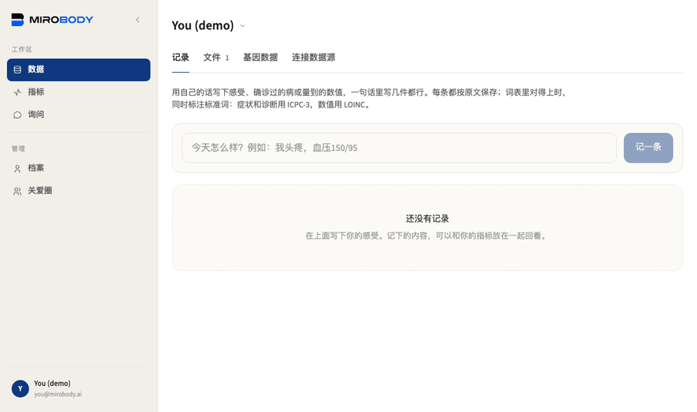
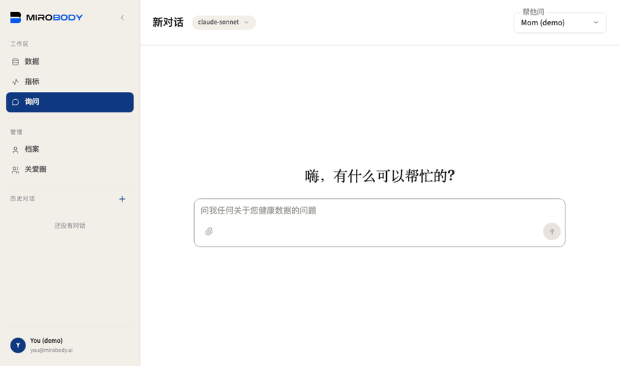
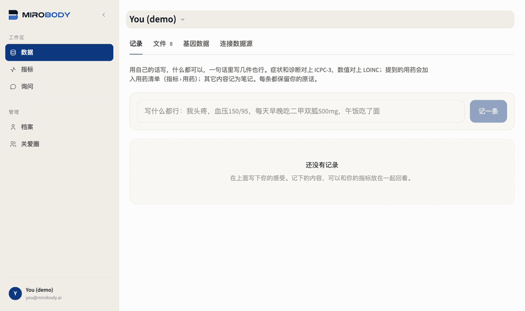
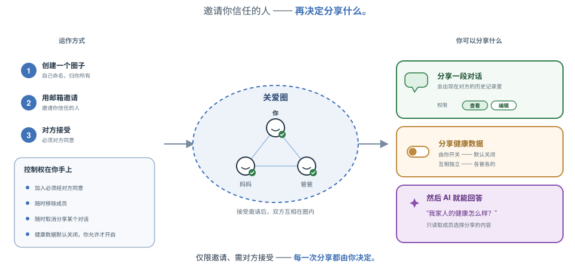
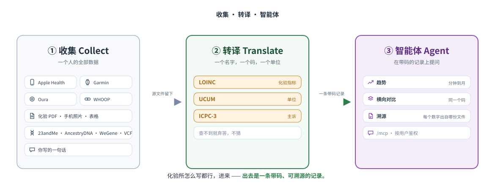
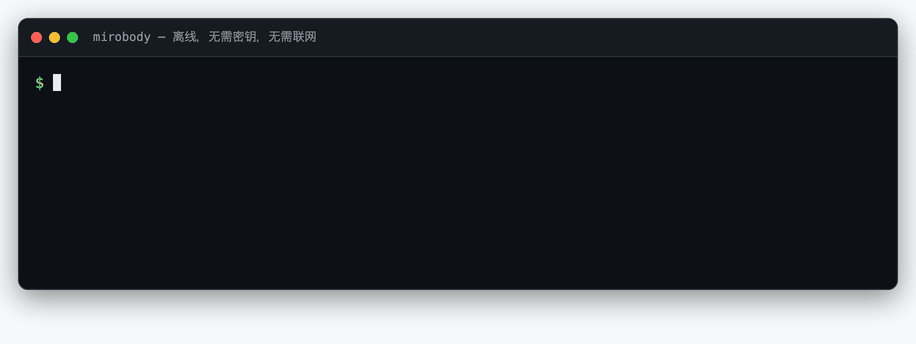

<div align="center">

<picture>
  <source media="(prefers-color-scheme: dark)" srcset="docs/images/mirobody-icon-dark.svg">
  
</picture>

# Mirobody

**自托管的 AI 健康数据引擎：化验单、穿戴设备和基因文件汇成一份记录，由一个每句话都有出处的智能体来回答。**

**[English](README.md)** · **中文**

[](https://pypi.org/project/mirobody/)
[](https://hub.docker.com/r/thetahealth4mirobody/mirobody)
[](https://pepy.tech/projects/mirobody)
[](LICENSE)
[](https://github.com/thetahealth/mirobody/stargazers)

**[▶ 在线 Demo，免注册](https://chat.mirobody.ai/demo)** · **[📚 文档](https://docs.mirobody.ai/zh/self-host)** · **[🐳 Docker Hub](https://hub.docker.com/r/thetahealth4mirobody/mirobody)** · **[☁ 云端 API](https://platform.mirobody.cn/)**

</div>

---

去年体检写 `A1c`，今年医院写 `HbA1c`，换家机构又成 `糖化血红蛋白`。一项检查三个名字，读不懂，也比不了。Mirobody 把任何来源、任何格式、任何语言的健康数据读进来，每个值都落到同一套标准上，再在这份记录上回答你的问题，每个数字都能追回它出自的那份文件。全部跑在你自己的机器上：用一把模型 key，或者让所有模型也跑在这台机器上，由 [llama.cpp](https://github.com/ggml-org/llama.cpp) 提供模型服务；记录存在你自己运行的 Postgres 里。

<p align="center">
  
</p>
<p align="center"><em>三份文件，三种写法，同一个码。智能体把三份都找出来，画出趋势，并说明每个数字来自哪份文件。</em></p>

## 两条命令跑起来

```bash
git clone --depth 1 https://github.com/thetahealth/mirobody.git && cd mirobody
./deploy.sh     # Postgres、服务端、worker 起来，并打印首次设置页的链接
```

首次设置页会问：由谁来处理你的健康数据。粘贴一把模型 key，或者选**100% 在本机运行**，再从这台电脑上 llama.cpp 服务提供的模型里选。key 要先用一次真实请求验证通过才会保存；选择加密存储，之后可以在「设置 › 模型」里修改。手上已经有 key 的话，`OPENROUTER_API_KEY=sk-or-... ./deploy.sh` 会跳过这一页。

<p align="center">
  
</p>
<p align="center"><em>在一台 16 GB 内存的笔记本上录制，用的是默认的本地组合：MiniCPM5-2B 回答问题，GLM-OCR-0.9B 读文档，两个都由 llama.cpp 提供服务。大号的 Qwen3.8-27B 需要约 20 GB 内存。</em></p>

| | 模型在哪里跑 | 你需要 | 什么会离开这台机器 |
| --- | --- | --- | --- |
| **一把模型 key** | 在你粘贴 key 的那家厂商：OpenRouter、OpenAI、Gemini、Anthropic、DeepSeek、DashScope，或任何 OpenAI 兼容网关 | Docker 和一把 key | 你的提问、智能体读到的数据行和它读的文档，都会发给那家厂商 |
| **100% 在本机运行** | **由 [llama.cpp](https://github.com/ggml-org/llama.cpp) 的 `llama-server` 提供模型服务**，跟服务一起跑；Mirobody 自己不跑模型。默认由 MiniCPM5-2B 回答问题、GLM-OCR-0.9B 读文档；内存更多时可换 Qwen3.8-27B，回答更好。模型名可以自己改（[说明](docs/local-models.md)） | Docker 和 16 GB 内存即可跑默认组合，不需要显卡，Windows、Linux、macOS 都行（Qwen3.8-27B 约需 20 GB）；模型一次性下载 3.0 GB（大号 14.5 GB） | 与你有关的任何数据都不会离开；在 16 GB 的 M1 Pro 上一个回答约 30 秒（Qwen3.8-27B 在 M4 Pro 上约两分钟） |
| **只用库** | 不需要模型：`pip install mirobody` 或 `uvx --python 3.12 mirobody` 把名称解析到 LOINC、单位换算到 UCUM | Python 3.12 | 什么都不会离开：词表随包发布 |

用模型 key 时只需要 Docker：不用 Python，不用 Node.js，不用 GPU，不用 Git LFS，连 Git 都可以不装（`curl -L https://github.com/thetahealth/mirobody/archive/refs/heads/main.tar.gz | tar xz && cd mirobody-main` 得到的是同一份检出）。`deploy.sh` 会把密钥和你的 key 写进 `.env`，拉取预构建镜像，拉不到时才用当前检出在本机构建；端口被占用、或同名的另一套 Mirobody 已经在跑时，它会停下来并说清楚怎么改。镜像要和自己的 Postgres 一起跑，所以单独 `docker run` 是跑不起来的。之后再加 key：写进 `.env`，然后 `docker compose up -d`；`restart` 不会重新读 `.env`。

1. **登录。** 登录页会直接给出演示账号：「邮箱验证码」页签，`you@mirobody.ai`，验证码 `111111`。`SEED_DEMO_DATA` 默认打开，一开始两个账号就合计有 **2,019 条读数**：你自己，和把记录以只读方式共享给你的 `mom@mirobody.ai`。
2. **把一份文件拖到 Data 页。** [`demo/upload/`](demo/) 里放着四份种子数据故意没写进库的文件：化验单 PDF 和另一家化验所导出的 CSV 是你的，打印报告的照片和表格是妈妈的，要用她的账号上传。每一项分析物都带着数值、单位和编码被抽出来，并链回它来源的那一页。
3. **提问。**「我的胆固醇怎么变的？」会把带着这一项的文件全都找出来，不管化验所怎么写，画出趋势，并说明每个数字出自哪份文件。同一个问题问到共享给你的那份记录上，答案就来自你只能看、不能改的数据。
4. **用自己的话记下感受。** 在「数据 › 记录」里写一句 `昨晚开始头疼，血压150/95，没发烧，每天早晚吃二甲双胍500mg`：一句话变成一条带码的症状、两条带码的读数和一条用药，「没发烧」不会被当成发烧记下来。

<p align="center">
  
  
  
</p>

**用哪把 key。** 下面任何一把都能把整套跑通：[OpenRouter](https://openrouter.ai/keys)（`OPENROUTER_API_KEY`）、[OpenAI](https://platform.openai.com/api-keys)（`OPENAI_API_KEY`）、[Gemini](https://aistudio.google.com/apikey)（`GOOGLE_API_KEY`）、[Anthropic](https://platform.claude.com/settings/keys)（`ANTHROPIC_API_KEY`）、DeepSeek、DashScope，或者任何 OpenAI 兼容网关（`<PROVIDER>_BASE_URL`）。[`config.llm.yaml`](config.llm.yaml) 写的是变量名（`api_key: OPENROUTER_API_KEY`），不是密钥本身；`mirobody doctor` 会列出每一环选中了什么。

→ [自部署指南](https://docs.mirobody.ai/zh/self-host) · [配置](https://docs.mirobody.ai/zh/configuration) · [部署到服务器](https://docs.mirobody.ai/zh/deployment/production)

## 你会得到什么

- **所有来源，一份记录。** Garmin、Oura、Whoop 直接对接；任何写进 Apple Health 的手环、戒指、体重秤一并进来；PDF、照片、表格、导出文件，23 种文件类型，按类型读取。
- **全家人一份记录。** 邀请伴侣、父母，或者添加一个完全不会自己登录的孩子。共享叫**关爱圈**：邀请制，默认关闭，一个账号要读到不属于自己的记录，只有 `resolve_subject` 这一条路。
- **用自己的话记下感受。** 在「记录」里写一句 `昨晚开始头疼，血压150/95，没发烧，每天早晚吃二甲双胍500mg`，拆句和打标签的是你选的模型，编码来自词表，从不来自模型。
- **绝不瞎编编码。** 每一条读数要么落进一套确定的体系，要么明说没解析出来并留下你的原话。基于真实报告开发和测试，英文、中文、日文、俄文的写法都认。
- **基因数据，只说测到了什么。** 把 23andMe、AncestryDNA、MyHeritage、FTDNA、WeGene 的原始导出或 VCF 传上来，就能按 rsID、基因或染色体区间查。问到用药，它只说明 CPIC 相关位点哪些测到、哪些缺失、哪些没读出来，不推断代谢型，更不建议调整用药。[基因数据怎么处理](docs/genetics.zh-CN.md)。
- **智能体只在编码过的数据上推理，而且不一定得是我们这一个。** 分钟到月的趋势画成图；跨化验所、跨文件、跨设备直接比较，因为底下是同一个码。每个工具同时挂在 `/mcp` 上，按用户鉴权。

<p align="center">
  <picture>
    <source media="(prefers-color-scheme: dark)" srcset="docs/images/your-care-circle-dark.zh-CN.svg">
    
  </picture>
</p>

→ [四分钟完整演示](docs/walkthrough.zh-CN.md) · [设备接入](docs/provider-setup.zh-CN.md)：Garmin、Oura、Whoop

## 收集 · 转译 · 智能体

<p align="center">
<picture>
  <source media="(prefers-color-scheme: dark)" srcset="docs/images/collect-translate-agent-dark.zh-CN.svg">
  
</picture>
</p>

| 阶段 | 做什么 | 在哪 |
| --- | --- | --- |
| **① 收集 Collect** | 化验单、穿戴设备、手机照片、基因文件、记录里的一句话，都收进来。源文件原样留下，每一条读数都能指回它被读出来的那一页。 | [`collect/`](mirobody/collect/) |
| **② 转译 Translate** | 一个名字解析成一个码，一个单位统一到 UCUM，全程离线、结果确定。`A1c`、`HbA1c`、`糖化血红蛋白` 在这一层变成同一项检查（LOINC），`头疼` 和 `headache` 也成了同一条主诉（ICPC-3）。 | [`engine/`](mirobody/engine/) · [`translate/`](mirobody/translate/) |
| **③ 智能体 Agent** | 在编码后的记录上提问。按分钟、小时、天、周、月给出趋势；同一个码，跨化验所、跨设备直接比较。图表画在回复里，每个数字都说明出自哪份文件。 | [`agent/`](mirobody/agent/) |

## 单独试一下引擎

一条命令，五种写法，不用 key，不用联网；用 `uvx`，连装都省了。

```bash
uvx --python 3.12 mirobody resolve "LDL cholesterol" 血红蛋白 ヘモグロビン "空腹血糖(GLU)" 血脂
```

`--python 3.12` 让 uv 自己取到这个包需要的 Python：默认解释器版本较旧时，它会装上 1.2 之前的旧版本。

<p align="center">
  
</p>

`血红蛋白` 和 `ヘモグロビン`，两种语言，同一个码 718-7。`血脂` 说的是一个类别，不是一项具体检查，所以它解析成空，而不是猜一个。

```python
from mirobody.engine import resolve, resolve_reading, standardize_reading

resolve("血红蛋白").loinc                                     # '718-7'   任何语言，同一个码
resolve("total cholesterol").loinc                          # '2093-3'  [Mass/volume]
resolve_reading("total cholesterol", "5.0", "mmol/L").loinc  # '14647-2' [Moles/volume]：单位决定码
resolve_reading("total cholesterol", "193", "mg/dL").loinc   # '2093-3'
resolve("中性粒细胞百分比").loinc                               # '26511-6' Neutrophils/Leukocytes
resolve_reading("中性粒细胞", "62 %", None).loinc              # '26511-6' 百分比……
resolve_reading("中性粒细胞", "4.2", "10*9/L").loinc           # '26499-4' ……和绝对值是两个码
resolve("血脂").resolved                                     # False    一个类别，不是一项检查
standardize_reading("血红蛋白", "13.5", "g/dL")["code"]["coding"][0]["code"]  # '718-7'  同一个答案，写成 FHIR Observation
```

主诉和诊断有自己的一条轴，ICPC-3，规则一样：给一个码，或者明说不编，绝不猜。

```python
from mirobody.translate import resolve_symptom, resolve_condition

resolve_symptom("头疼").code           # 'NS01'         头痛；'headache'、'頭痛'、'головная боль' 答的是同一个码
resolve_symptom("疼").outcome         # 'refused'      太笼统，不编码；原话留下，码不瞎猜
resolve_condition("2型糖尿病").code    # 'TD72'         2 型糖尿病
resolve_condition("糖尿病").outcome    # 'needs-input'  哪一型？问你，不替你定
```

→ [标准化详解](docs/standardization.zh-CN.md) · [作为库使用](https://docs.mirobody.ai/zh/quickstart#a--the-library) · [`examples/`](examples/README.md)

### 或者交给你的 agent

两个 skill 教会 Claude Code、Codex、Cursor 或 Gemini CLI 用它。一个把原始健康文件、导出和症状变成带码的行、读化验单时查解析器而不靠记忆，不需要 key；另一个跑起整套引擎、通过 MCP 接入：

```bash
npx skills add thetahealth/mirobody --skill translate-health-data
npx skills add thetahealth/mirobody --skill mirobody
```

或者不用 Node，从 Claude Code 和 Codex 都认的插件市场装：

```bash
claude plugin marketplace add thetahealth/mirobody && claude plugin install mirobody@mirobody
codex plugin marketplace add thetahealth/mirobody && codex plugin add mirobody@mirobody
```

→ [`skills/`](skills/README.md)

### 或者通过 MCP 接到你的 agent

内置智能体的每个工具同时挂在 `/mcp` 上，一人一条链接：**设置 → MCP 链接** 生成的链接只打开你自己的记录。在同一台电脑上：

| 客户端 | 配置 |
| --- | --- |
| Claude Code | `claude mcp add --transport http mirobody <链接>` |
| Codex | `codex mcp add mirobody --url <链接>` |
| Cursor | `~/.cursor/mcp.json`：`{"mcpServers": {"mirobody": {"url": "<链接>"}}}` |
| Gemini CLI | `gemini mcp add --transport http mirobody <链接>` |
| Claude Desktop | `claude_desktop_config.json`：`{"mcpServers": {"mirobody": {"command": "npx", "args": ["-y", "mcp-remote", "<链接>"]}}}`。它的「添加自定义连接器」是从 Anthropic 的云端去连，访问不到 `localhost`。 |
| ChatGPT、claude.ai | 同样从云端连接，所以需要一个它们访问得到的 HTTPS 地址：[部署到服务器](https://docs.mirobody.ai/zh/deployment/production)，并先读 [SECURITY.md](SECURITY.md)。 |

不起整套服务时，`uvx --python 3.12 mirobody mcp` 通过 stdio 提供词表工具，离线、不需要 key：名称到 LOINC、单位，以及把读数或症状写成 FHIR。其中读整份文档的 `standardize_report` 还需要 `[parse]` 扩展和一把模型 key：`uvx --python 3.12 --from 'mirobody[parse]' mirobody mcp`。

## 什么留在你的机器上

你的记录存在你自己的 Postgres 里，容器是你自己起的，这里不会把任何使用情况报给谁。什么会离开，取决于由谁来读：

| | 用模型 key | 100% 在本机运行 |
| --- | --- | --- |
| 你的文档和提问 | 发给那家模型厂商，受其条款约束 | 留在这里 |
| 名字对到码、单位换算成 UCUM（**② 转译**） | 在这里，查随包发布的词表，不联网 | 同左 |
| 模型权重 | 无 | 首次从 Hugging Face 下载一次（`.env` 里的 `HF_ENDPOINT` 可以指定镜像） |
| 设备厂商（Garmin、Oura、Whoop） | 只在你连接之后：它的令牌和你自己的数据 | 同左 |
| 容器镜像 | `./deploy.sh` 从 Docker Hub 拉取；Docker Hub 不通时用镜像站（`.env` 里写 `DOCKER_MIRROR=` 可关闭） | 同左 |

落库加密覆盖聊天、上传的文件、用药文字和你的档案，读数和基因型还没有覆盖。要把它接到一个你控制不了的网络上，先过一遍 [SECURITY.md](SECURITY.md)，服务端会访问的所有地址都列在那里。

## 每一个数字，都可以复现

| 说法 | 怎么验 |
| --- | --- |
| **317/317**：常规体检会打印的那些项目，按报告上真正的印法写，覆盖英文、中文（简体和繁体）、日文、俄文和爱沙尼亚文 | [`test_engine_coverage.py`](mirobody/tests/test_engine_coverage.py) 跑一下就会把分数打出来 |
| **328 个 UCUM 单位**，带量纲分析和摩尔质量换算，百分比和绝对值之间明确拒绝换算 | [标准化详解](docs/standardization.zh-CN.md) |
| **316 项设备指标** | [设备对照表](docs/device-crosswalk.md) |
| 包会自己说清楚是哪份词表在回答你：`mirobody.BUNDLE_VERSION` 是 `loinc-2.83+2026.09.17-aacb2c715b56` | `python -c "import mirobody; print(mirobody.BUNDLE_VERSION)"` |
| 三个公开的健康 agent 评测集：[ESL-Bench](https://huggingface.co/datasets/mirobody/ESL-Bench)（纵向的虚拟用户；论文 [arXiv 2604.02834](https://arxiv.org/abs/2604.02834)）、[MedHall-Bench](https://huggingface.co/datasets/mirobody/MedHall-Bench)（逐字段查幻觉：剂量、单位、参考范围、编码）和 [MedHarm-Bench](https://huggingface.co/datasets/mirobody/MedHarm-Bench)（红队安全） | [`thetahealth/mirobody-eval`](https://github.com/thetahealth/mirobody-eval) 用同一套打分规则跑它们 |

这套引擎驱动着 **[Theta Wellness](https://www.thetahealth.ai/)**：一款已经上线、注册用户 12,000+、日活 1,700+ 的个人健康产品。

## 使用和扩展

| 你想要 | 这样做 |
| --- | --- |
| 让所有模型都跑在自己的机器上 | `./deploy.sh`，再在它给出的页面上选**100% 在本机运行**；硬件要求、实测过的模型和各平台命令见 [docs/local-models.md](docs/local-models.md)（英文） |
| 在自己代码里做离线解析和单位换算 | `pip install mirobody`（Python 3.12+）：不用 key，不用联网，两个包 |
| 把一份文件变成读数 | `pip install 'mirobody[parse]'`：PDF、图片、Excel、Word、PowerPoint、文本都行；只有扫描件才会送到视觉模型 |
| 在 Claude Code、Codex、Cursor、Claude Desktop 或自己的 loop 里用这些工具 | 设置 → MCP 链接，再按[各客户端一行配置](#或者通过-mcp-接到你的-agent) |
| 加一个工具或一个设备数据源 | 往 `mirobody/agent/tools/` 或 `mirobody/collect/providers/` 丢个文件重启，或者 `pip install` 一个声明了 `mirobody.providers` / `mirobody.tools` / `mirobody.agents` entry point 的包 |
| 让你的编码 agent 学会用它 | `npx skills add thetahealth/mirobody --skill translate-health-data` 用库，`--skill mirobody` 装整套引擎；见 [`skills/`](skills/README.md) |
| 换掉自带的 agent 框架 | `pip install 'mirobody[agent]'` 拿中间件和虚拟文件系统后端；或者把 `AGENT_DIRS` 指向自己的目录，整体替换自带的 agent |

→ [MCP 接入](https://docs.mirobody.ai/zh/tools/mcp-integration) · [添加工具](https://docs.mirobody.ai/zh/tools/adding-tools) · [接入自己的 agent](CONTRIBUTING.md#-bringing-your-own-agent)

## 贡献

最大的贡献，是找出一个解析器答错的词。拿你自己报告上的写法跑一下 `mirobody resolve "<词>"`，主诉用 `resolve_symptom`；如果答案错了，或者是空的，[提个 issue](https://github.com/thetahealth/mirobody/issues/new?template=wrong-term.yml)，或者往 [`resolver_overrides.tsv`](mirobody/res/loinc/resolver_overrides.tsv) 加一行，再往 [`test_engine_coverage.py`](mirobody/tests/test_engine_coverage.py) 加一个用例。覆盖率分数，就是评审。

```bash
pip install -e '.[app,test]'
pytest -q                                                            # 随克隆发布的门禁
python -m unittest benchmarks.health_records.test_cases              # LOINC/UCUM 与 ICPC-3 判定，五种语言
python -m unittest discover -s benchmarks/genomics -p 'test_*.py'    # 一份基因型标准答案，十种文件格式
lint-imports && ruff check mirobody examples
```

→ [CONTRIBUTING.md](CONTRIBUTING.md) · [`benchmarks/`](benchmarks/README.md) · [AGENTS.md](AGENTS.md)（给编码智能体看的） · [仓库结构](docs/repository-layout.zh-CN.md) · [路线图](docs/roadmap.md) · [CHANGELOG](CHANGELOG.md) · [SECURITY](SECURITY.md)

## 文档，以及这套设计参考过的项目

**[docs.mirobody.ai](https://docs.mirobody.ai/zh/self-host)** 是中英双语的使用指南；本仓库的 [`docs/`](docs/README.md) 放的是代码据以核对的设计说明：数据管线、回答接口、标准化。

本项目的设计参考了以下标准与项目，特此鸣谢：
[HL7 FHIR](https://hl7.org/fhir/)、[Regenstrief Institute](https://www.regenstrief.org/)（[LOINC](https://loinc.org/)）、[UCUM](https://ucum.org/)、[ICPC-3](https://icpc-3.info/)（WONCA）、[CPIC](https://cpicpgx.org/)、[OHDSI OMOP](https://www.ohdsi.org/)、
[Open Wearables](https://github.com/the-momentum/open-wearables)、[Open mHealth](https://github.com/openmhealth/schemas) / IEEE 1752、[wearipedia](https://github.com/Stanford-Health/wearipedia)、[dlt](https://github.com/dlt-hub/dlt) / [Airbyte](https://github.com/airbytehq/airbyte-python-cdk) / [Singer](https://github.com/meltano/sdk)、[deepagents](https://github.com/langchain-ai/deepagents) 和 LangChain。随包分发的术语许可在 [`LICENSE-3RD-PARTY`](LICENSE-3RD-PARTY) 里。

<div align="center">

<a href="https://www.star-history.com/#thetahealth/mirobody&Date">
  <picture>
    <source media="(prefers-color-scheme: dark)" srcset="https://api.star-history.com/svg?repos=thetahealth/mirobody&type=Date&theme=dark" />
    <source media="(prefers-color-scheme: light)" srcset="https://api.star-history.com/svg?repos=thetahealth/mirobody&type=Date" />
    
  </picture>
</a>

*如果它替你读懂了一份报告，点个 star，下一个人就更容易找到它。基本每周都有新版本，[Watch](https://github.com/thetahealth/mirobody/subscription) 一下就能第一时间收到。*

Apache 2.0 · © 2026 [Theta Health](https://thetahealth.ai)

</div>

<!-- mcp-name: ai.thetahealth/mirobody -->
