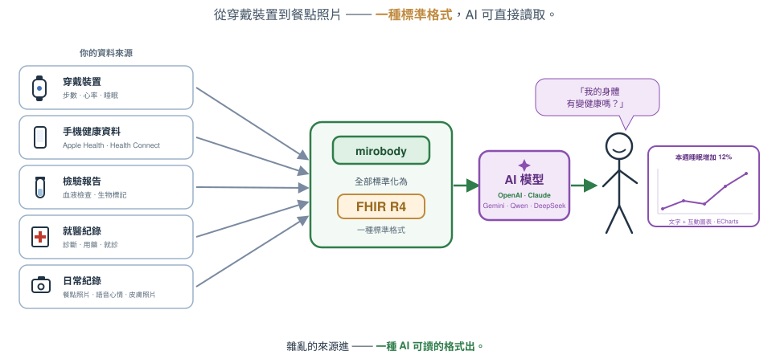
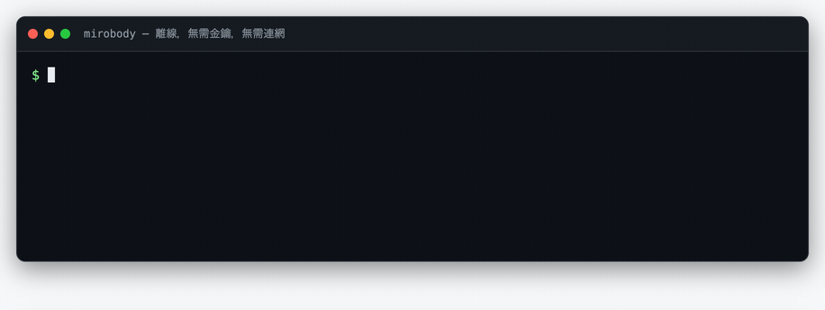
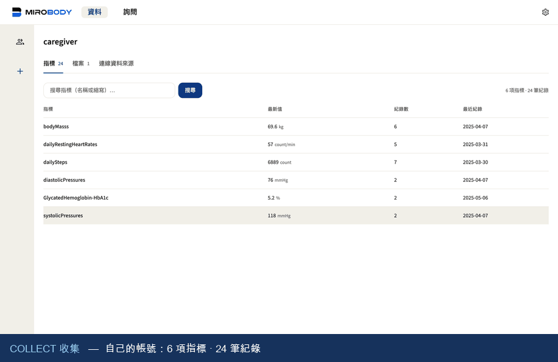
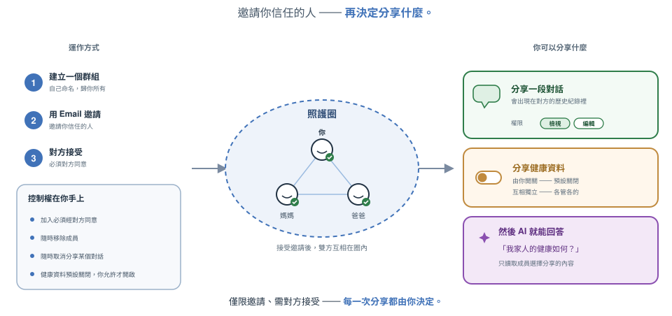
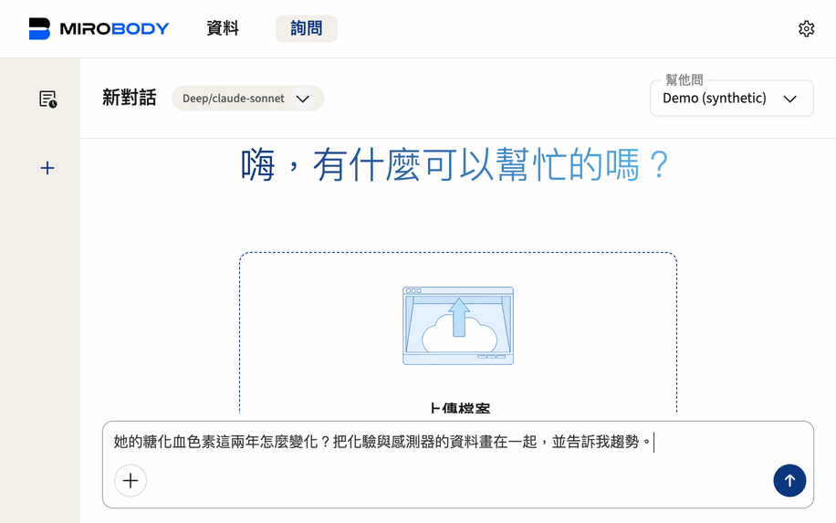
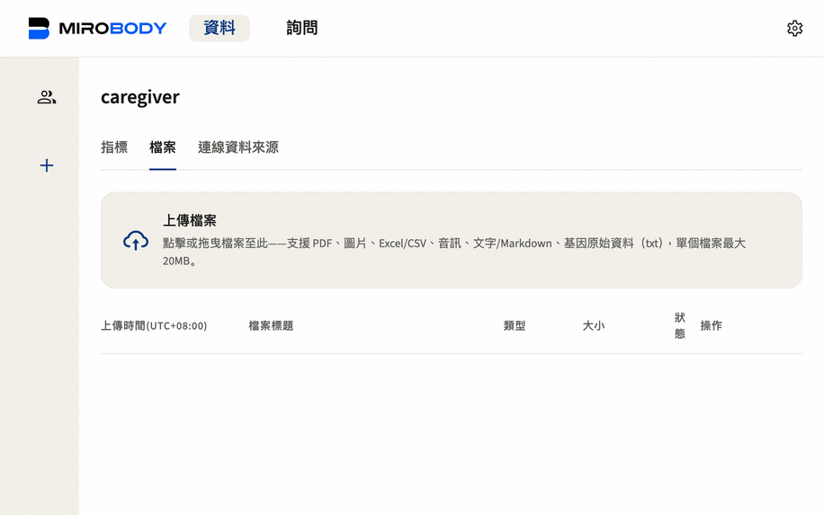
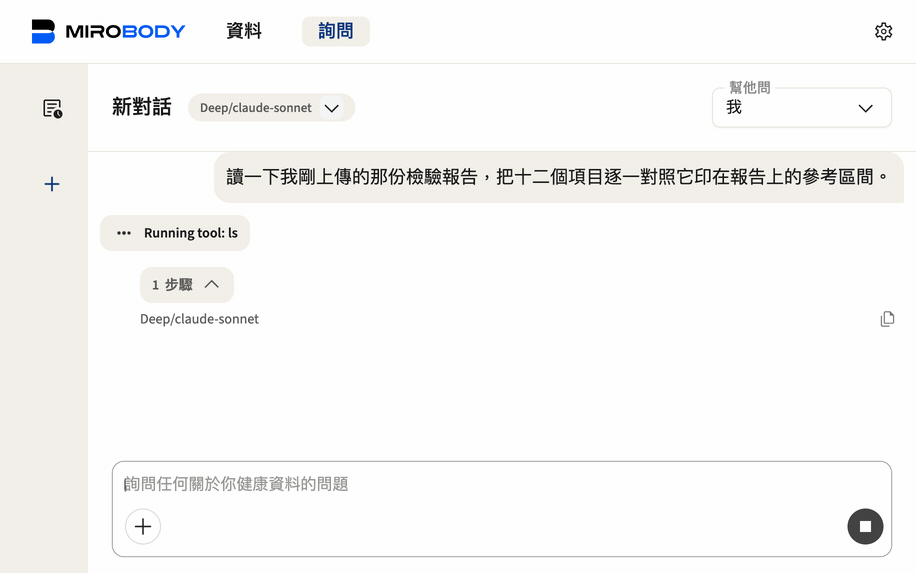

<div align="center">

# 🚀 Mirobody

**AI 原生的健康資料引擎——收集、標準化，並針對檢驗報告、穿戴裝置與基因體資料進行推理。**

[](LICENSE)
[](pyproject.toml)
[](https://pepy.tech/projects/mirobody)
[](https://huggingface.co/healthmemoryarena)
[](https://arxiv.org/abs/2604.02834)
[](https://docs.mirobody.ai/)

**[📚 文件](https://docs.mirobody.ai/)** · **[💬 雲端聊天服務——chat.mirobody.ai](https://chat.mirobody.ai/)** · **[🔌 API 平台——platform.mirobody.ai](https://platform.mirobody.ai/)**

**[English](README.md)** · **[简体中文](README.zh-CN.md)** · **繁體中文** · **[日本語](README.ja.md)**

*血液檢驗、穿戴裝置、基因體、影像——全部都是碎片化的，彼此互不相容。
在 AI 能真正理解你的健康之前，必須先有人把這些訊號統一成一個 AI
真正讀得懂的標準。這正是這個引擎在做的事。*



</div>

這個引擎做三件事，而整個程式碼庫（包括「貢獻方式」一節）也完全依照這三個階段來組織——正是[文件](https://docs.mirobody.ai/zh/api-reference/)裡用的同一套 **C · S · A**：

| 階段 | 意思 | 位置 |
| -------------------- | ----------------------------------------------------------------------------------------------------------------- | ------------------------------------------------------- |
| **① 收集** | 把訊號拉進來：3 家裝置提供者 + 一個 SQL 來源 · 7 種檔案格式 · Apple Health | [`pulse/`](mirobody/pulse/) |
| **② 標準化** | 一套標準：把任何一筆讀值解析成標準代碼（LOINC · SNOMED CT · RxNorm），統一單位，並落地到 FHIR 認可的碼制 | [`indicator/`](mirobody/indicator/) |
| **③ 解答** | 推理：agent 透過虛擬檔案系統讀取*原始文件*，並用圖表與引用來源作答 | [`agent/`](mirobody/agent/) |

---

## ⚡ 60 秒快速體驗

指標解析是這個引擎的正門，不需要 key、不需要配置、不需要連網：

```bash
pip install mirobody
mirobody resolve "LDL cholesterol" 血红蛋白 ヘモグロビン "空腹血糖(GLU)" 血脂
```

<p align="center">
  
</p>

> 這是真實輸出，而且 GIF 是建置產物——[`docs/demo/resolve.html`](docs/demo/resolve.html) 由 [`scripts/make_demo_gifs.py`](scripts/make_demo_gifs.py) 渲染，所以它不會和它聲稱展示的指令走散。

```python
from mirobody.engine import resolve, resolve_reading

resolve("血红蛋白").loinc                                # '718-7'   任何語言，同一個碼
resolve("total cholesterol").loinc                     # '2093-3'  [質量/體積]
resolve_reading("total cholesterol", "5.0", "mmol/L")   # '14647-2' [摩爾/體積]
resolve_reading("total cholesterol", "193", "mg/dL")    # '2093-3'  單位決定了碼
resolve("血脂").resolved                                 # False    這是類別，不是一次觀測
```

**手上有數值和單位就一起傳進去。** LOINC 把單位**和**結果型別編進了身分，所以同一個
名稱會解析到不同的碼——把一筆 mmol/L 的結果歸到 mg/dL 的碼下，就是一個序列悄悄混進
兩種單位的原因。`resolve` 寧可棄權也不猜：`""` 是值得再看一眼的空缺，`"refused"`
才是答案。
→ [引擎參考](https://docs.mirobody.ai/zh/engine/) ·
[指標](https://docs.mirobody.ai/zh/concepts/indicators/)

---

## 標準化層的能力

標準化層並非簡單的對照查表，而是一套完整的術語歸一體系：

- **概念圖譜**：440,961 個節點 · 22,044,110 條跨詞表邊 · **595,746 個來源 id**
  蒸餾成標準概念（LOINC · SNOMED CT · RxNorm 橋接）。
- **49,253 個多語言別名**（中文 22,578 · 日本語 16,809 · 另 5 種：de·es·fr·ko·ru）。
  `hemoglobin`、`血红蛋白`、`血紅素`、`ヘモグロビン` 全部落到 LOINC 718-7。
- **繁體中文是兩個問題，分兩套處理。** 字形折疊是機械的（隨包 3,336 字的
  zh-Hant → zh-Hans 表）；詞彙不是——台灣臨床用詞不同，把 `血紅素` 折疊會得到
  HbA1c 的碼。這類詞按繁體拼寫單獨收錄，收錄行永遠壓過折疊。
- **單位**歸一到約 310 個 UCUM 家族，含因次分析、依 LOINC 碼索引的摩爾質量橋接，
  以及對 `%` 與 `10*9/L` 的明確拒絕。300 個標準 pulse 指標。
- **還有第二層，而且刻意保持可選。** 上面全是詞法的，遇到不認識的詞就棄答——這是個誠實
  的天花板。餘弦召回（[`indicator/semantic.py`](mirobody/indicator/semantic.py)）能越過
  它，但**它無法棄答**：面對從沒見過的詞，它會用和正確答案相同的信賴度返回最近鄰，沒有
  任何閾值能把兩者分開。repo 裡不發布向量矩陣，所以 `resolve()` 不受影響，除非你把
  `MIROBODY_SEMANTIC_INDEX` 指向一個——之後用它來*建議*一個由人確認的碼，絕不用它鑄造身分。
  → [語義召回](https://docs.mirobody.ai/zh/concepts/semantic-recall/)：基準數字、兩道軸向
  閘門，以及為什麼 `min_score` 不是正確性閾值。
- **這個說法我們是量出來的，不是斷言的。**
  [`test_engine_coverage.py`](mirobody/test_engine_coverage.py) 用健檢實際會開的
  套組給離線解析器打分，按報告實際列印的寫法，涵蓋英文、简体中文、繁體中文、日本語，
  外加平台 API 教的穿戴式詞彙。**今天 211/211；寫出來那天是 32/94。** 它評的是
  **臨床**正確性：把 `血红蛋白` 答成 HbA1c 的碼算失敗，而 `血脂` 必須解析為空。

```bash
pytest mirobody/test_engine_coverage.py -s   # 離線，約一秒
```

→ [標準化](https://docs.mirobody.ai/zh/api-reference/standardization/) ·
[架構](https://docs.mirobody.ai/zh/concepts/architecture/) ·
[資料流](https://docs.mirobody.ai/zh/concepts/data-flow/)

---

## 📊 基準——評測全部開源，可獨立重現

我們的健康 AI 基準是 Hugging Face 上同類裡**下載量最高的**（各 4,000+）：

| 基準 | 測什麼 | 下載量 |
| --- | --- | --- |
| [ESL-Bench](https://huggingface.co/datasets/healthmemoryarena/ESL-Bench) | 事件驅動的縱向健康 agent——100 個合成使用者、10,000 個問題、程式化標準答案（[arXiv:2604.02834](https://arxiv.org/abs/2604.02834)） | 4,800+ |
| [MedHall-Bench](https://huggingface.co/datasets/healthmemoryarena/MedHall-Bench) | 醫療幻覺 | 4,500+ |
| [MedHarm-Bench](https://huggingface.co/datasets/healthmemoryarena/MedHarm-Bench) | 有害醫療建議 | 4,300+ |

用 **[mirobody-eval](https://github.com/thetahealth/mirobody-eval)** 一行指令複現
任何一個；它同時也能給部署灌入合成（不含 PHI）軌跡資料。

---

## 🚀 完整部署

```bash
git clone https://github.com/thetahealth/mirobody.git && cd mirobody
git lfs pull          # 引擎的資料包，`resolve` 需要它
./deploy.sh           # Postgres + pgvector、Redis、服務、worker
```

然後開啟 **http://localhost:18060**。服務啟動時會列印它接受的帳號——隨包那個是
`caregiver@mirobody.ai`，驗證碼 `111111`，名字就是角色：你以照護者身分登入，
讀的是別人的紀錄。

沒有郵件服務？不需要。登入頁預設落在**密碼**，把 Email 驗證碼留作第三個分頁：

```bash
curl -X POST localhost:18060/password/register -H 'Content-Type: application/json' \
     -d '{"email":"you@example.com","password":"at-least-8-chars"}'
```

**一把 key 即可啟用全部能力。** 將 [OpenRouter key](https://openrouter.ai/keys)
設定為 `OPENROUTER_API_KEY`——Docker 部署下即寫入 `compose.yaml` 旁的 `.env`
檔案並 `docker compose restart`（重啟即可生效：應用會重讀 `/app/.env`；shell 裡
`export` 不會傳入容器）——對話、檔案視覺解析、指標語義搜尋即全部就緒——對話
使用 Claude/GPT/DeepSeek，語義搜尋使用開源權重的 Qwen3-Embedding-8B（支援自主
部署：以任何 OpenAI 相容的 `/v1/embeddings` 服務部署同一模型，並將
`OPENROUTER_BASE_URL` 指向該服務即可）。

若所在網路無法連上 openrouter.ai（中國大陸境內即屬此情形），可將
[DashScope key](https://dashscope.console.aliyun.com/apiKey) 設定為
`DASHSCOPE_API_KEY` 作為等價替代——對話使用 Qwen（取消對應註解即可啟用
DeepSeek/Kimi），視覺解析使用 qwen3-vl，語義搜尋使用 text-embedding-v4。

兩條路徑均無需額外設定；各廠商的直連 key（Google、OpenAI）同樣支援——見
`config.yaml`。
→ [Docker 部署](https://docs.mirobody.ai/zh/deployment/docker/) ·
[設定](https://docs.mirobody.ai/zh/configuration/) ·
[本地 Python 環境](https://docs.mirobody.ai/zh/development/setup/)

### 👨‍👩‍👧 四分鐘走一遍整個引擎

`SEED_DEMO_DATA` 預設開啟，所以 `./deploy.sh` 一跑完，① → ② → ③ 這條鏈就能整個
走一遍——登入與瀏覽種子資料不需要任何 key；第 2 步的上傳擷取與其後的提問共用上文
設定的那一把 key。四段，每一段都錄自真實跑著的堆疊。

**1 · 登入。** 登入後你名下已有一份**輕量**紀錄——數週的自測體徵與一次結果正常的
年度健檢；同時，照護圈中已有一位合成使用者向你共享了一份**完整**紀錄：
**Demo (synthetic)**，兩年跨度、244 個指標、14,273 條讀數，以及五份 agent 可透過
`read_file` 讀取的文件。同一個問題對應兩份相互獨立的紀錄：查詢*你自己*的 HbA1c，
答案是你名下的一條正常值；查詢*她*的，答案來自一份你僅有檢視權限的兩年紀錄。
資料隔離由此直接可見。

<p align="center">
  
</p>

<div align="center">

</div>

她的 HbA1c 是最該先打開的一條序列——因為它改善過，然後沒保住：

```
2024-04-16   7.2 %
2024-10-15   6.5
2025-04-15   6.6      ← 之後就沒有了
```

**問它。** 用繁體中文問她這兩年的糖化血色素怎麼變化，agent 自己去找資料：真正抽血的
化驗只有 **2 筆**，而感測器推算的 eA1C 有 **85 筆**，它把兩者畫在同一張圖上、拿同期的
月均值交叉比對，然後告訴你這兩年就在 6.57%~6.62% 的窄幅裡貼著 6.5% 的臨界值——沒有
明顯惡化，也沒有回到正常。它也主動說了自己的限制：只有兩次化驗，而感測器資料到
2026-04 之後就沒有了，建議補做一次。

<p align="center">
  
</p>

**接著給它一個檔案。** `mirobody/demo/lab_report_2025-10-15.pdf` 是她**下一次**的
面板，刻意從灌入資料裡留出，所以上傳它不是空操作。拖到 Data 頁，① 收集 和 ② 標準化
在幾秒內跑完：十二個分析物帶著數值和單位出來，每一個都能點回它被讀出來的那一頁。

<p align="center">
  
</p>

**再問它一次，這次是你自己剛上傳的那份。** 同一個 agent，換一份資料：它讀那份報告
本身，把十二個項目逐一對照報告上印的參考區間——十二項全部被標示為異常——然後直接說
你的檔案庫裡只有這一份，所以無法呈現趨勢。

<p align="center">
  
</p>

這個對比就是這段演示的用意：**兩年歷史買到的是趨勢，一份面板買到的是解讀。**兩個回答
都會引用自己讀到的東西。

所有數值都是合成的——由 [mirobody-eval](https://github.com/thetahealth/mirobody-eval)
為 ESL-Bench 生成後固化在 repo 裡，所以灌資料不需要連網、不需要 key。要讓部署承載
真實資料，把 `SEED_DEMO_DATA` 設為 false。抽取這一步對那十二條讀數**還做不到**什麼，
寫在 [docs/roadmap.md](docs/roadmap.md) 裡，而不是在這裡含糊過去。

---

## 🧩 擴充

五個目錄鍵指向外掛根目錄；丟一個檔案進去，重啟即可。工具會同時成為 agent 工具和
MCP 工具，不需要額外接線。

| 你想要 | 丟進 | 文件 |
| --- | --- | --- |
| 一個新工具 | `mirobody/agent/tools/` | [新增工具](https://docs.mirobody.ai/zh/tools/adding-tools/) |
| 一個 Agent Skill（SKILL.md） | `mirobody/agent/skills/` | [Skills](https://docs.mirobody.ai/zh/tools/skills/) |
| 一整個 agent | `mirobody/agent/` | [Agents](https://docs.mirobody.ai/zh/tools/agents/) |
| 一個裝置 provider | `mirobody/pulse/providers/` | [Provider 接入](https://docs.mirobody.ai/zh/development/provider-integration/) |
| 別人的 MCP 服務 | Settings → MCP | [MCP 整合](https://docs.mirobody.ai/zh/tools/mcp-integration/) |

agent 擁有的每個工具同時透過 `/mcp` 對外提供，依使用者門控。
→ [內建工具](https://docs.mirobody.ai/zh/tools/built-in/) ·
[MCP 服務](https://docs.mirobody.ai/zh/api-reference/mcp-servers/)

---

## 🔌 程式化接入

| 介面 | 適合 | 文件 |
| --- | --- | --- |
| `pip install mirobody` | 解析與檔案解析，不需要服務 | [引擎](https://docs.mirobody.ai/zh/engine/) |
| HTTP API | 你的應用對接一個部署 | [API 總覽](https://docs.mirobody.ai/zh/api-reference/overview/) · [資料](https://docs.mirobody.ai/zh/api-reference/data/) |
| MCP | Claude、Cursor 或任何 MCP 用戶端讀取使用者紀錄 | [MCP 服務](https://docs.mirobody.ai/zh/api-reference/mcp-servers/) |
| Backbone 模式 | 你自己的 agent，我們的資料層 | [Backbone](https://docs.mirobody.ai/zh/api-reference/backbone-mode/) |

不確定選哪個？→ [如何選 API](https://docs.mirobody.ai/zh/api-reference/choose-your-api/)

---

## 🏗️ 倉庫結構

```
mirobody/
├── pulse/       ① 收集     —— provider、檔案解析、彙總
├── indicator/   ② 標準化   —— 解析器、單位、概念圖（無 DB、無網路）
├── agent/       ③ 回答     —— DeepAgent、工具、skills、chat
├── mcp/         MCP 服務
├── schema/      DDL，開發環境啟動時重放
└── demo/        照護圈示範資料
```

**一條機器強制的規則**：`indicator/` 永不匯入 agent 層，所以
`pip install mirobody` 約為 200 MB、90 個左右的套件，看不到任何框架——加上
`[agents]` 後約增至三倍（約 600 MB；實際數字隨平台與安裝器有所差異）。兩條
import-linter 契約守著這條線，`lint-imports` 會讓建置失敗。

→ [架構](https://docs.mirobody.ai/zh/concepts/architecture/) ·
[CONTRIBUTING.md](CONTRIBUTING.md)

---

## 📚 文件

更多細節請參考 **[docs.mirobody.ai](https://docs.mirobody.ai/)** 線上文件
（英文與簡體中文）。

| | |
| --- | --- |
| [快速開始](https://docs.mirobody.ai/zh/quickstart/) · [安裝](https://docs.mirobody.ai/zh/installation/) · [自架](https://docs.mirobody.ai/zh/self-host/) | 先跑起來 |
| [指標](https://docs.mirobody.ai/zh/concepts/indicators/) · [Provider](https://docs.mirobody.ai/zh/concepts/providers/) · [檔案處理](https://docs.mirobody.ai/zh/concepts/file-processing/) | 三個階段怎麼工作 |
| [API 參考](https://docs.mirobody.ai/zh/api-reference/) · [串流](https://docs.mirobody.ai/zh/api-reference/streaming/) · [函式呼叫](https://docs.mirobody.ai/zh/api-reference/function-calling/) | 基於它開發 |
| [貢獻](https://docs.mirobody.ai/zh/development/contributing/) · [環境建置](https://docs.mirobody.ai/zh/development/setup/) | 參與開發 |

### repo 內，面向貢獻者

每個套件都帶一份 `README.md` 說明它是什麼；長文指南在 [`docs/`](docs/)。
無論你從哪個語言的 README 過來，這些都是英文的。

| | Where |
| --- | --- |
| 可執行範例 | [`examples/`](examples/README.md) |
| ① 收集 | [`pulse/`](mirobody/pulse/README.md) · [providers](mirobody/pulse/providers/README.md) · [aggregation](mirobody/pulse/aggregate/README.md) · [Apple Health](mirobody/pulse/apple/README.md) |
| ① 指南 | [connect a wearable](docs/provider-setup.md) · [write a provider](docs/provider-guide.md) · [file processing](docs/file-processing.md) · [Apple Health API](docs/apple-health.md) |
| ② 標準化 | [`indicator/`](mirobody/indicator/README.md) · [indicators & units](mirobody/pulse/standardize/README.md) |
| ③ 回答 | [`agent/`](mirobody/agent/README.md) · [tools](mirobody/agent/tools/README.md) · [ChatGPT widgets](mirobody/agent/resources/README.md) |
| 底層設施 | [configuration](mirobody/utils/config/README.md) · [database schema](mirobody/schema/README.md) · [shipping the frontend](docs/frontend-shipping.md) |
| 參與開發 | [CONTRIBUTING.md](CONTRIBUTING.md) · [testing](docs/testing.md) · [aggregator script](docs/aggregation-tests.md) · [roadmap](docs/roadmap.md) · [CHANGELOG](CHANGELOG.md) · [SECURITY](SECURITY.md) |

---

## 🤝 貢獻

槓桿最高的貢獻是一個解析器答錯的詞。跑 `mirobody resolve "<詞>"`，如果答案錯了
或是空的，就往 [`resolver_overrides.tsv`](mirobody/res/resolver_overrides.tsv)
加一行，再往 [`test_engine_coverage.py`](mirobody/test_engine_coverage.py) 加一個
用例——覆蓋率分數就是評審。

```bash
pip install -e '.[test]' && pytest -q && lint-imports
```

→ [貢獻指南](https://docs.mirobody.ai/zh/development/contributing/) ·
[CONTRIBUTING.md](CONTRIBUTING.md)

---

<div align="center">

**[📚 文件](https://docs.mirobody.ai/)** · **[💬 Chat](https://chat.mirobody.ai/)** · **[🔌 平台](https://platform.mirobody.ai/)** · **[🧪 Eval](https://github.com/thetahealth/mirobody-eval)**

Apache 2.0 · © 2026 [Theta Health](https://thetahealth.ai)

</div>
