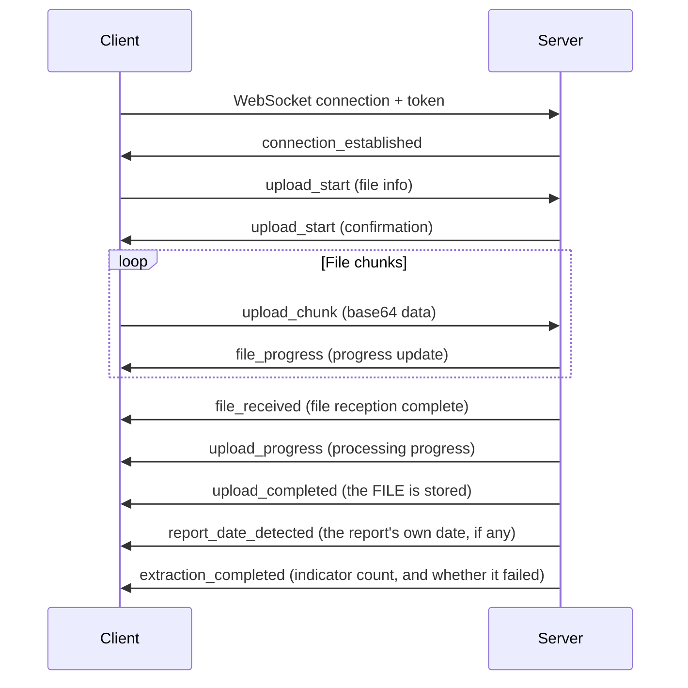

# File Processing Module Guide

## Overview

This module provides comprehensive health data file processing capabilities, including file upload, health indicator extraction, and file deletion. The system uses a modular design, supports multiple file types, and provides real-time progress feedback.

## Table of Contents

- [Features](#features)
- [Supported File Types](#supported-file-types)
- [File Upload](#file-upload)
  - [WebSocket Upload (Recommended)](#websocket-upload-recommended)
  - [REST API Upload](#rest-api-upload)
- [Processing Flow](#processing-flow)
- [Health Indicator Extraction](#health-indicator-extraction)
- [File Deletion](#file-deletion)
- [API Reference](#api-reference)
- [Data Models](#data-models)
- [Error Handling](#error-handling)
- [Best Practices](#best-practices)
- [Code Examples](#code-examples)

---

## Features

- ✅ **Multiple Upload Methods**: Supports WebSocket real-time upload and REST API batch upload
- ✅ **Real-time Progress Feedback**: WebSocket connections provide real-time progress updates for file upload and processing
- ✅ **Smart File Recognition**: Automatically identifies file types and selects the appropriate handler
- ✅ **Health Indicator Extraction**: Uses LLM to automatically extract health indicator data from medical reports
- ✅ **Multi-format Support**: Supports PDF, images, Office documents, text, genetic data and more
- ✅ **PDF Parallel Processing**: Multi-page PDFs are processed in parallel for improved efficiency
- ✅ **File Summary Generation**: Automatically generates file content summaries
- ✅ **Cascade Deletion**: Automatically cleans up associated health data when files are deleted

---

## Supported File Types

| File Type | MIME Type | Handler | Description |
|-----------|-----------|---------|-------------|
| PDF | `application/pdf` | `PDFHandler` | Multi-page parallel processing with automatic health indicator extraction |
| Images | `image/*` | `ImageHandler` | `.jpg`, `.jpeg`, `.png`, `.gif`, `.bmp`, `.webp`, `.heic`, `.heif`, `.tif`, `.tiff`; downscaled and OCR'd, then the same extraction path as PDF |
| Genetic Data | Raw genotype export, `.txt` / `.csv`: WeGene, 23andMe, AncestryDNA, MyHeritage | `GeneticHandler` | Recognised by its column header; one row per rsID into `th_series_data_genetic`. See [genetics.md](genetics.md) |
| Text | `text/*` | `TextHandler` | `.txt`, `.md`, `.csv`, `.json`, `.xml`, `.html`, `.htm`, `.log` decoded directly, same extraction path as PDF |
| Excel | OOXML | `ExcelHandler` | `.xlsx`, `.xlsm` read with openpyxl as markdown tables under a row budget. `.xls` and `.xlsb` upload but do not parse: openpyxl reads only the zip formats, and `detect.LEGACY_OFFICE_SUFFIXES` names them so a reader is told the file could not be read rather than handed container bytes as prose |
| Word / PowerPoint | OOXML | `DocumentHandler` | `.docx`, `.pptx` as markdown (headings, paragraphs, tables, slides) |

Two lists, and they are not the same list. `mirobody/utils/file_types.py` is
the UPLOAD accept-list: what a user is allowed to hand the server. It carries
`.xls` and `.xlsb`, which no parser here reads. What a file can be READ as is
`mirobody/documents/detect.py`: `EXTRACTABLE_SUFFIXES` (15, through a parser
or OCR) plus `TEXT_EXTENSIONS` (8, decoded directly) is the 23 the README
counts. When this table and that module disagree, the module is the contract.

Whatever the handler, the TEXT of a document comes from one place:
`mirobody/documents/` (`detect.kind` by extension, content type and, when
those lie, the bytes; `extract.extract_text` by kind). A PDF gives up its
embedded text layer page by page and only the pages that have none — scans —
are rendered and handed to the vision model, one image at a time; a photo is
downscaled and OCR'd; a spreadsheet or Word file never reaches a model at
all. The result is cached by content hash through `th_files`, so the same
bytes are never OCR'd twice, and the file summary is generated from that text
rather than from the file.

---

## File Upload

### WebSocket Upload (Recommended)

WebSocket upload provides real-time progress feedback, ideal for large file uploads and scenarios requiring real-time status updates.

#### Endpoint

```
ws://<host>/ws/upload-health-report?token=<auth_token>
```

#### Connection Flow



`upload_completed` and `extraction_completed` answer different questions, and a
client needs both: the first says the file arrived and is readable, the second
says whether anything could be extracted from it. Extraction runs after the
upload has already completed, so a client that stops listening at
`upload_completed` will render a stored file as a finished one.

#### Message Types

##### 1. Upload Start (upload_start)

Client sends:
```json
{
    "type": "upload_start",
    "messageId": "unique-message-id",
    "sessionId": "session-id",
    "query": "user notes",
    "isFirstMessage": false,
    "query_user_id": "target-user-id",
    "files": [
        {
            "filename": "report.pdf",
            "contentType": "application/pdf",
            "size": 1024000
        }
    ]
}
```

| Field | Type | Required | Description |
|-------|------|----------|-------------|
| type | string | ✅ | Must be "upload_start" |
| messageId | string | ❌ | Unique message ID, auto-generated if not provided |
| sessionId | string | ✅ | Session ID |
| query | string | ❌ | User notes or query text |
| isFirstMessage | boolean | ❌ | Whether this is the first message of a new session |
| query_user_id | string | ❌ | Target user ID for proxy uploads |
| files | array | ✅ | Array of file metadata |

Server response:
```json
{
    "type": "upload_start",
    "messageId": "generated-message-id",
    "sessionId": "session-id",
    "status": "uploading",
    "progress": 0,
    "message": "Ready to receive 1 files",
    "files": [...]
}
```

##### 2. Upload Chunk (upload_chunk)

Client sends:
```json
{
    "type": "upload_chunk",
    "messageId": "message-id",
    "filename": "report.pdf",
    "chunk": "<base64-encoded-data>",
    "chunkIndex": 0,
    "totalChunks": 10,
    "contentType": "application/pdf",
    "fileSize": 1024000
}
```

Server response:
```json
{
    "type": "file_progress",
    "messageId": "message-id",
    "filename": "report.pdf",
    "progress": 10.0,
    "status": "uploading",
    "message": "Uploading report.pdf: 10.0%"
}
```

##### 3. File Received (file_received)

```json
{
    "type": "file_received",
    "messageId": "message-id",
    "filename": "report.pdf",
    "status": "received",
    "message": "File report.pdf received successfully",
    "size": 1024000
}
```

##### 4. Upload Progress (upload_progress)

```json
{
    "type": "upload_progress",
    "messageId": "message-id",
    "status": "processing",
    "progress": 65,
    "message": "Starting to analyze health indicators in report.pdf...",
    "filename": "report.pdf",
    "timestamp": "2024-01-15T10:30:00.000Z"
}
```

##### 5. Upload Completed (upload_completed)

```json
{
    "type": "upload_completed",
    "messageId": "message-id",
    "status": "completed",
    "progress": 100,
    "message": "Processing completed: 1 files successful",
    "successful_files": 1,
    "failed_files": 0,
    "total_files": 1,
    "results": {
        "success": true,
        "message": "File processing completed",
        "type": "pdf",
        "url_thumb": ["https://..."],
        "url_full": ["https://..."],
        "files": [
            {
                "filename": "report.pdf",
                "type": "pdf",
                "url_thumb": "https://...",
                "url_full": "https://...",
                "file_key": "uploads/xxx.pdf",
                "file_size": 1024000,
                "file_abstract": "Health report summary...",
                "file_name": "2024 Annual Health Report",
                "success": true
            }
        ]
    }
}
```

##### 6. Report Date Detected (report_date_detected)

Sent as soon as the report's own date has been probed — seconds after upload,
while the 15-25 s indicator extraction is still running — so the client can ask
about a missing date without waiting for the whole extraction.

```json
{
    "type": "report_date_detected",
    "file_key": "uploads/xxx.pdf",
    "file_name": "2024 Annual Health Report",
    "report_date": "2024-03-29 00:00:00",
    "date_source": "document"
}
```

`date_source` is `document` when the date was read off the report itself, and
`upload` when none was found and the upload time is standing in as a
placeholder. A client should offer to correct the second case.

##### 7. Extraction Completed (extraction_completed)

**This is the event that says whether extraction worked**, and the only one
that does. `upload_completed` above reports that the FILE arrived and is
stored — it says `1 files successful` even when every model call failed, because
the file is genuinely stored and readable either way.

```json
{
    "type": "extraction_completed",
    "file_key": "uploads/xxx.pdf",
    "file_name": "2024 Annual Health Report",
    "indicators_count": 145,
    "failed": false,
    "report_date": "2024-03-29 00:00:00",
    "date_source": "document"
}
```

`failed: true` means extraction could not run — no provider is configured, or
every call to the configured one errored. The sentence explaining which is on
the file row (`error`, from `GET /api/v1/health-indicators/files`); the file
itself is stored and readable. `failed: false` with `indicators_count: 0` is a
different and ordinary outcome: a document that genuinely has no indicators in
it. A client must not render the first two like the third — that is what made a
green row over an empty list, with the cause visible only in server logs.

##### 8. Heartbeat (ping/pong)

Client sends:
```json
{
    "type": "ping"
}
```

Server response:
```json
{
    "type": "pong",
    "timestamp": "2024-01-15T10:30:00.000Z"
}
```

#### Timeout Mechanism

| Type | Duration | Description |
|------|----------|-------------|
| Idle Timeout | 5 minutes | Auto-disconnect when no activity |
| Upload Timeout | 30 minutes | Extended timeout during active uploads |
| Heartbeat | 30 seconds | Recommended ping interval |

---

### REST API Upload

REST API provides a simple file upload method, suitable for simple scenarios or applications that don't require real-time progress.

#### Endpoint

```http
POST /files/upload
Content-Type: multipart/form-data
Authorization: Bearer <token>
```

#### Request Parameters

| Parameter | Type | Required | Description |
|-----------|------|----------|-------------|
| files | File[] | ✅ | List of files to upload |
| folder | string | ❌ | Custom folder prefix, defaults to 'uploads' |

#### Response Example

```json
{
    "code": 0,
    "msg": "All 2 files uploaded successfully",
    "data": [
        {
            "file_url": "https://storage.example.com/uploads/20240115_xxx.pdf",
            "file_name": "report.pdf",
            "file_key": "uploads/20240115_xxx.pdf",
            "file_size": 1024000,
            "file_type": "application/pdf",
            "upload_time": "2024-01-15T10:30:00.000Z",
            "duration": null
        }
    ]
}
```

#### Response Codes

| Code | Description |
|------|-------------|
| 0 | All uploads successful |
| 1 | Partial or complete failure |

---

## Processing Flow

### Architecture Overview

```
┌───────────────────────────────────────────────────────────────┐
│                         File Upload                           │
│  ┌─────────────┐    ┌─────────────┐    ┌─────────────┐        │
│  │  WebSocket  │    │  REST API   │    │   Direct    │        │
│  │   Upload    │    │   Upload    │    │   Upload    │        │
│  └──────┬──────┘    └──────┬──────┘    └──────┬──────┘        │
│         │                  │                  │                │
│         └──────────────────┼──────────────────┘                │
│                            ▼                                   │
│                   ┌─────────────────┐                          │
│                   │  FileProcessor  │                          │
│                   └────────┬────────┘                          │
│                            │                                   │
│         ┌──────────────────┼──────────────────┐                │
│         ▼                  ▼                  ▼                │
│  ┌─────────────┐   ┌─────────────┐   ┌─────────────┐          │
│  │ PDFHandler  │   │ImageHandler │   │ TextHandler │   ...    │
│  └──────┬──────┘   └──────┬──────┘   └──────┬──────┘          │
│         │                  │                  │                │
│         └──────────────────┼──────────────────┘                │
│                            ▼                                   │
│                  ┌───────────────────┐                         │
│                  │IndicatorExtractor │                         │
│                  └─────────┬─────────┘                         │
│                            ▼                                   │
│                   ┌─────────────────┐                          │
│                   │    Database     │                          │
│                   │  (th_messages,  │                          │
│                   │  th_observation)│                          │
│                   └─────────────────┘                          │
└───────────────────────────────────────────────────────────────┘
```

### Processing Steps

#### 1. File Upload Phase (0-30%)

- Receive file data
- Validate file type and size
- Generate unique file identifier
- Upload to object storage (S3/OSS)

#### 2. File Type Recognition (30-35%)

The system automatically identifies file types via `FileHandlerFactory`:

```python
# Handler selection priority
1. GeneticHandler  - Genetic data files
2. ImageHandler    - Image files (image/*)
3. PDFHandler      - PDF documents
```

#### 3. Content Processing Phase (35-90%)

**PDF File Processing:**
```
Single/few page PDF:
  35-65%: File upload and save
  65-90%: LLM indicator extraction

Multi-page PDF (>2 pages):
  35-50%: File upload and PDF splitting
  50-70%: Parallel page processing
  70-90%: Result merging and deduplication
```

**Image File Processing:**
```
35-55%: Image upload
55-90%: Recognition + indicator extraction
```

#### 4. Summary Generation Phase (90-95%)

- Generate file content summary using LLM
- Generate intelligent file name

#### 5. Result Saving Phase (95-100%)

- Save processing results to database
- Write the extracted indicators as observations (`th_observation`, coded on the way in)
- Update user health profile

---

## Health Indicator Extraction

### Description

The system uses Large Language Models (LLM) to automatically identify and extract health indicator data from medical reports.

### Configuration

```yaml
# config.yaml
ENABLE_INDICATOR_EXTRACTION: 1  # Set to 1 to enable indicator extraction
```

### Supported Indicator Types

- Complete Blood Count (WBC, RBC, Hemoglobin, etc.)
- Biochemistry (Liver function, Kidney function, Lipids, etc.)
- Physical Examination (Blood pressure, Heart rate, Weight, etc.)
- Tumor Markers
- Thyroid Function
- Other Medical Test Indicators

### Extraction Result Format

```json
{
    "indicators": [
        {
            "original_indicator": "White Blood Cell Count",
            "value": "6.5",
            "unit": "10^9/L",
            "reference_range": "4.0-10.0",
            "status": "normal"
        },
        {
            "original_indicator": "Hemoglobin",
            "value": "145",
            "unit": "g/L",
            "reference_range": "120-160",
            "status": "normal"
        }
    ],
    "content_info": {
        "date_time": "2024-01-15",
        "institution": "XX Hospital"
    },
    "file_abstract": "January 2024 health report including CBC, comprehensive metabolic panel..."
}
```

### Report Date

`content_info.date_time` becomes the `start_time`/`end_time` of every reading
extracted from the file. When the document shows no date (or one the parser
cannot read), the readings are filed under the user's current time — and that
fallback is **labelled**, not silent: each reading's `comment` JSON and the
file row carry `date_source`:

| `date_source` | Meaning |
|---------------|---------|
| `extracted` | Read off the document |
| `upload_time` | The upload time stood in; nothing on the document gave a date |
| `manual` | Set through the endpoint below |

The labelling exists because extraction runs one file at a time. A report
photographed as three screenshots shows its date on the first page only, and
"page 2 of the same report" is indistinguishable from "a second report whose
date did not come out" — so nothing is inherited automatically. The files
listing (`GET /api/v1/data/uploaded-files`) exposes `report_date`,
`date_source` and `date_confirmed` per file; the web client asks about
`upload_time` files and offers the dates read from the other files of the same
upload (same `created_source_id`, or uploaded within a few minutes of it — the
web client opens one upload session per file).

```http
POST /api/v1/health-indicators/file-date
Content-Type: application/json
Authorization: Bearer <token>

{"file_key": "20260903103000_ab12cd34", "report_date": "2025-08-15"}
```

The date is looked up before the indicators, in its own small model call, and
the upload WebSocket carries two events after `upload_completed`:
`report_date_detected` (`file_key`, `report_date`, `date_source`, seconds after
the upload) and `extraction_completed` (adds `indicators_count`); both carry
the upload's `sessionId`, which is how the web client groups the files of one
multi-select into one prompt. In chat, the agent's `ask_user` tool asks the
question instead (naming the files in `report_date_for`); the reply is parsed
and applied on resume — the same rule as the endpoint below.

Moves every reading of that file to the date (`date_source: manual`) and
answers `{"file_key", "report_date", "moved", "skipped"}` — `skipped` counts
readings whose indicator already had a row on that date, which stay put rather
than overwrite it. Omit `report_date` to keep the upload time and stop the
prompt (`date_confirmed: true`). A file uploaded into someone else's record
needs that member's care-circle **write** grant; otherwise the file is reported
as not found.

### Data Storage

Extracted indicator data is stored in the observation model (`th_observation`
and its coding tables, `mirobody/schema/30_observations.sql`). The write
goes through `collect/observations.py:ingest` — the one writer of those tables —
which freezes the extraction as read (`th_extraction`), stores every field as
printed, codes each row and skips a row the same file already wrote. A
deleted file's rows are erased with it (the privacy path), so a re-upload
after a delete writes them fresh:

| Column | Description |
|-------|-------------|
| user_id | The person the file was uploaded into |
| name_text / value_text / unit_text / ref_text / flag_text | As printed on the report, never translated or edited |
| value_kind / value_num / comparator / unit_ucum | The typed layer derived from the text (`mirobody.translate.parse_value`) |
| observed_start / observed_end / tz / local_date | The report date (see above), the zone it was placed in, and the local day computed once |
| source_kind / source_ref | `file` / `th_files:<file_key>`: the handle back to the original document |
| extraction_id | The frozen `th_extraction` row holding the model's output verbatim |
| note_text | The extractor's note, encrypted at rest |
| (th_coding_current) code / series_id / outcome / reason | The LOINC code and series, or why there is none (`needs-input`, `refused`) |

---

## File Deletion

### Endpoint

```http
POST /api/v1/data/delete-files
Content-Type: application/json
Authorization: Bearer <token>
```

### Request Body

```json
{
    "message_id": "message-uuid",
    "file_keys": ["uploads/xxx.pdf", "uploads/yyy.jpg"]
}
```

| Parameter | Type | Required | Description |
|-----------|------|----------|-------------|
| message_id | string | ✅ | Message ID |
| file_keys | string[] | ❌ | List of file keys to delete; if empty, deletes all files |

### Response Example

```json
{
    "code": 0,
    "msg": "Successfully deleted 2 file(s)",
    "data": {
        "success": true,
        "message_id": "message-uuid",
        "deleted_files": [
            {
                "file_key": "uploads/xxx.pdf",
                "filename": "report.pdf",
                "type": "pdf",
                "status": "deleted"
            }
        ],
        "failed_deletions": [],
        "remaining_files_count": 0,
        "message_deleted": true
    }
}
```

### Cascade Deletion

When deleting files, the system automatically performs cascade deletion:

1. **Storage Deletion**: Delete file from object storage (S3/OSS)
2. **Database Update**: Update file list in `th_messages` table
3. **Health Data Cleanup**: Erase the observations extracted from the file (`observations.erase`, cascading to their coding and day authority)
4. **Genetic Data Cleanup**: If genetic file, delete data from `th_series_data_genetic`
5. **Message Marking**: If all files are deleted, mark message as deleted

---

## API Reference

### File Service Endpoints

| Method | Endpoint | Description |
|--------|----------|-------------|
| WS | `/ws/upload-health-report` | WebSocket file upload |
| POST | `/files/upload` | REST API file upload |
| POST | `/api/v1/data/delete-files` | Delete files |
| GET | `/files/{file_path}` | Get file content (proxy access) |

### Authentication

All endpoints require a valid authentication token:

- **REST API**: Use `Authorization: Bearer <token>` header
- **WebSocket**: Pass via URL parameter `?token=<token>`

---

## Data Models

### FileUploadData

```typescript
interface FileUploadData {
    file_url: string;      // File access URL
    file_name: string;     // Original filename
    file_key: string;      // Storage key
    file_size: number;     // File size in bytes
    file_type: string;     // MIME type
    upload_time: string;   // Upload timestamp
}
```

### FileDeleteRequest

```typescript
interface FileDeleteRequest {
    message_id: string;        // Message ID
    file_keys?: string[];      // List of file keys to delete
}
```

### FileProcessingResult

```typescript
interface FileProcessingResult {
    success: boolean;
    message: string;
    type: string;              // File type: pdf, image, etc.
    filename: string;          // Original filename
    full_url: string;          // Full access URL
    file_key: string;          // Storage key
    file_abstract: string;     // File summary
    file_name: string;         // AI-generated file name
    raw?: string;              // Formatted markdown content from extracted data
}
```

---

## Error Handling

### WebSocket Error Messages

```json
{
    "type": "upload_error",
    "messageId": "message-id",
    "status": "failed",
    "message": "Upload start failed: <error_details>"
}
```

### REST API Error Response

```json
{
    "code": 1,
    "msg": "File upload failed: <error_details>",
    "data": null
}
```

### Common Errors

| Error Type | Description | Solution |
|------------|-------------|----------|
| Invalid token | Token is invalid or expired | Obtain a new token |
| File type not supported | Unsupported file type | Use a supported file format |
| File is empty | File has no content | Check file content |
| Upload session not found | Upload session doesn't exist | Restart the upload |
| Permission denied | No permission for operation | Check user permissions |

### Timeout Handling

WebSocket connections receive a notification on timeout:

```json
{
    "type": "connection_timeout",
    "message": "Connection closed due to 5 minutes of inactivity",
    "idle_seconds": 300,
    "timeout_type": "idle",
    "active_uploads_count": 0
}
```

---

## Best Practices

### 1. Large File Uploads

- Use WebSocket upload with chunked transfer
- Recommended chunk size: 1MB
- Implement resumable upload mechanism

### 2. Batch Uploads

- Keep uploads to a handful of files and moderate total size. (These are
  recommendations for client behavior — the server does not currently enforce
  a per-upload file count or total-size ceiling, so a client that ignores
  them fails slowly rather than being rejected.)

### 3. Progress Monitoring

- Listen for `upload_progress` messages during WebSocket uploads
- Handle `file_progress` to display individual file progress

### 4. Error Handling

- Implement retry mechanism (recommended: max 3 retries)
- Capture and display user-friendly error messages

### 5. Connection Keep-alive

- Send ping every 30 seconds for WebSocket connections
- Handle pong response to confirm connection status

---

## Code Examples

### JavaScript WebSocket Upload

```javascript
class FileUploader {
    constructor(token) {
        this.token = token;
        this.ws = null;
    }

    connect() {
        return new Promise((resolve, reject) => {
            this.ws = new WebSocket(
                `ws://localhost:18060/ws/upload-health-report?token=${this.token}`
            );

            this.ws.onopen = () => {
                console.log('WebSocket connected');
                resolve();
            };

            this.ws.onmessage = (event) => {
                const data = JSON.parse(event.data);
                this.handleMessage(data);
            };

            this.ws.onerror = reject;
        });
    }

    async uploadFile(file, messageId, sessionId) {
        // 1. Send upload start message
        this.ws.send(JSON.stringify({
            type: 'upload_start',
            messageId,
            sessionId,
            files: [{
                filename: file.name,
                contentType: file.type,
                size: file.size
            }]
        }));

        // 2. Chunked upload
        const chunkSize = 1024 * 1024; // 1MB
        const totalChunks = Math.ceil(file.size / chunkSize);

        for (let i = 0; i < totalChunks; i++) {
            const start = i * chunkSize;
            const end = Math.min(start + chunkSize, file.size);
            const chunk = file.slice(start, end);
            const base64 = await this.readAsBase64(chunk);

            this.ws.send(JSON.stringify({
                type: 'upload_chunk',
                messageId,
                filename: file.name,
                chunk: base64,
                chunkIndex: i,
                totalChunks,
                contentType: file.type,
                fileSize: file.size
            }));
        }
    }

    readAsBase64(blob) {
        return new Promise((resolve) => {
            const reader = new FileReader();
            reader.onloadend = () => {
                const base64 = reader.result.split(',')[1];
                resolve(base64);
            };
            reader.readAsDataURL(blob);
        });
    }

    handleMessage(data) {
        switch (data.type) {
            case 'upload_progress':
                console.log(`Progress: ${data.progress}% - ${data.message}`);
                break;
            case 'upload_completed':
                console.log('Upload completed:', data.results);
                break;
            case 'upload_error':
                console.error('Upload error:', data.message);
                break;
        }
    }
}

// Usage
const uploader = new FileUploader('your-auth-token');
await uploader.connect();
await uploader.uploadFile(file, 'msg-123', 'session-456');
```

### Python REST API Upload

```python
import requests
from pathlib import Path

def upload_files(file_paths: list, token: str, folder: str = None) -> dict:
    """
    Upload files to the server.
    
    Args:
        file_paths: List of file paths to upload
        token: Authentication token
        folder: Custom folder prefix (optional)
    
    Returns:
        Upload result dictionary
    """
    url = "http://localhost:18060/files/upload"
    headers = {"Authorization": f"Bearer {token}"}
    
    files = []
    for file_path in file_paths:
        path = Path(file_path)
        files.append(('files', (path.name, open(path, 'rb'))))
    
    params = {}
    if folder:
        params['folder'] = folder
    
    try:
        response = requests.post(
            url,
            headers=headers,
            files=files,
            params=params
        )
        return response.json()
    finally:
        # Close file handles
        for _, file_tuple in files:
            file_tuple[1].close()


def delete_files(message_id: str, file_keys: list, token: str) -> dict:
    """
    Delete files from a message.
    
    Args:
        message_id: Message ID containing the files
        file_keys: List of file keys to delete
        token: Authentication token
    
    Returns:
        Deletion result dictionary
    """
    url = "http://localhost:18060/api/v1/data/delete-files"
    headers = {
        "Authorization": f"Bearer {token}",
        "Content-Type": "application/json"
    }
    
    payload = {
        "message_id": message_id,
        "file_keys": file_keys
    }
    
    response = requests.post(url, headers=headers, json=payload)
    return response.json()


# Usage examples
if __name__ == "__main__":
    TOKEN = "your-auth-token"
    
    # Upload files
    result = upload_files(
        file_paths=["./report.pdf", "./lab_results.jpg"],
        token=TOKEN,
        folder="health-reports"
    )
    print("Upload result:", result)
    
    # Delete files
    if result["code"] == 0:
        message_id = result["data"][0]["file_key"].split("/")[0]
        delete_result = delete_files(
            message_id=message_id,
            file_keys=[item["file_key"] for item in result["data"]],
            token=TOKEN
        )
        print("Delete result:", delete_result)
```

---