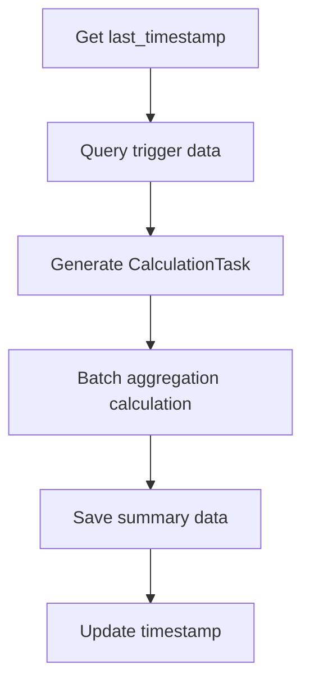

# Aggregate Indicator Module

## Overview

Aggregate Indicator is a high-performance health data aggregation calculation module that aggregates raw time series data (`series_data`) into daily summary indicators (`th_series_data`).

## Core Objectives

- **Incremental Processing**: Process only new or updated data based on `update_time`
- **High-Performance Batch Processing**: Support multi-user batch processing to optimize database query performance
- **Rule-Driven**: Automatically generate aggregation rules based on `IndicatorInfo`
- **Timezone-Aware**: Correctly handle data boundaries across different timezones
- **Idempotent Operations**: Support repeated execution without side effects

## ⚠️ System Constraints

### Sleep Data Time Window Rules

**Critical Constraint**: Sleep data uses an **18:00-18:00** time window (from 18:00 previous day to 18:00 current day), not the 00:00-24:00 window used for normal data.

#### Sleep Data Identification Rules

Current implementation uses keyword matching to identify sleep data:
```sql
LOWER(indicator) LIKE '%sleep%'
```

**Known Limitations**: The following sleep-related indicators that don't contain the 'sleep' keyword will be missed:
1. `napDuration` - Nap duration
2. `inBedStartTime` - Time when user went to bed
3. `endSleepReportTimeOffset` - Sleep report end time offset
4. `startSleepReportTimeOffset` - Sleep report start time offset

**Alternative Solutions** (in priority order):
1. **Recommended**: Use `category=Categories.SLEEP.value` for determination (requires join or pre-built mapping)
2. Extend keywords: `LIKE '%sleep%' OR LIKE '%nap%' OR LIKE '%inbed%' OR LIKE '%awake%'`
3. Maintain a whitelist of sleep indicators

**Important**: If modifying sleep data identification logic, must update simultaneously:
- `get_trigger_tasks` method in `mirobody/pulse/core/aggregate_indicator/aggregators/sql_aggregator.py`
- `_get_tasks_for_user_date_range` method in `mirobody/pulse/core/aggregate_indicator/aggregators/sql_aggregator.py`
- This document and `cursorrules` file

#### data_begin Calculation Logic

**Normal Data**:
```sql
DATE(time AT TIME ZONE timezone) as data_begin
-- Result: User's local date at 00:00:00
-- Query range: data_begin to data_begin+24h
```

**Sleep Data**:
```sql
DATE((time AT TIME ZONE timezone) - INTERVAL '18 hours') + INTERVAL '18 hours' as data_begin
-- Result: User's local date at 18:00:00
-- Query range: data_begin to data_begin+24h (i.e., 18:00 to 18:00 next day)
```

**Examples**:
- User timezone: Asia/Shanghai (+8)
- Data time: 2025-10-30 20:00 (local time)
- Normal data: data_begin = 2025-10-30 00:00:00
- Sleep data: data_begin = 2025-10-30 18:00:00

- Data time: 2025-10-30 12:00 (local time)  
- Normal data: data_begin = 2025-10-30 00:00:00
- Sleep data: data_begin = 2025-10-29 18:00:00 (previous day!)

#### Timezone Processing Principles

1. **Timezone conversion at SQL layer**: Use `time AT TIME ZONE timezone` to convert UTC time to user's local time
2. **data_begin contains complete time information**: Not just the date, but also the time point (00:00 or 18:00)
3. **Subsequent processing fully decoupled**: Calculate time boundaries based on data_begin, no longer need timezone information
4. **Unified query range**: Always `[data_begin, data_begin+24h)`

## Architecture Design

### Core Components

```
AggregateIndicatorService (service.py)
├── SQLAggregator (aggregators/sql_aggregator.py)
│   ├── get_trigger_tasks() - Query trigger data
│   ├── calculate_batch_aggregations() - Batch aggregation calculation
│   └── calculate_time_range_aggregations() - Time range aggregation
├── AggregateDatabaseService (database_service.py)
│   └── batch_save_summary_data() - Batch save summary data
└── RuleGenerator (rule_generator.py)
    └── get_all_aggregation_rules() - Get aggregation rules
```

### Data Flow

```
series_data (Raw data)
    ↓ (Incremental query)
CalculationTask (Calculation task)
    ↓ (Batch aggregation)
Summary Records (Summary records)
    ↓ (UPSERT save)
th_series_data (Summary table)
```

## Execution Flow

### 1. Incremental Processing Flow (process_incremental)



### 2. Batch Processing Architecture

- **Group by date**: First group tasks by `date_key`
- **Intelligent SQL selection**: 
  - Task count ≤ 5000: Single SQL query for all users and indicators
  - Task count > 5000: Group by indicator, one SQL per indicator
- **Multi-user batch processing**: Support processing multiple users simultaneously

### 3. Time Range Processing

- **Single user processing**: `calculate_time_range_aggregations` processes only one user at a time
- **30-day chunking**: Automatically chunks and recursively processes periods exceeding 30 days
- **Direct aggregation**: Directly aggregates entire time range for ≤30 days

## Performance Optimization Strategies

### Query Optimization
- **GROUP BY optimization**: Use `GROUP BY user_id, indicator, DATE(time), timezone` to reduce trigger records
- **Batch user query**: Use `user_id = ANY(:user_ids)` to support multi-user queries
- **No LIMIT constraint**: Remove query limits to ensure all data is processed

### Batch Aggregation Optimization
- **Single SQL aggregation**: Small batch tasks use single SQL to query all indicators
- **Split by indicator aggregation**: Large batch tasks group by indicator to avoid SQL complexity
- **Intelligent grouping**: Automatically select optimal strategy based on task count

### User Count Threshold Control
- **MAX_TASKS_PER_SQL**: 5000 tasks threshold
- **MAX_DAYS_PER_MONTH**: 30-day chunking threshold
- **Dynamic adjustment**: Automatically select processing strategy based on data volume

## Supported Processing Scenarios

### Scheduled Execution
- **Frequency**: Executes every 6 minutes
- **Incremental processing**: Only processes data after `last_timestamp`
- **Distributed lock**: Prevents concurrent execution across multiple instances

### Force Execution
- **API trigger**: Centrally managed through scheduler, use `scheduler.trigger_task("aggregate_indicator", force=True)`
- **Bypass lock**: Skips distributed lock check during force execution
- **Full processing**: Processes all available data

### Historical Data Recalculation
- **API trigger**: `/api/v1/manage/aggregate/recalculate-range`
- **Time range**: Supports specifying start and end dates
- **User filtering**: Supports specifying specific users
- **30-day limit**: Automatically chunks processing for periods exceeding 30 days

## Batch Processing Flow Details

### Data Grouping Strategy
1. **Group by date**: `date_groups[date_key] = [tasks...]`
2. **Select strategy based on task count**:
   - ≤ 5000: `_process_date_aggregations` (Single SQL)
   - > 5000: `_process_date_split_aggregations` (Split by indicator)

### SQL Batch Query Optimization
```sql
-- Single SQL query example
SELECT user_id, indicator, source,
       ROUND(AVG(value::numeric), 2) as avg_value,
       ROUND(MAX(value::numeric), 2) as max_value
FROM series_data
WHERE user_id = ANY(:user_ids)
  AND indicator = ANY(:indicators)
  AND time >= :day_start AND time <= :day_end
GROUP BY user_id, indicator, source
ORDER BY user_id, indicator, source
```

### Performance Improvement Effects
- **Reduced query count**: From N×M queries down to 1 (N=user count, M=indicator count)
- **Reduced database load**: Batch queries reduce connection overhead
- **Improved processing speed**: Process more data in a single operation

## Aggregation Rule System

### Automatic Rule Generation
- **Based on IndicatorInfo**: Automatically generated from `StandardIndicator` enum
- **Naming convention**: `daily{Method}{Indicator}` (camelCase)
- **Example**: `heartRates` + `['avg', 'max']` → `dailyAvgHeartRates`, `dailyMaxHeartRates`

### Supported Aggregation Methods
- **Basic statistics**: `avg`, `max`, `min`, `sum`, `total`, `count`
- **Advanced statistics**: `stddev`, `variance`, `median`, `p95`
- **Time series statistics**: `last`, `first`

### Custom Rules
```python
# Register custom rule
custom_rule = AggregationRule(
    source_indicator="heartRates",
    target_indicator="dailyRestingHeartRate",
    aggregation_type="avg",
    time_window="daily"
)
register_custom_rule(custom_rule)
```

## 数据模型

### CalculationTask
```python
@dataclass
class CalculationTask:
    user_id: str
    source_indicator: str
    target_indicator: str
    aggregation_type: str
    timezone: str
    date_key: Any  # Date object or string
    update_time: datetime
```

### ProcessingStats
```python
@dataclass
class ProcessingStats:
    executed_at: datetime
    summaries_created: int
    users_affected: int
    execution_time_ms: float
    mode: str  # normal | force | cold_start
    errors: List[str]
```

## Technical Implementation

### Dependency Injection Pattern
- **AggregatorProtocol**: Defines aggregator interface
- **SQLAggregator**: Default SQL implementation
- **Extensibility**: Supports custom aggregator implementations

### Error Handling
- **Exception catching**: All critical operations have exception handling
- **Logging**: Detailed execution logs and error information
- **Graceful degradation**: Errors don't affect other data processing

### Redis Caching
- **last_timestamp**: Stores last processing timestamp
- **processing_stats**: Stores processing statistics
- **distributed_lock**: Distributed lock to prevent concurrent execution

## Execution Parameters

| Parameter | Value | Description |
|------|-----|------|
| Execution frequency | 5 minutes | Scheduled interval |
| Task threshold | 5000 tasks | Single SQL vs split by indicator threshold |
| Time chunking | 30 days | Historical data processing chunk size |
| Batch size | 1000 records | Database batch save size |
| Lock timeout | 10 minutes | Distributed lock timeout duration |

## Monitoring and Debugging

### Log Levels
- **INFO**: Basic execution information
- **DEBUG**: Detailed processing steps
- **WARNING**: Warning messages (e.g., execution skipped)
- **ERROR**: Error messages

### Status Query
```python
# Get service status
status = await service.get_status()
# Returns: last_timestamp, last_stats, is_running
```

### Performance Monitoring
- **Execution time**: Time statistics for each processing run
- **Processing count**: Number of summary records and affected users
- **Error statistics**: Error types and frequency

## Self-Test Functionality

### Overview

The module includes built-in self-test functionality to verify core logic correctness during service initialization. Self-tests don't depend on database connections and can quickly verify:
- Timezone conversion logic (UTC ↔ local time)
- Data aggregation calculations (sum, avg, count, etc.)
- Time window boundaries (normal data 00:00-24:00, sleep data 18:00-18:00)

### How to Run

```bash
# Run standalone test script
docker exec a007-opensource-backend-1 python3 /app/test_aggregator_self_test.py
```

### Test Contents

#### Test 1: Normal Data Timezone Conversion
- Verify local time → UTC conversion
- Example: Asia/Shanghai 2025-10-30 00:00 → UTC 2025-10-29 16:00

#### Test 2: Sleep Data Timezone Conversion
- Verify timezone conversion for sleep data special window
- Example: Asia/Shanghai 2025-10-30 18:00 → UTC 2025-10-30 10:00

#### Test 3: Reverse Timezone Conversion
- Verify UTC → local time conversion
- Ensure conversion reversibility

#### Test 4: Aggregation Calculations
- Verify sum, avg, count and other aggregation functions
- Example: 10 records × 1000 = sum:10000, avg:1000, count:10

#### Test 5: Time Window Boundaries
- Verify normal data window: 00:00-23:59:59
- Verify sleep data storage window: 00:00-23:59:59

#### Test 6: UTC Query Boundaries
- Verify UTC query time range is exactly 24 hours
- Ensure indexes can be used correctly

### Expected Output

```
================================================================================
Running Aggregator Self-Test
================================================================================
Test 1: Timezone conversion for normal data
✓ Normal data: 2025-10-30 00:00:00 (Asia/Shanghai) = 2025-10-29 16:00:00 (UTC)
Test 2: Timezone conversion for sleep data
✓ Sleep data: 2025-10-30 18:00:00 (Asia/Shanghai) = 2025-10-30 10:00:00 (UTC)
Test 3: Reverse conversion (UTC -> Local)
✓ Reverse: 2025-10-29 16:00:00 (UTC) = 2025-10-30 00:00:00 (Asia/Shanghai)
Test 4: Aggregation calculations
✓ Aggregation: sum=10000, avg=1000.0, count=10
Test 5: Time window boundaries
✓ Normal window: 2025-10-30 00:00:00 ~ 2025-10-30 23:59:59
✓ Sleep window (stored): 2025-10-30 00:00:00 ~ 2025-10-30 23:59:59
Test 6: UTC query boundaries
✓ UTC query window: 2025-10-29 16:00:00 ~ 2025-10-30 16:00:00 (24h)
================================================================================
✅ All self-tests PASSED
================================================================================
```

### Design Advantages

1. **Implementation-agnostic**: Test logic is independent of specific implementations (SQLAggregator, SQLv2Aggregator, PyAggregator, etc.)
2. **Fast verification**: No database dependency, verification can be completed at startup
3. **Easy to maintain**: Test code is centralized, easy to update
4. **Continuous assurance**: Can be run at every service startup to ensure code stability

### When to Use

- **Development phase**: Verify correctness after modifying aggregation logic
- **Deployment phase**: Quick self-check at service startup
- **Debugging phase**: Run test script independently to troubleshoot issues
- **Upgrade phase**: Verify consistency between new and old implementations

## Summary

The Aggregate Indicator module achieves high-performance batch data processing through the following features:

### Core Advantages
1. **Batch processing architecture**: Supports multi-user batch processing, significantly improving performance
2. **Intelligent SQL optimization**: Automatically selects optimal query strategy based on data volume
3. **Rule-driven design**: Automatically generates aggregation rules based on configuration, easy to maintain
4. **Incremental processing mechanism**: Only processes changed data, avoiding duplicate calculations
5. **Timezone-aware processing**: Correctly handles data boundaries across different timezones

### Performance Improvements
- **Query efficiency**: Batch queries reduce database connection overhead
- **Processing speed**: Process more users and indicator data in a single operation
- **Resource utilization**: Intelligent grouping reduces memory and CPU consumption
- **Scalability**: Supports large-scale user and indicator processing

### Reliability Assurance
- **Idempotent operations**: Supports repeated execution without side effects
- **Error handling**: Comprehensive exception handling and error recovery mechanisms
- **Distributed lock**: Prevents concurrent execution conflicts across multiple instances
- **Data consistency**: UPSERT operations ensure data consistency